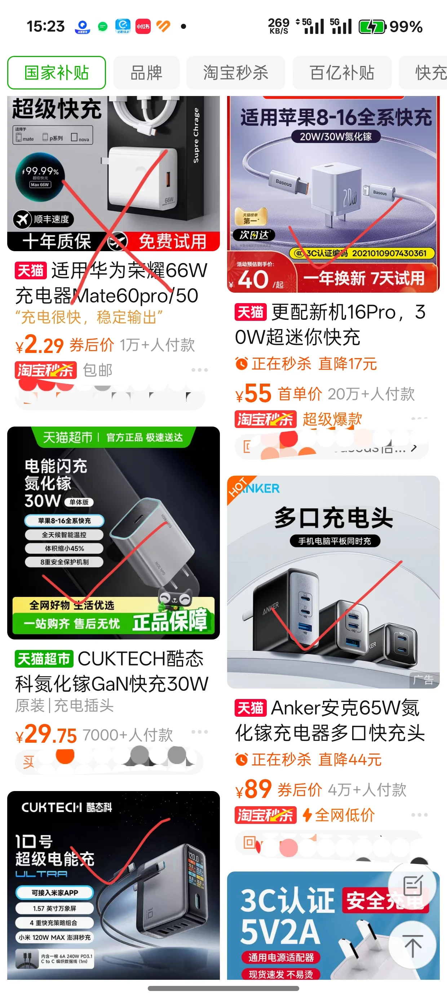

转眼之间，报到将至，同学们即将开启崭新的大学生活。  
大学生活与高中有显著的不同，因此建议您在暑假期间提前准备一些物品。不同的物品有不同的采购策略，建议您根据自己情况调整。
本文部分内容经过AI润色。
::: details 点我查看本文目录
[[TOC]]
:::

## 前人总结的表格
还挺全面的，我先放在这
::: details
| 分类         | 序号 | 物品名称                  | 备注说明                                                                 |
|--------------|------|---------------------------|--------------------------------------------------------------------------|
| **证件类**   | 1    | 录取通知书                | -                                                                        |
|              | 2    | 高考准考证                | -                                                                        |
|              | 3    | 档案                      | -                                                                        |
|              | 4    | 党、团组织关系介绍信      | -                                                                        |
|              | 5    | 身份证原件及复印件        | 正反两面复印件                                                           |
|              | 6    | 证件照                    | 白底、蓝底、红底各一份，每份洗一寸、二寸各一版；电子档需保存             |
|              | 7    | 户口迁移证（可选）        | 转户口的学生需要 ,一般不需要转户口                                                        |
|              | 8    | 贫困证明（可选）          | 通知书内的家庭经济困难认定表                                             |
| **日常用品** | 1    | 牙刷                      | 这个还是带着吧，自己的比较方便                                                                       |
|              | 2    | 牙膏                      | -                                                                        |
|              | 3    | 牙缸                      | -                                                                        |
|              | 4    | 毛巾                      | 擦脸、洗澡用、擦脚                                                       |
|              | 5    | 洗发水                    | 少带一小瓶就行，开学到了再买                                                                        |
|              | 6    | 盆                        | 可以带，但不是必须的开学以后再买就行，上京东买隔天就到了                                                    |
|              | 7    | 洗衣液或洗衣凝珠          | 开学物品较贵，可自带少量过渡，用完后上网买                                             |
|              | 8    | 喝水杯、水瓶              | 水杯选耐摔款（宿舍用），水瓶便于出门携带，建议500ml左右                                 |
|              | 9    | 纸抽                      | 带一包就行了，用完后上网买                                                                          |
|              | 10   | 湿巾                      | 可当抹布使用（刚开学宿舍有灰尘）                                         |
|              | 11   | 垃圾袋                    | 可以带几只，刚开学打扫卫生用量大。                                                                        |
|              | 12   | 床垫                      | 尺寸 2.0*0.9m（南京是 1.9*0.9），可铺两层增强厚度 。建议自己买了快递寄过去，不要在“学长学姐”那买                                        |
|              | 13   | 枕头                      | -                                                                        |
|              | 14   | 被子                      | -                                                                        |
|              | 15   | 床上三件套                | 含枕套、被套、床单                                                       |
|              | 16   | 垃圾篓                    | 这个不用带，宿舍一般都有。没有的话开学上京东买一个。                     |
|              | 17   | 雨伞                      | 选质量好的并标注姓名，避免丢失或错拿                                     |
|              | 18   | 宽带                      | 宿舍成员需共同商量                                                       |
| **文具及电子产品** | 18 | 书包                  | -                                                                        |
|              | 19   | 笔                        | 自带少量即可，无需过多                                                   |
|              | 20   | U盘                       | 用于拷贝课件和提交作业                                                   |
|              | 21   | 高频收音机 + 耳机         | 非英语专业期末考及所有同学四六级考试需用，可开学后在校购买                 |
|              | 22   | 手机 + 充电器             | 必备，充电器一定要买大品牌的正规产品。切勿购买所谓“原装正品”                                                       |
|              | 23   | 护眼台灯                  | 宿舍桌面光线较暗，需照明。这个没必要开学带，到宿舍买就行了                                                 |
|              | 24   | 插线板                    | 优先选孔多、线长的款式。一定要买正规CCC产品，切勿购买廉价劣质插排                                                   |
|              | 25   | 剪刀、裁纸刀              | 拆快递使用。上不去高铁，注意一下。                                                               |
|              | 26   | 胶                        | 备透明胶、双面胶、大圈透明胶、胶棒（用于粘字、照片、固定物品等）         |
| **衣物**     | 1    | 衣服                      | 四季外套、内衣、袜子等，可邮寄到校                                       |
|              | 2    | 鞋                        | 根据需求准备                                                             |
|              | 3    | 拖鞋                      | 根据需求准备                                                                       |
|              | 4    | 衣架                      | 可先带少量，到校后再补充（衣架不嫌多）                                   |
|              | 5    | 晒衣夹（一排）            | 用于固定衣架和晒衣绳，防止衣服吹跑；可备环形衣架晒袜子                   |
|              | 6    | 挂钩若干                  | 推荐贴墙式或磁吸式，多备实用                                             |
| **其他实用物品** | 1  | 护肤品（军训防晒品）    | 军训防晒必备，日常也可使用                                               |
|              | 2    | 剃须刀（男生）            | -                                                                        |
|              | 3    | 香皂、香皂盒或洗手液      | 洗手用，部分食堂可能提供洗手液。这个开学以后上网买就行                                           |
|              | 4    | 抹布或（酒精）湿巾        | 开学擦灰使用                                                             |
|              | 5    | 暖壶                      | 便于打水，减少往返次数。这个开学以后上网买就行                                           |
|              | 6    | 指甲刀                    | 建议随身带一个                                                           |
|              | 7    | 一次性筷子                | 按需准备，方便吃泡面或者外卖                                                   |
|              | 8    | 钢丝球                    | 刚开学宿舍可能较脏，用于清洁                                             |
|              | 9    | 凉席                      | 非必需，但夏天使用较舒适                                                 |
|              | 10   | 蚊帐                      | 推荐蚊帐床帘一体式，营造独立空间                                         |
|              | 11   | 小板凳                    | 非必需                                                       |
|              | 12   | 床上桌                    | 便于在床上用电脑或平板，非必须                                         |
|              | 13   | 电脑                      | 部分专业大一原则上不允许携带（**强烈建议携带**）                                 |
|              | 14   | 锁和钥匙                  | 无需过多，用于锁重要物品（如军训时的柜子）除非特别贵重，基本不用锁                               |
|              | 15   | 随身小记事本              | 养成随时记录的好习惯                                                     |
|              | 16   | 床篮                      | 实用，可在床上放置物品 (建议开学找学长收购)                                                  |
|              | 17   | 桌上收纳盒                | 适合物品较多的人整理桌面                                                 |
|              | 18   | 7号、5号电池                   | 学校售卖的收音机适用                                                     |
|              | 19   | 小工具箱                  | 带螺丝刀等工具，便于维修物品（这个开学后自己慢慢准备）                                             |
|              | 20   | 晒衣服的撑杆              | 部分宿舍晾衣架较高/远，到校后根据需求准备                                 |
|              | 21   | 防蛀防潮物品              | 除湿袋很实用 （这个开学后再准备）                                                           |
|              | 22   | 鞋垫                      | 军训时使用，提升舒适度                                                   |
|              | 23   | 凉贴                      | 他人推荐，可按需尝试                                                     |
|              | 24   | 花露水/风油精/驱蚊液            | 防蚊虫叮咬 ，选择国药准字或有农药许可的                                                              |
|              | 25   | 洗衣桶                    | 用于装换洗衣物，开学上网买                                                           |
|              | 26   | 银行卡                    | 开学学校会统一组织办理，无需急带                                         |
|              | 27   | 订书钉                    | 平时用得少，但需要时常用                                                 |
|              | 28   | 小镜子                    | 方便日常整理仪表                                                       |
|              | 29   | 药                        | 推荐备感冒药、藿香正气水（防中暑）、拉肚子药；跌打损伤药可备（或直接去校医院） |
:::

## 基础文具
   基本不需要准备文具，携带几根中性笔、铅笔、橡皮，胶带、本子足矣。   
   你高中时的文具足够多，无一般来说需新买。  
    可以购买一些文件袋，用于放置个人档案和录取通知书等。

## 证件照片

建议准备一寸、二寸免冠蓝底、白底、红底证件照片若干，方便后续使用。

## 档案资料

请以学校通知为准

## 电子设备（根据专业需求选择）

### 个人电脑   
   个人电脑是非常重要的生产力工具。   
   无论是编程课还是写论文、做小组作业都非常重要。一般而言，平板电脑无法替代，而机房电脑又十分难用。
> [!TIP]
> 电脑是大学生活的重要生产力工具，建议您提前购买。   

> [!WARNING]
> 个别学院（如计算机学院）对电脑具有较为严格的管控。
> 大部分学院允许新生在签署承诺书后使用电脑。
> **强烈建议您提前购买电脑！**

关于选购电脑的知识，由于篇幅较长，您可以参考[电脑选购](/选购指南/电脑选购.html)章节。

### 存储设备
   
   U 盘是大学生活中不可或缺的数据传输工具。为了满足日常使用需求，建议您至少准备一个 U 盘。在选购时，请注意以下几点：

   - 存储容量：建议选择 64GB 及以上容量，通常价格在 20~40 元。
   - 品牌选择：推荐选购知名品牌产品，如闪迪 (SanDisk)、金士顿 (Kingston) 等。
   - 接口类型：建议选择 USB 3.0 USB-A 接口（方口），传输速度更快。  
如果您的设备主要使用 Type-C 接口（!! 圆口、华为口!!），可以额外购置一个 Type-C 接口的 U 盘，但应该配置 USB-C 转 USB-A 转接器以方便链接教室电脑。脑。

### 手机充电器、充电宝（移动电源）及电源线
   
#### 充电器和充电线的选购建议

在选购充电器和充电线时，请注意以下几点：

1. **安全认证**
   - 必须选购具有中国国家强制性产品认证（3C认证）的产品
   - 建议购买知名品牌的正规产品

2. **选购建议**
   - 充电器建议选择支持多协议快充的产品
   - 充电线推荐选购耐用且支持快充的产品
   - 不建议购买高价的"原装"产品，性价比较低
   - 谨防假冒伪劣产品，尤其是所谓的"原装拆机"产品

::: details 以下是一些选购充电器的示例：
| 充电器选购示例1 | 充电器选购示例2 | 充电器选购示例3 |
|:---:|:---:|:---:|
|  |  |  |

相信这些图片可以起到抛砖引玉的作用。

:::

## 电力设备
   
   为了方便及安全可靠地使用电器设备，建议您准备至少一个符合**国家标准**的插线板或电源转换器。  
   插座使用久了可能容易松动打火存在安全隐患，如果您宿舍的插座松动，请联系宿管或在微信上报修。  

   江阴校区宿舍配置情况：  
   - 床位区域：标准五孔插座 × 1  
   - 桌面区域：标准五孔插座 × 1  
  
  南京校区情况：

  - 床位区域：**部分**宿舍有标准五孔插座 × 1
  - 桌面区域：所有宿舍有标准五孔插座 × 1

   > [!CAUTION]
> 请务必避免购买来自广东揭阳地区生产或发货的插排产品，该地区盛产劣质插排，此类产品普遍存在严重的安全隐患，产品多半不满足国家要求。不合格的电器可能导致触电、起火等危险！  
> 推荐购买的插线板或转换器品牌如下，（不分先后）  
   > 正泰、绿联、公牛、小米、突破电器、良工、得力、爱国者、清风、德力西、德木等

::: details DeepSeek 说，如何选购合格插排

### 

#### 1. 认证与安全标准
- 必须具有 CCC 认证（中国强制性产品认证）标志
- 符合新国标（GB/T 2099.7-2015）要求

#### 2. 核心安全设计
- **阻燃材质**：外壳需采用 750℃阻燃级别的 ABS 或 PC 材料
- **安全防护**：配备防误触保护门
- **过载保护**：内置过载自动断电功能
- **内部用料**：采用一体式铜套结构，线径≥1mm²

#### 3. 功能选择建议
- 普通用电设备选择 10A 规格
- 大功率电器（如空调）使用 16A 规格
- USB 充电功能需选择带智能功率分配的型号

#### 4. 购买建议
建议通过以下渠道购买：
- 品牌官方旗舰店（京东/天猫）
- 大型商超
- 品牌授权专卖店

#### 5. 劣质插排的主要风险
1. **安全隐患**
   - 易发生火灾（材料易熔化、短路）
   - 存在触电风险（保护不当）
2. **使用风险**
   - 可能损坏连接设备
   - 缺乏正规售后保障

#### 6.避坑提示
- 警惕 `"万能插排"`（旧国标，已禁用）
- 认准 `新国标`
- 价格过低（如10元以下）的插排大概率偷工减料
- 查看商品详情页的 `检测报告截图`

::: 

## 床上用品
   床上用品是大学生活中不可或缺的一部分。    
   宿舍不提供任何床上用品，每张床都只有床架和床板。   
   宿舍床铺尺寸为：200 * 90 或 195 * 90 或 190 * 90   (具体参照 宿舍 章节)      
   床垫尺寸推荐为：190 * 90   
   学校对床上用品没有统一要求，您可以自己购买，但军训期间不允许使用蚊帐、床帘等，建议军训结束后再买。    
   建议使用快递的方式直接发送到学校。    
   江南地区较为潮湿，且温度较高，建议您根据个人喜好准备。   

## 其他生活日用品

由于大部分北区宿舍及江阴宿舍都没有电梯，且校园面积较大，报道当天人数又众多，建议只准备 7 日的用量。  
如两包抽纸，一小瓶洗衣液，一小瓶沐浴露、牙刷牙膏等。   
脸盆、卫生纸、洗衣液等极其沉重或体积较大的低值日用品，建议到校前后在京东自营上购买，可实现隔日甚至当日达。

## 服装

学校没有校服要求，但军训时会发军训服（包括短袖、外套、外裤、军训鞋等）   
根据自身需求携带即可，建议无须携带过多冬季厚重衣物，快递运输不过一二十元。   

