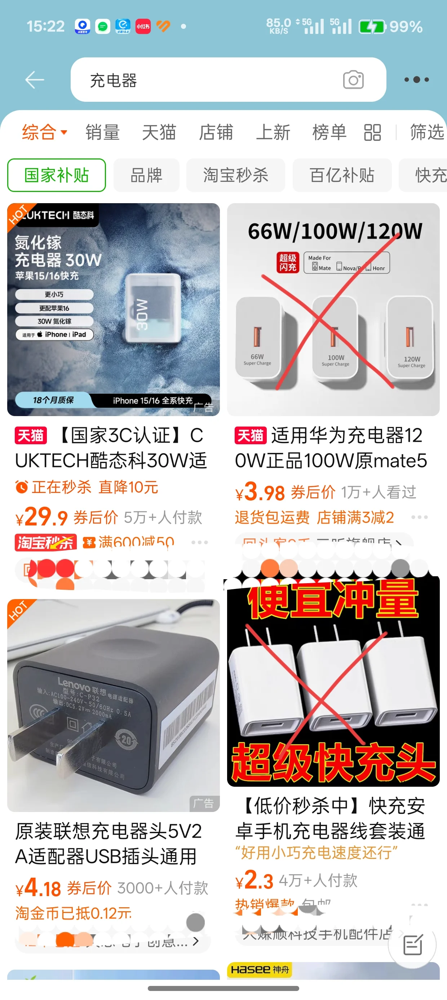

转眼之间，报到将至，同学们即将开启崭新的大学生活。
大学生活与高中有显著不同，建议提前准备以下物品。不同物品有不同的采购策略，请根据自身情况调整。

::: details 📋 完整物品清单（点击展开）
| # | 分类 | 物品名称 | 备注 |
|---|------|----------|------|
| 1 | 证件 | 录取通知书 | 必带 |
| 2 | 证件 | 高考准考证 | 建议携带 |
| 3 | 证件 | 档案 | 保持密封，勿拆封 |
| 4 | 证件 | 党/团组织关系介绍信 | 需转接的同学携带 |
| 5 | 证件 | 身份证原件及复印件 | 正反两面，建议多备几份 |
| 6 | 证件 | 证件照 | 白/蓝/红底各一份，一寸二寸各一版，保留电子档 |
| 7 | 证件 | 户口迁移证 | 一般不迁，仅需迁移的同学携带 |
| 8 | 证件 | 贫困证明 | 通知书内附认定表，选带 |
| 9 | 洗漱 | 牙刷、牙膏、牙杯 | 自带 |
| 10 | 洗漱 | 毛巾 | 擦脸、洗澡建议分开 |
| 11 | 洗漱 | 洗发水/沐浴露 | 带小瓶过渡，到校网购大瓶 |
| 12 | 洗漱 | 脸盆 | 到校网购即可 |
| 13 | 清洁 | 洗衣液/洗衣凝珠 | 带小瓶过渡，到校网购。推荐立白、奥妙、蓝月亮等大品牌 |
| 14 | 清洁 | 纸抽/湿巾 | 带一包过渡，到校网购 |
| 15 | 清洁 | 垃圾袋 | 带几只，开学打扫用量大 |
| 16 | 清洁 | 抹布 | 开学擦灰用 |
| 17 | 日用 | 水杯 | 宿舍用选耐摔款，出门带 500ml 左右 |
| 18 | 日用 | 雨伞 | 选质量好的，标注姓名防拿错 |
| 19 | 日用 | 衣架 | 带少量过渡，到校补充 |
| 20 | 日用 | 挂钩 | 贴墙式或磁吸式，实用 |
| 21 | 日用 | 台灯 | 到校后网购 |
| 22 | 日用 | 指甲刀 | 随身带一个 |
| 23 | 日用 | 暖壶 | 到校网购 |
| 24 | 日用 | 小锁 | 军训时锁柜子用，不必多买 |
| 25 | 床上 | 床垫 | 190×90cm，建议网购寄到学校 |
| 26 | 床上 | 枕头、被子 | 自备 |
| 27 | 床上 | 三件套 | 枕套、被套、床单 |
| 28 | 床上 | 蚊帐/床帘 | 军训后可用，推荐一体式 |
| 29 | 电子 | 电脑 | 强烈建议携带，参考[选购指南](/选购指南/电脑选购.html) |
| 30 | 电子 | U 盘 | 64GB+，USB 3.0，推荐闪迪、金士顿 |
| 31 | 电子 | 手机 + 充电器 | 充电器必选 3C 认证大品牌 |
| 32 | 电子 | 充电宝 | 按需准备 |
| 33 | 电子 | 插线板 | 选新国标 CCC 认证，推荐公牛、绿联、小米等 |
| 34 | 电子 | 高频收音机 + 耳机 | 英语考试用，可开学后购买 |
| 35 | 文具 | 中性笔、铅笔、橡皮 | 带少量即可 |
| 36 | 文具 | 本子/记事本 | 按需 |
| 37 | 文具 | 文件袋 | 放档案和录取通知书 |
| 38 | 文具 | 胶带、胶棒 | 透明胶、双面胶各一 |
| 39 | 文具 | 剪刀/裁纸刀 | 注意：高铁可能不允许携带 |
| 40 | 衣物 | 四季外套、内衣、袜子 | 可快递寄到学校 |
| 41 | 衣物 | 鞋、拖鞋 | 按需 |
| 42 | 护理 | 防晒霜 | 军训必备 |
| 43 | 护理 | 剃须刀 | 男生按需 |
| 44 | 护理 | 花露水/驱蚊液 | 选国药准字或农药许可产品 |
| 45 | 药品 | 感冒药、藿香正气水 | 防中暑 |
| 46 | 药品 | 止泻药、跌打损伤药 | 或直接去校医院 |
| 47 | 其他 | 鞋垫 | 军训用，提升舒适度 |
| 48 | 其他 | 电池（5 号/7 号） | 遥控器、收音机用，建议网购 |
| 49 | 其他 | 银行卡 | 开学后学校统一办理，也可自带一类卡 |
| 50 | 其他 | 订书机 | 按需，推荐买小号的 |
| 51 | 其他 | 小镜子 | 按需 |
| 52 | 其他 | 除湿袋 | 江南潮湿，建议到校后购买 |
:::

以下是对表格中重点物品的详细说明。

## 证件资料

- 录取通知书和高考准考证是报到必需，建议装在文件袋内随身携带
- 身份证建议多复印几份正反面备用
- 证件照准备一寸、二寸各一版，白/蓝/红底均备，务必保留电子档
- 档案须保持密封状态，切勿自行拆封
- 户口迁移非必须，大部分政务服务已支持异地通办，一般不推荐迁移

## 电子设备

### 个人电脑

电脑是大学生活的核心生产力工具。编程、论文、小组作业都离不开它，平板无法替代，机房电脑体验较差。

> [!TIP]
> 建议提前购买，详见[电脑选购指南](/选购指南/电脑选购.html)。

> [!WARNING]
> 个别学院对新生使用电脑有管控，大部分学院允许签署承诺书后使用。请了解所在学院的具体规定。

### U 盘

- 容量建议 64GB 起步，价格约 20~40 元
- 推荐品牌：闪迪 (SanDisk)、金士顿 (Kingston)
- 接口优先选 USB 3.0 Type-A（方口）。若设备仅有 Type-C，另配一个转接头以便连接教室电脑

### 充电器和充电线

- 必须选购 3C 认证产品，推荐知名品牌
- 选择支持多协议快充的充电器，无需买高价"原装"产品
- 谨防"原装拆机"等假冒伪劣产品

::: details 充电器选购参考

:::

## 电力设备（插线板）

宿舍桌面和床头各有一个五孔插座（南京校区部分宿舍床头无插座），建议备一个插线板。

> [!CAUTION]
> 务必选择**新国标**（GB/T 2099.7-2015）且带 **CCC 认证**的插线板。警惕广东揭阳地区生产的劣质产品——该地区盛产不合规插排，存在火灾和触电风险。
>
> 推荐品牌：公牛、绿联、小米、正泰、得力、德力西等。
> - 认准"新国标"，避坑"万能插排"（旧国标已禁用）
> - 10 元以下大概率偷工减料
> - 优先通过品牌官方旗舰店购买

## 床上用品

- 宿舍仅提供床板，床垫、被褥、枕头、三件套均需自备
- 床垫推荐尺寸 190×90cm
- 军训期间不允许使用蚊帐和床帘，建议军训后再购买
- 江南潮湿，建议到校后购买除湿袋
- 建议提前网购寄到学校，报到当天轻装出行

## 日常用品

- **洗漱**：带小瓶洗发水、沐浴露过渡即可，到校网购大瓶
- **清洁**：洗衣液、纸抽带少量（约一周用量），到校京东下单隔日即达
- **文具**：带几根中性笔、一支铅笔、一块橡皮足矣
- **其他**：水杯、雨伞（标注姓名）、拖鞋、几根衣架随身携带，其余到校后按需添置

## 服装与军训

- 学校无统一校服，报到后发放军训服（含短袖、外套、外裤、鞋）
- 日常衣物按需携带，冬季厚重衣物可后续快递到校
- 建议自备一双舒适的鞋垫

## 药品建议

推荐备一个小药包：感冒药、藿香正气水（防中暑）、止泻药。跌打损伤等可直接去校医院处理。
