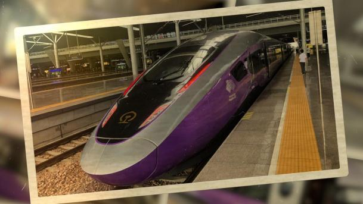
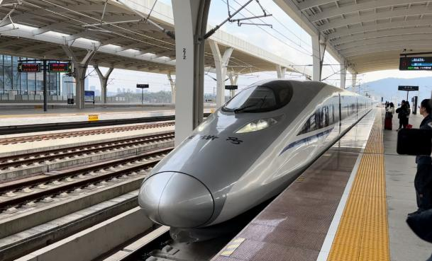
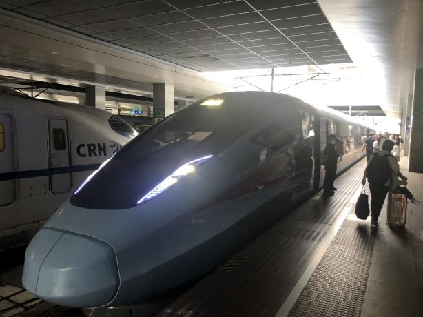
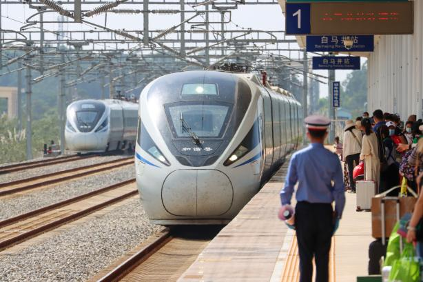
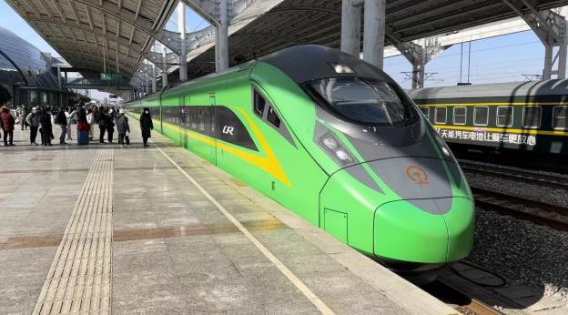
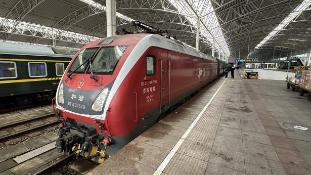
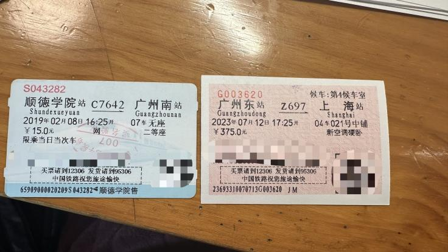
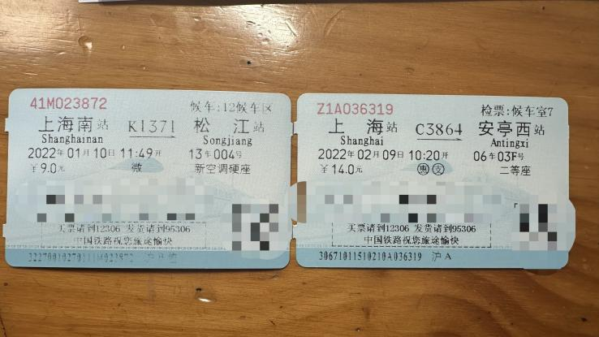

**1.基础知识 FAQ**

**Q1.1：铁路系统分为哪些列车种别？**

A1.1：种别根据字母开头来分，常见的基本上是 G、C、D、Z、T、K、Y 以及纯数字开头车次。（有的少见的没列出）
| 字母前缀 | 读法 | 含义 |
|----------|------|------|
| G | 高 | 高速动车组列车（最高速度在 250~350 之间） |
| C | 城 | 单一铁路局管内城际动车组列车 |
| D | 动 | 动车组列车（一般而言，D1~D499 是普速铁路动车，最高时速 160（但有例外），其余最高时速 250） |
| Z | 直 | 直达特快列车（最早是直达，现在是最高速度 160 的列车） |
| T | 特 | 特快列车（现在是最高速度 140 的列车） |
| K | 快 | 快速列车（现在是最高速度 120 的列车） |
| Y | 游 | 旅游列车 |
| 1001~5999 | 直接读数字 | 普快列车 |
| 6001~9999 | 直接读数字 | 普客列车 |

根据速度种别，一般有上述分类，而一般情况下 G、C、D（除了普速动车）三种列车，被俗称为高铁，其余的被俗称为火车。但是正确的速度分类其实是 G、C、D（D500 以上号段）为行走高速铁路的高速列车，其余均为行走普速铁路的普速列车（D1~D499 有少数行走高速铁路的特例）。在部分情况下，高速动车列车也会跑到市中心的老火车站进行上下客，方便乘客乘车。

在中国高铁系统中，存在两种命名：“和谐号”和“复兴号”。其中“和谐号”系中国高铁早期发展时通过消化吸收国外技术制造的动车组，目前是中国高速铁路列车运用的主力。“复兴号”是中国拥有自主知识产权的动车组列车，自 2017 年开始在全国铁路系统中铺开，此类列车能在京沪高速线、京广高速线、沪宁沿江等部分铁路线路上达到 350km/h 的时速，大大节省旅途时间。

行走 G9315 次列车的 CR400BF-Z 动力分散型动车组（摄于杭州东站）

行走 G1674 次列车的 CRH380AL 型动力分散型动车组（摄于台州站）

行走 D2922 的 CR300AF 动力分散型动车组（摄于上海站）

行走 C7444 的 CRH1A-A 型动力分散型动车组（由末日晴空学长摄于白马井站）

行走 C421 的 CR200J 动力集中型动车组（摄于南通站）

行走 K4666 的郑州局 HXD1D 机车 + 乌鲁木齐局 25G 车底（摄于上海站）

**Q1.2：上述列车哪种最快，哪种最慢？**

A1.2：一般情况下 G>D>Z>T>K>纯数字，C 字头视乎铁路运行条件最高时速 200~350 都有可能。Y 字头的列车速度需要根据具体的列车排图来决定，但一般是普速临时列车排图。

**Q1.3：上述列车哪种最贵，哪种最便宜？**

A1.3：根据全国铁路运价标准，普快价格大于普客，K、T、Z 价格大于普快，D 价格大于 K、T、Z，G 价格大于 D。但是在设计时速不大于 250 的铁路上，G 与 D 的执行票价相同。其余列车根据自己的速度等级来确定票价。由于国家赋予广州铁路集团一定的定价权限，导致广铁内列车的价格相比全国各地普遍偏贵。以上均为执行票价，实际票价往往会在执行票价上打折扣。

**Q1.4：火车有哪几种座位类型？**

A1.4：一般情况下有如下席别。

普速：无座、硬座、软座、硬卧、软卧、高级软卧。

高速：无座、二等座、一等座、特等座、商务座、动卧、高级动卧

在昆明前往丽江的双层普速卧铺火车上，甚至设置了“一人软包”（两张大床一张小床，实际上可以睡三个人（比如一对情侣和一个电灯泡）。

在无座的情况下，有空座位依旧可以坐下，但是如果有持有座位票的旅客需要就座时，必须让座。

需要注意的是，部分列车只贩售无座票（例如广珠城际、北京市郊铁路系统）

**Q1.5：我购买了车票，车票只显示了城市名字，应该在哪个车站坐车？到达的又是哪个车站？如何判断我在火车站还是高铁站坐车？**

A1.5：全国铁路标注 xx 就是 xx 站，标注 xx 东/南/西/北就是 xx 东/南/西/北站。火车票出发站叫什么名字，就去那个名字的车站坐车，火车票到达站叫什么名字，就在那个名字的车站下车，如果火车站没有方位词，那么说明这个车站就叫这个名字（比如说到达站是“广州”意思就是这个车到“广州站”而不是“广州南站”）若实在不清楚的打开地图搜索一下就行。另外，实际乘车过程中，不要刻意区分什么火车站高铁站，很多车站既有普通火车，也有高铁动车，他们本质上都是行走在相同轨道的铁路车辆，请大家不要刻意区分。

**EG1.5-1：左边这张到达位于广州城南的广州南站，右边这张从天河区的广州东站出发**

**

**

**EG1.5-2：左边这张从上海南边的上海南站出发，右边这张从新静安的新客站（也就是上海火车站）出发**

**

**

**EG1.5-3：教训如下图所示，这位小红书博主就因为错误地以为高速动车均在哈尔滨西站始发，因此跑到哈尔滨西站才发现该车在哈尔滨站开出**

**

**