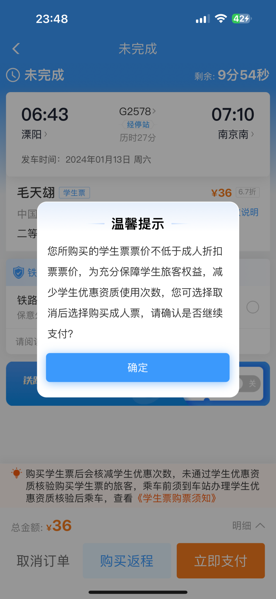
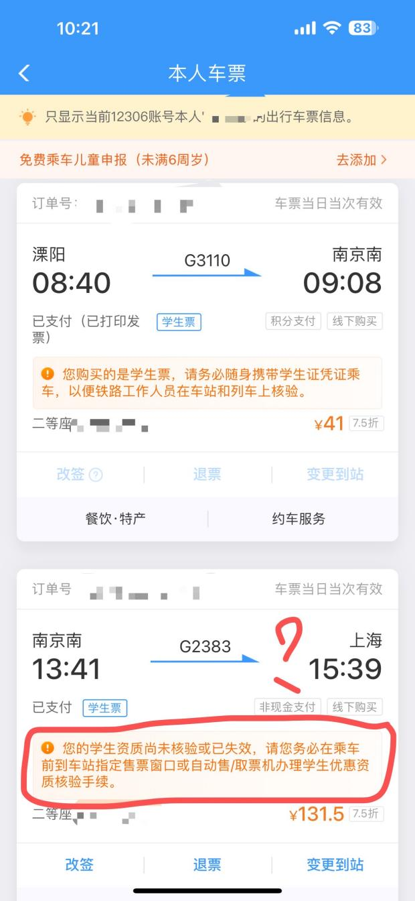
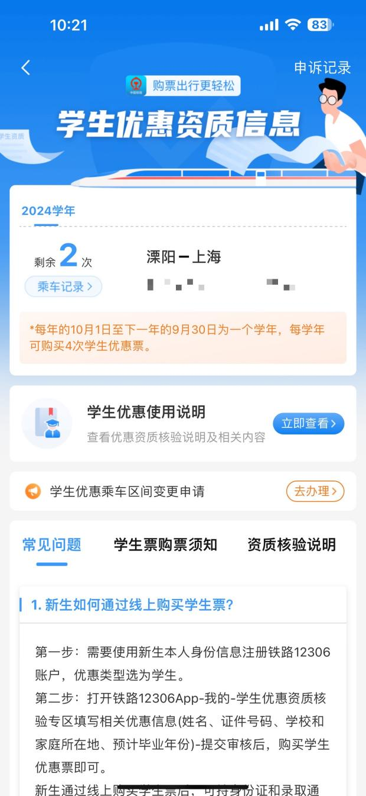
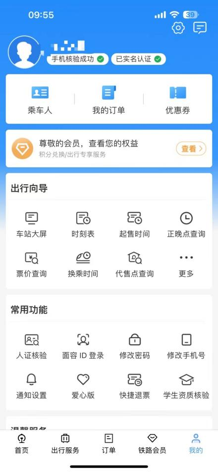
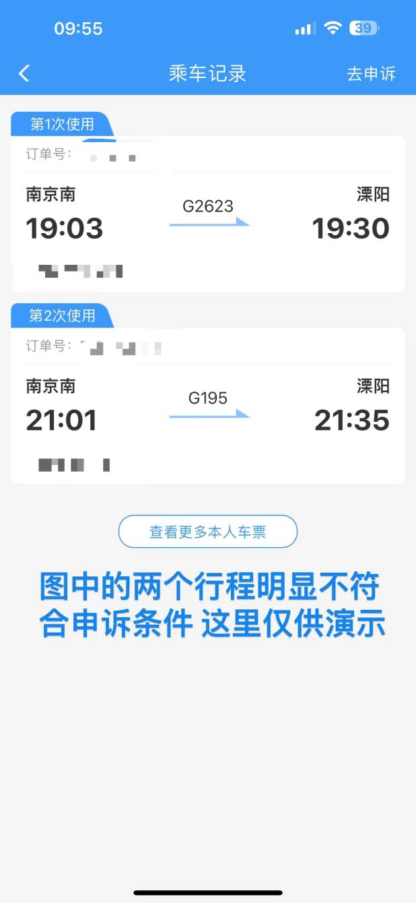
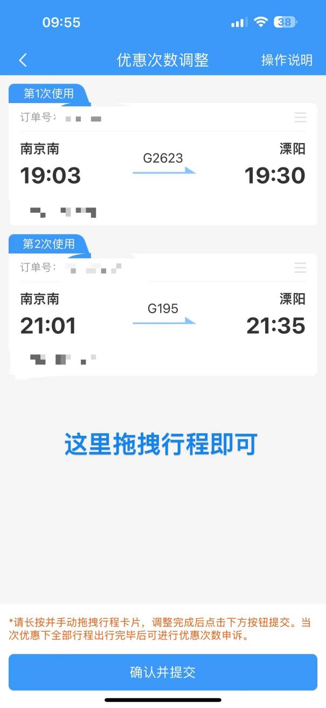
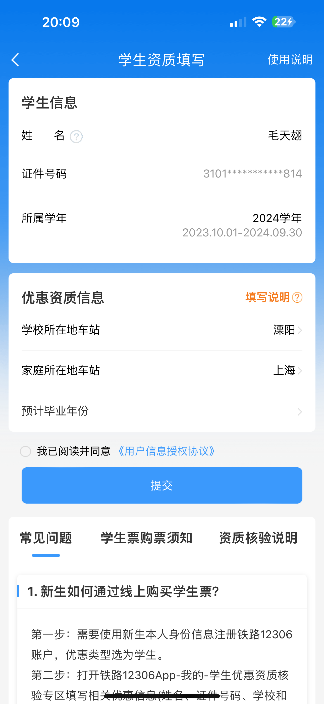

**4.学生票 FAQ**

::: tips
  铁路部门积极顺应学生旅客多样化的出行需求，继 8 月 1 日起全面实行学生旅客预约购票服务之后，进一步优化学生旅客购票出行优惠措施，学生旅客每学年（10 月 1 日至次年 9 月 30 日）4 次单程优惠票可随时使用，**优惠区间可根据家庭居住地至学校所在地调整设置**，动车组列车学生优惠票适用范围扩大至二等座、一等座和卧铺各席别，票价调整为按执行票价 7.5 折计算，学生旅客购票出行将更加灵活方便，得到更多实惠。目前，铁路 12306 科创中心正在组织系统优化测试，相关优惠车票预计将于 9 月 6 日开始发售。 

  一是学生优惠票可在每学年内随时使用。学生优惠票使用不再限于寒暑假期，可在每学年内随时使用。学生优惠票办理退票后将返还优惠次数。 

  二是优惠区间可根据家庭居住地至学校所在地调整设置。学生优惠票原适用区间为“家庭居住地至院校所在地”，优化调整后，****院校所在地须与学信网信息一致，家庭居住地可根据实际变动情况设置，修改次数不限，学生旅客可灵活安排行程。 **

  三是动车组列车学生优惠票适用范围扩大。动车组列车学生优惠票适用的席别范围由“仅限二等座”调整为“包括二等座、一等座和动车组卧铺各席别”，学生旅客将有更多的席别选择。普速旅客列车学生优惠票适用范围不变，仍为硬座、硬卧。 

  四是动车组列车学生优惠票按执行票价打折优惠。动车组列车学生优惠票计价规则由“公布票价的 7.5 折”调整为“执行票价的 7.5 折”，相当于“折上折”，最低折扣为公布票价 4 折，如某趟车次二等座的执行票价为公布票价的 8 折，学生优惠票将再打 7.5 折，相当于公布票价的 6 折，学生旅客将享受到更多优惠。普速旅客列车票价实行政府定价，学生优惠票价按现行政策规定执行、保持不变，硬座按票价的 5 折计算，硬卧加收硬卧与硬座的全价差额。 

  五是查验规则进一步优化。在校学生已通过优惠资质核验的，出行时铁路部门将不再查验学生证；未通过优惠资质核验的，仍需携带学生证乘车，铁路部门将依规查验学生证。入学新生可凭录取通知书线上、线下购买学生优惠票出行。 

  对学生购买火车票进一步优惠让利，是国铁企业积极顺应学生多样化的出行需求、关心关爱学生群体的重要举措，有利于学生享受更多票价优惠，方便就学、与家人团聚，拥有更好的出行体验。 

  近年来，铁路部门坚持以人民为中心的发展思想，推出了一系列保障学生群体出行的新服务新举措，优化学生优惠资质核验方式，提供线上、线下多渠道学生身份核验；实行学生预约购票服务，票额优先向学生群体倾斜；开行点对点“学生专列”，安排专人引导，便利学生旅客出行。 

       相关优惠车票预计将于 9 月 6 日开始发售，请学生旅客通过铁路 12306 网站、客户端、微信等渠道查询，或关注各地铁路部门发布的动态信息。 
:::

**Q4.1：学生票一年有几次使用次数？区间可以填写到哪？**

A4.1：四次，但是在中转符合规定的情况下，从家到学校即使中转 n 次也只扣减一次学生票次数。所填写的区间必须是家所在车站到学校，但是家所在车站可以不是户籍地址所在车站（入学前户籍和学校在同一个城市除外）。  
需要注意的是，12306APP 上的区间要和学生证上的区间保持一致，不然不能使用学生票。  
**新规不再查验学生证**

**Q4.2：我的学校到家没有直达车，请问我可以买中转的学生票吗？**

A4.2：可以，但是前提是从家到学校不能绕路，或者是需要与直达车路径保持一致，或者是要在合理路线范围之内。这种情况下只扣减一次学生票次数。

**Q4.3：我打算中转回家，需要如何购买中转车票？**

A4.3：直接分开购买两段就好，不需要使用 12306 的中转换乘功能。

**EG4.3：王同学家住在昆山，打算此次回家购买南京中转的车票。他于是在 12306 上分别搜索了溧阳 - 南京南和南京南 - 昆山南两段的车票并分别下单购买，两段均可以购买学生票。分开购买的车票在 12306 也被自动判定为联程车票。**

**Q4.4：我从学校到家需要中转一次，请问单程需要消耗两次学生票次数吗？**

A4.4：不会，如果是中转且路径合理的情况下，从学校回家，不论中转几次，只要每一段都包含在学生票优惠区间内，均可以购买学生票，且全程只扣减一次学生票次数，但是在非特殊标红的特定折返区间内折返时（也就是走回头路的情况）会多消耗一次次数。标红特殊折返区间内折返不会额外消耗次数。（查询特定标红的折返区间请至溧阳站阅读《中国铁路接算站示意图》，最典型的区间就是青岛站 - 青岛北站）

**Q4.5：中转的最短和最长时间限制是？**

A4.5:12306 设置的同站最短中转时长是 10 分钟，同城不同站最短中转时长是 40 分钟。根据笔者先前询问溧阳站的票务员可知，铁路相关部门对学生票中转时长并没有硬性规定，你完全可以在顺路的情况下，于一个城市玩两天，呆足够久再启程回家。但笔者建议，全部的行程最好不要超过 10 日。

**Q4.6：学生票一次次数中转最多几次？**

A4.6：你想转几次就转几次，但是要保证在合理路径。

**EG4.6：付同学家在库车，因此她的路线为溧阳 - 南京南 - 郑州东 - 西安 - 宝鸡 - 库车，前三段都为高速动车，最后一段是普速铁路列车，此种走法只需消耗一次学生票次数。**

**Q4.7：我想回家，想先去 A 城玩一圈然后再回家，请问两段都可以买学生票吗？**

A4.7：类似于 Q2 的规则，如果 A 城在你从学校回家的顺路或者合理路径上，就都可以买学生票，但是如果不满足上述条件，就只能买成人票

**EG4.7-1：王同学打算从溧阳回莱芜，但是在回家之前去需要去长沙玩几天再回家，由于长沙不在溧阳到莱芜的合理路线上，需要绕路前往，因此无法发售学生票。**

**EG4.7-2：笔者打算从溧阳回上海，但是在回家之前要去南京的宣同学家里住一晚，然后再去商场里参加一次随机宅舞再回沪，由于溧阳站到上海从南京中转在铁路上路径最短，因此学生票发售成功。**

**Q4.8：中转票的购买顺序是否影响学生票的次数扣减？学生票先买后段再买前段可以吗？**

A4.8：不影响，你完全可以先买后段再买前段。但是有些时候系统可能抽风导致了先买后段再买前段会多扣减学生票次数，此时可以按照 Q4.18 进行申诉。

**Q4.9：我家只有高铁站能通溧阳，但是我学生证的区间是我家火车站到溧阳，请问还可以买学生票吗？反过来也可以吗？（比如区间是长沙站到溧阳，但是直达车是长沙南去溧阳的情况）**

A4.9:12306 系统并未区分车站属性是高铁站或者火车站，况且，此种情况下，同一个城市市辖区内（一般不包括下辖县）的车站都会维护为同城枢纽车站。同城枢纽车站依然在学生票的购票区间范围。

**EG4.9：周同学的区间是溧阳 - 郴州西，他购买了溧阳 - 诸暨的动车和诸暨 - 郴州的普速火车，虽然终到站是郴州站而不是郴州西站，他依然可以买学生票。**

**Q4.10：在中转的时候，请问必须在同站中转吗？不同站会多扣减一次学生票次数吗？**

A4.10：不需要，只要是维护为同城枢纽的车站，均可以互相换乘，不扣额外学生票次数。但是如果不是同城枢纽，那就会被多扣一次

**EG4.10：陆同学家在射阳，学生票区间为盐城 - 溧阳。某次回家时，她购买的车票为溧阳 - 南京南和南京 - 盐城两段车票，其中在南京市需要跨站换乘，在行程结束后，此行程只扣去了她一次学生票次数。**

**Q4.11：为什么我买学生票的时候，12306 会推荐我买成人票？**

**

**

A4.11：火车票票价分为公布票价和执行票价，执行票价有时可能会有相较于公布票价的折扣。与此同时，学生票的折扣是高铁公布票价的 75 折，普速公布票价的 5 折，因此如果执行票价折扣大于学生票折扣，这个时候学生票就不合算了，此时 12306 就会弹窗推荐，以防学生多用次数。

**注：自 2025 年 9 月 6 日后，学生票按执行票价的 75 折计算优惠。**

**Q4.12：海南铁路轮渡和烟大铁路轮渡是否发售学生票？**

A4.12：经过海南铁路轮渡的旅客列车发售学生票，但是两个轮渡线散客票本身不通过 12306 发售学生票。如果要购买船学生票请咨询船官网。如果你的区间是溧阳 - 大连，那么不能买去烟台的学生票。

**Q4.13：假如乘坐直达车从溧阳去北京南，在北京南下车，但是区间填写的是溧阳 - 天津南，于 12306 成功购买学生票，请问还能乘坐吗？**

A4.13：需要在车上补票补天津南 - 北京全价

**Q4.14：假如乘坐直达车从溧阳去天津南，购买了溧阳 - 北京南的车票，但是区间填写的是溧阳 - 天津南，于 12306 成功购买学生票，请问还能乘坐吗？**

A4.14：目前这个情况尚无定论。根据小红书上不同路局的大学生的实操结果来看，一般是按照实际下车地点计算。如果你在天津下车，那么不用车上补票。但是如果车内查票的时候，有可能在你申明了下车站的情况也需要补票。

**Q4.15：买了学生票，忘带学生证了怎么办？**

A4.15：请注意，购买学生票乘坐列车必须携带学生证原件（不得为照片或者视频）！且原件上必须盖有院校公章！如果被查到未携带学生证购买学生票乘车的，列车员可以要求你补票到执行票价，次数退还。~~若要退钱，需要开具客运记录，并在乘车日后 30 天内前往事发列车停靠的任一车站退费。若无客运记录，在部分路局的售票窗口无法退款。~~
该规定已废止，不再查验学生证。

**EG4.15-1 张同学于 2 月份从日照回溧阳，在连云港乘车到南京时因为忘记携带学生证导致车上被查票时补票。补票时未开具客运记录。事后，他尝试和笔者一起前往溧阳站进行退款操作，但被告知只能在补票事发列车的途径车站办理退费。后续他前往南京游玩时在南京南站试图退款，但因为售票员要求出示客运记录，导致了该款项无法退回。**

**EG4.15-2 小 C 同学常住上海，在山师大读书。由于 cosplay 时将学生证作为道具丢出导致学生证未在返校时随身携带，在乘车时被查票并要求补票。后续她前往市区参与活动时路过济南西站，凭借身份证和学生证原件成功退款。**

**Q4.16：忘带身份证了，使用临时身份证明乘车，怎么办？**

A4.16：若学生证没有丢失，在持有临时身份证明的情况下不影响学生票的正常使用，无需补票。但是如果你学生证丢失了，就乖乖补票吧。

**Q4.17：我已经核验完成学生票优惠资质了，为什么买了学生票之后还说我没有通过核验？**

**

**

A4.17：分开买的联程中转确实会出现这样的情况，不过，问题不大，到车站售票机点击“优惠资质绑定”花一分钟时间重新绑定就行。

**Q4.18：请问 12306 抽风了，导致我分开买的回家中转车票被计入了两次，该如何是好？**

A4.18：这种时候就需要用到申诉了，首先你要有 12306APP 方法如下：

先找到 12306APP 的“我的”界面

看到这个界面，点击“学生资质核验”，进入如下界面：

看到这个界面，点击“乘车记录”

看到这个界面点击右上角的“去申诉”

拖拽行程到一起即可（不可以成人票和学生票混用！！！！！！）

当然，绕路学生票不会被整合入一起。

如果上述方法无法申诉成功，你还可以拨打 12306 客服电话来进行申诉。

**Q4.19 乘务员错误理解学生票区间，导致明明符合乘车区间却被错误补票，怎么补救？**

A4.19 请一定要让该乘务员或者列车长开具客运记录！并且记住该乘务员的编号！列车到站后，拨打 12306 电话投诉该乘务员。乘车结束后 30 日内，请携带学生证原件、身份证原件和客运记录原件，前往列车经过车站的窗口进行退款。

**Q4.20 我想修改乘车区间，该如何修改？**

A4.20 目前乘车区间以学生证纸质记载为准，并加盖院校公章后方可使用。因此，请先到师生服务大厅办理学生证区间变更和补发手续，学生证内页需要重新打印，并重新提供一寸照片供粘贴。这个过程可能需要一段时间。学生证内页更新完成后，需要加盖院校公章和注册章。在以上手续完成后，再前往 12306APP 找到“我的 - 学生优惠资质核验 - 学生优惠乘车区间变更申请”重新填写学生票区间，区间均需精确到车站。

