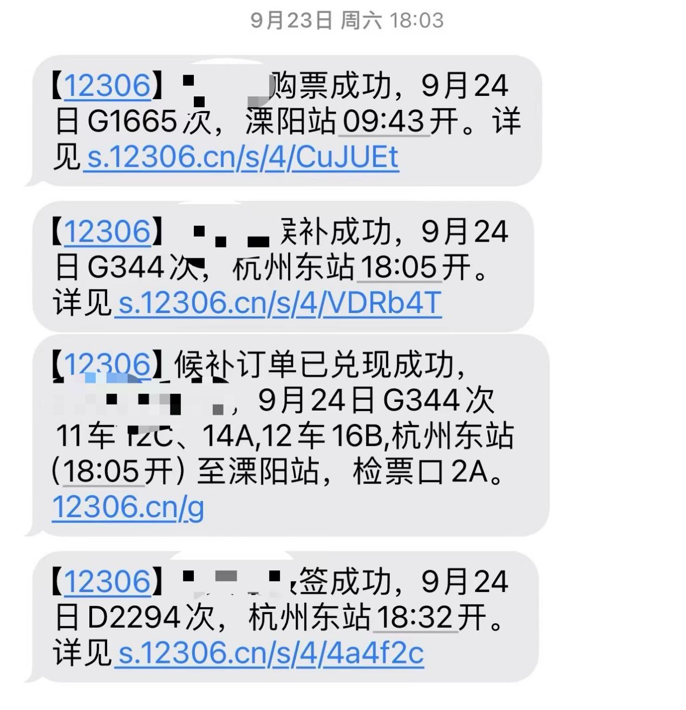
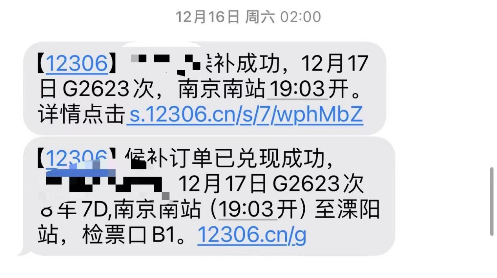
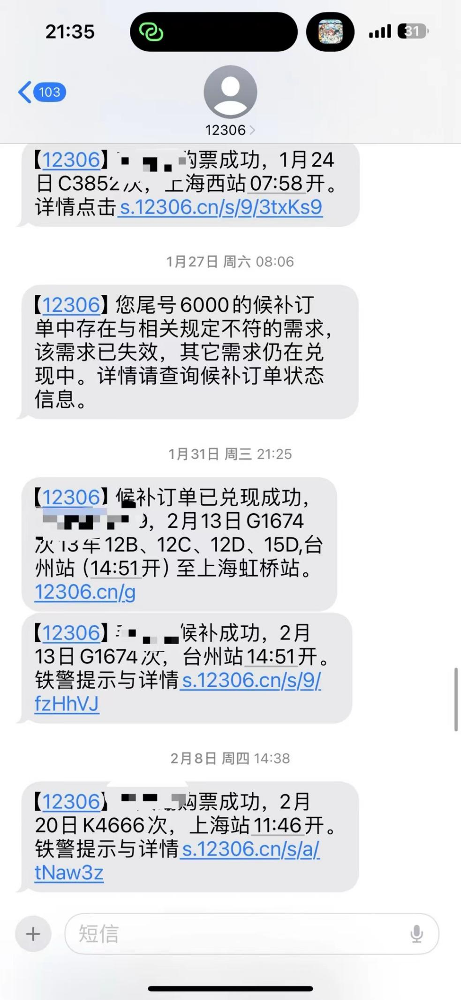
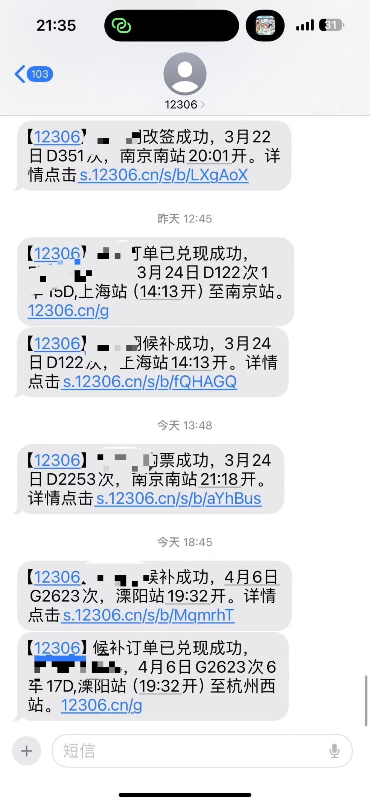
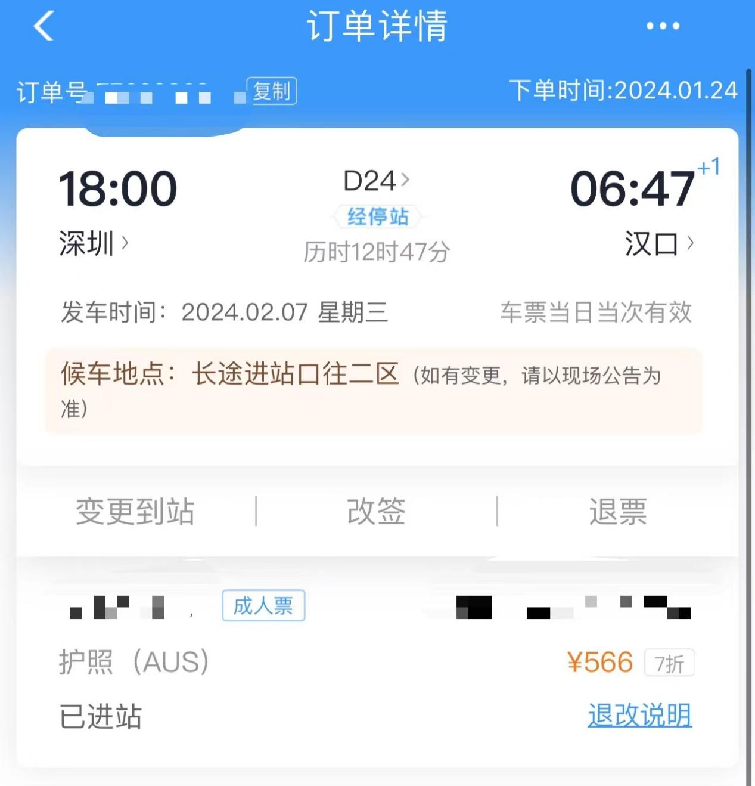
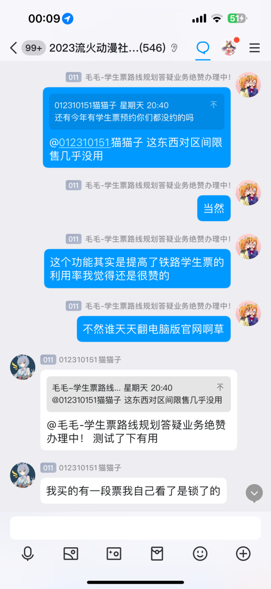
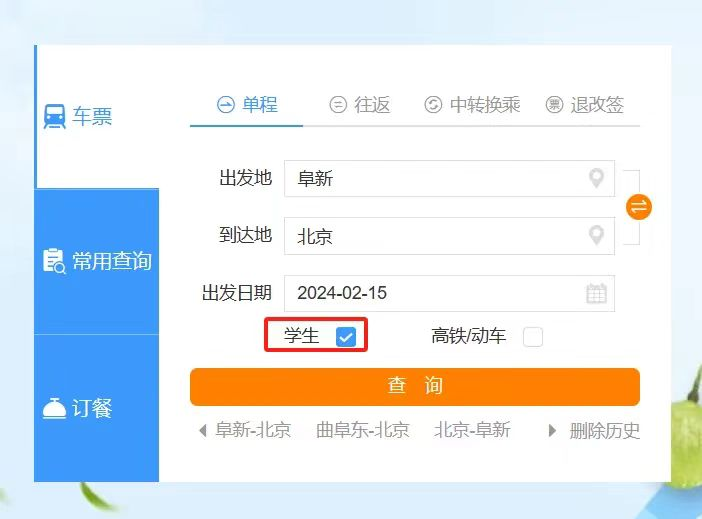
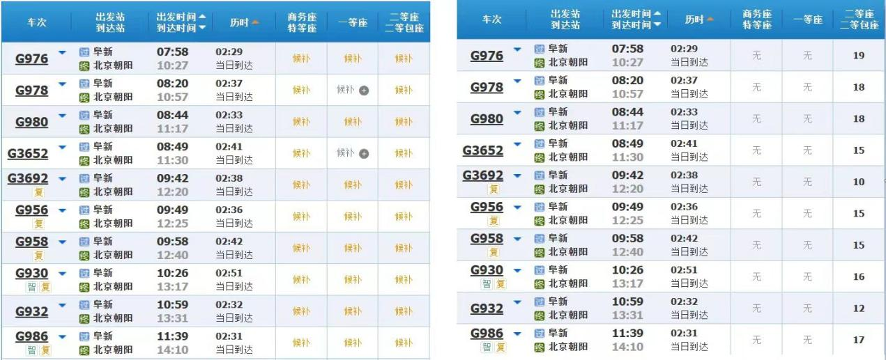

**5.抢票攻略**

**很多同学会抱怨“为什么我的列车开售就候补了！”，亦或者是“抢不到根本抢不到！”，这里给大家一些攻略，祝大家早日抢到自己心仪的车票！**

5.1搞清放票逻辑，赶早不如赶巧

每一班车都有属于自己独特的放票逻辑，此类放票逻辑根据列车始发站的铁路路局不同而具有不同的特点。比如说京局、哈尔滨局喜欢把票全留给始发站，上海局喜欢提前7、3、2、1天慢慢放区间票，广铁喜欢把车票憋到开车前24小时才解除限售，南昌局喜欢在刚开售时突然全部放出车票，等到当日其他车票开售之后就限售该班车车票，等等等等......而为了搞懂每一种放票模式，建议各位同学对一列特定车次进行横向对比（即在同样时刻查询的情况下，比较于不同日期发车的同一班次的售票状况）及纵向对比（即在开车前的不同日期、不同小时比较同一天同班车的售票情况），进而形成对特定某一班车的售票模式认知。

下面，笔者为大家整理了几种典型的放票逻辑。

逻辑一：开售全放型

此种逻辑一般适用于某些管内城际铁路的线路内车次，或者是绝大多数车次的全程票，或者是一站直达车的票。此类车次一开售便会毫无保留地将所有的车票均放出。

对应策略：牢记开售时间，勿输在起跑线。

中国铁路的各大车站都会在每天的的某个时刻发售15天后的车票具体的时刻信息因发车车站而异。比如南京站、南京南站是早上8点开售，上海虹桥站13：30开售，上海站14：30开售。根据开售时间抢购车票对部分不限售车次成功率会比较高。

**EG5.1.1:G7008（上海-南京）、D24（深圳-汉口）**

逻辑2：不抛弃，不放弃，先开售等后开售

由于途径车站的开售时间不一样，且每列车给每个区段预留票额不一，因此在部分情况下（尤其是先开售车站和后开售车站共用同一个票额的情况）先售票的车站会出现“开售即候补”的状况，等待后续车站开售后一起放票。

对应策略：掉皮掉肉不掉队，跟着末售站准会

这种情况你需要把列车沿途各站的开售时间均记牢，在最晚开售的车站开售后再登陆官网抢票。方法同策略1。

**EG5.1.2：K2666（苏州-临汾）、G7587（徐州东-苍南）**

逻辑3：全程急着卖，中间慢慢卖

中国铁路的有部分车次均采取此类策略放票。（一般是全程车站不是不给卖而是放少量的票（一般情况下对应的区间票无论采用何种排列组合均只有20~50张票的余量），等到开车前7、3、2、1天（开车当天也会调整票额）再逐步放出对应区间车票（一般情况此类放票模式会在开车前2天将大部分全程车票下沉到区间）

对应策略：莫急莫慌莫害怕，七三二一不要忘

可以在开车前7、3、2、1天再去看看余票信息，必要时可以使用候补购票。

**EG5.1.3：G2386（宜昌东-上海）、D2246（杭州东-重庆北）**

逻辑4：爷硬气，爷就是一毛不拔！

此种逻辑下，除了始发站到各地的票额有余票之外，其余区段均一张票不放，有时甚至只放全程票。直到开车前48h、24h甚至最极限的还有6h（以北京局为甚）才会将全程票额下沉到区间。而候补的情况下，只要候补的n张订单可以凑出一个全程，那就候补出单。（比如一个从A到E的车，经停BCD三站，那么甲候补C-E，乙候补A-B，丙候补B-C，当候补下单齐全之后，甲乙丙三人会同时候补成功）

对应策略：只要看全程车对应席位显示“有票”就放心大胆候补即可，但是在繁忙时期建议确认车次全程票的售卖情况，如果是诸如Z114（哈尔滨-海口）之类的客流爆炸车次不建议这么干。

**EG5.1.4：Z114（哈尔滨-海口）、G401（北京西-昆明南）、G79（北京西-香港西九龙）**

逻辑5：昙花一现

此种逻辑下，列车将会在所有车站开售（或者始发车站开售）之后不久将全部车票下放至区间，再在某一个时间点内将所有放出来的票全部限售，中间随机时刻出票直到开车前2天。而候补的情况下，类似于逻辑4，只要候补的n张订单可以凑出一个全程，那就候补出单。

对应策略：研究此车次最有可能在一天内某个时间段放票，在放票的时候盯着抢，另外如果你比较懒，用候补也很方便。

**EG5.1.5：G1674（厦门北-上海虹桥）**

逻辑6：票额分配

这一种逻辑仅限于上海铁路局管内的车次（大致可以理解为沪苏浙皖内的铁路）。由于上海局管理范围很大，且有部分车次为了兼顾沿途客流，会绕行很多不同的铁路，因此即使是管内车次也能达到好几个小时的长途。为了确保中间的小站有充足的票额前往大城市或者大站中转，因此在同一天，如果某一区段可供平行替代的车次很多，就不放票，如果某一区段可供平行替代的车次很少，就多放票。需要注意的是，这种放票逻辑下全程可能不放票，只放区间票。

**EG5.1.6 G7391（上海虹桥-杭州-南京南），这列车全程上海虹桥-南京南禁售，而将票额分配到了沿途诸如嘉兴南、宜兴、溧阳等小站，以满足诸如“上海虹桥-溧阳”、“嘉兴南-湖州”、“嘉善南-南京南”等不同排列组合下的出行需求。**

**C3197（南京-响水县），在同样是南京前往响水县的路途上，根据客流分布，放票时优先照顾从南京、扬州、宝应、建湖等大小车站前往盐城市境内各大车站和南京-扬州东区间，对于南京-镇江、南京-宝应和扬州-宝应等替代车次很多的区段没有预留票额。这样的方式不仅不会一刀切限制全程车票，还能最大程度确保沿途乘客出行。**

逻辑7：一刀切就是爽

此种逻辑下，包括始发站到终到站的全程票额都是售罄且无法候补状态，列车票额被完全锁票。

对应策略：静待花开，或者干脆不要去坐它

**EG5.1.7：G3110（杭州西-郑州东）（此车在放寒假前的一段时间锁票到开车前5天）**

一般地，对应每班列车的放票逻辑是以上6种情况的杂合体，实操还是需要具体问题具体分析。且如果不算部分阴间的放票模式的话，“候补购票”这一招几乎贯穿始终。

附：笔者候补成功合集

5.2勿用三方软件，官方优先最高

现在市面上有太多的第三方软件（比如某猪、某程、某哪儿之类的）也在其页面中添加了“12306服务”，虽然看似你直接从平台购买到了火车票，但是实际上本质还是第三方平台作为中间商在帮你完成刷票、代抢的操作。这种情况下优先级不如12306的候补。部分平台的高速抢票、余票监控渠道其实就是通过12306的候补来实现的。另外，12306最近一直在使用代码阻拦自动抢票系统，其在开售后便会直接过滤自动化抢票订单，如果使用第三方软件购票只会让你购票速度变得更慢。

**EG5.2：笔者曾经帮翟同学（一位澳籍华人）抢票的过程中，翟同学用某程抢票，我用购票信息预填来抢票，在抢同一班D24时，他开到极速抢票也没有笔者本人用购票信息预填来的快。**

最终我利用“购票信息预填”助我们开售秒杀，“候补购票”帮我们官方兜底票额，手机改签退票给了我们更多的灵活处理行程的选择。至今（2024.2.15）为止，笔者已经在短短一个学期内成功候补到6次车票订单。

5.3巧妙利用“大学生整治各大行业”的优势

在12306有一个界面是“学生、务工人员春运预约订票专区”在该专区内，只要是在时间范围内开售的车票能够办理预约，并在开售前就能告知预约结果。该功能可以规避一部分区间限售，使部分长途车通过学生票买短途票成为了可能。

**EG5.3：南航流火动漫社猫猫子同学成功利用学生票预约，绕过区间限售，购买到了回南京的火车票。**

5.4电脑版官网可能有意外惊喜

铁路部门为学生专门预留了部分票额。同学们可以进入12306电脑版官网，在首页选择“学生”一项，即可看到学生票的单独票额。在一部分情况下，铁路部门会专门留票给学生使用，在全部显示无票的情况下，学生票的“有票”将会成为你回学校最温暖的依靠。

（懒得翻图了，这里直接盗用一下北大铁协的图片吧）

5.5换一种冷门的交通方式

上海长途客运总站总经理肖峰说：“客流最高峰的时候，总站日发班次达到1280班，工作人员有300多人。现在日发班次约200班，工作人员在60人左右。”目前，长途大巴在国内呈不断衰落之势。但这反映了长途大巴的车票越来越好买的事实。

溧阳的高铁往西北只能从南京接入全国铁路网，往东南从湖州和杭州组网，导致了溧阳的高铁盲区较多。因此，溧阳也有不少大巴去跑高铁盲区生意。目前，溧阳站最多的班次还是溧阳-常州、溧阳-武进（湖塘）、溧阳-无锡、溧阳-苏州、溧阳-上海。其他班线有溧阳-盐城、溧阳-泰州、溧阳-芜湖等。此外，溧阳也有部分大巴公司承接过路车生意，同学可以通过联系大巴公司或者是大巴司机的电话，来确定上车地点。例如有一条班线是杭州至南阳，如果找到了司机师傅的随车电话，那么可以通过拨打电话预约的方式，确定上车地点，在溧阳上车前往南阳。车费上车时付款。

另外，如果溧阳的通达度不够，可以搜索附近常州、南京、武进（湖塘）、金坛等地的大巴班次，能够找到通往更多江苏苏北、安徽、山东乃至河南的长途汽车班次，并且价格实惠。

大巴不限制行李额度，对携带很多东西的同学非常友好。

**EG5：瑟扣酱家住南阳，2024年寒假结束返校时因为未成功购买到高铁票，于是去客运站购买了从南阳去溧阳的大巴票，并于2月24日启程。由于冻雨原因，各处高铁均有不同程度晚点或停运，她所乘坐的大巴在延迟一小时后，于11：00成功出发，并且在22：00成功抵达溧阳。**
