**高**

**等**

**票**

**学**

**目录**

0.作者介绍 4

1.基础知识FAQ 5

Q1.1：铁路列车种别 5

Q1.2：列车速度等级 8

Q1.3：列车票价等级 8

Q1.4：列车席别类型 8

Q1.5：乘降车站辨析 9

2.购票FAQ 11

Q2.1：‘购票地点 11

Q2.2：支付方式 12

Q2.3：窗口购票 12

Q2.4：12306APP购票 13

Q2.5：电话订票 13

Q2.6：预售期 13

Q2.7：候补 13

Q2.8：改签 14

Q2.9：退票 16

Q2.10：变更到站 16

Q2.11：退票费 17

Q2.12：改签费 18

Q2.13：领取报销凭证 20

Q2.14：常旅客计划 21

Q2.15：积分概论 21

Q2.16：因故停运处理 25

Q2.17：车内补票 26

3.乘车TIPS 27

3.1大站出发乘车流程 27

3.2规模相对小站出发乘车流程 32

3.3规模极小车站出发乘车流程. 36

3.4超简易车站乘车流程 39

3.5 中转换乘 39

3.6二次安检 42

3.7没带身份证开取临时身份证明流程 44

3.8安检查出违禁品被扣的补救方法 47

3.9坐过站补救办法 47

3.10因为列车晚点赶不上后续列车补救办法 49

4.学生票FAQ 51

Q4.1：学生票次数 51

Q4.2：学生票中转认定 51

Q4.3：中转车票购买方法 51

Q4.4：学生票次数扣减规则 52

Q4.5：中转的最短和最长时间限制 52

Q4.6：中转次数限制 52

Q4.7：合理利用学生票进行中转旅游 53

Q4.8：中转票的购买顺序 53

Q4.9：同城异站区间认定 53

Q4.10：中转不一定同站 54

Q4.11：学生票折扣 54

Q4.12：海南铁路轮渡和烟大铁路轮渡 55

Q4.13：记载区间比实际乘坐区间短的处理办法 55

Q4.14：记载区间与实际乘坐区间一致但购票区间比记载区间长的处理办法 55

Q4.15：忘带学生证了 55

Q4.16：使用临时身份证明 56

Q4.17：二次核验 56

Q4.18：中转异常申诉 57

Q4.19被错误补票 61

Q4.20修改乘车区间 62

5.抢票攻略 62

5.1搞清放票逻辑，赶早不如赶巧 63

5.2勿用三方软件，官方优先最高 70

5.3巧妙利用“大学生整治各大行业”的优势 71

5.4电脑版官网可能有意外惊喜 73

5.5换一种冷门的交通方式 74

致谢 75

**0.作者介绍**

**作者：坐过18次沪松专线0次莲松专线的愚蠢的毛毛弟弟**

**常居地点：上海铁路局上海站、上海铁路局苏州站、上海铁路局常州站武进站、上海铁路局南京站溧阳站。**

**专业：民航学院交通运输（机场运行与管理（中外合作办学））**

**爱好：研究各类公共交通，沉迷于以Love Live为首的部分二次元企划**

**特性：ENFP与ESTJ摆动人、溧阳站停止检票前0秒极限赶车人、G2578/D2253（往返宁溧之间的首班/末班车）狂热爱好者、南京南站踩点带师、大巴仙人（不是）、手指口呼发烧友、沉迷打call无法自拔。**

**作者的话：如今，随着我国交通系统的不断发展，我们的出行越来越便捷。但是由于铁路系统化科普教育的缺失，许多同学到上大学之前都未曾了解过中国铁路列车的乘车流程。在笔者入读南航之后，便发现许多同学对中国铁路的基本认知不足，或者是对学生票区间的理解有一定偏差，导致了自己或者是在根本不了解乘车流程、或者是在大型车站乘车时不知所措、又或者是没有办法有效利用学生票这一福利。为此，笔者写作此文，以方便各位新生或者是不太了解乘车过程的同学享受交通出行带来的便利。**

**2.购票FAQ**

**Q2.1：我现在想坐火车，在哪里买票？**

A2.1：中国铁路提供了非常多样化的购票方式，从线上到线下有很多不同的方案。

如果你选择线下买票，你可以选择在火车站的营业时间去任何一个火车站，找到售票窗口或者自动售票机；你也可以选择去寻找城市内的野生售票机购买火车票（比如延吉机场便摆放了一台铁路售票机）；如果你懒得去火车站，你也可以寻找你家附近的火车票代售点购买车票。

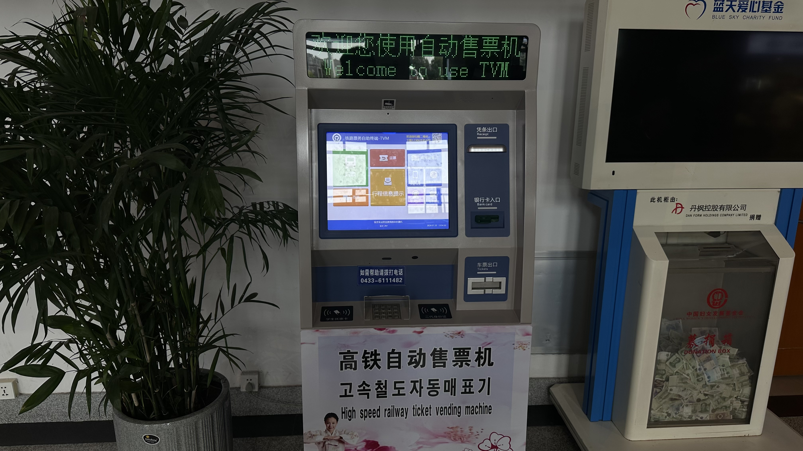

如果你选择线上买票，你可以下载12306APP，你也可以在电脑上12306官网买票，千万不要使用携程、飞猪、智行等第三方软件！（后文会解释原因）

还有一种非常复古的买票方案：电话订票。这种情况下，请拨打95105105，输入车次号，根据电话提示预定对应车票，并在规定时间内前往车站窗口或者代售点窗口，凭有效证件支付车费。

**Q2.2：购票后的支付方式有哪些？**

A2.2：车站窗口购票支持电子扫码支付、现金支付、银行卡支付、12306乘车积分支付等几乎所有支付方式；代售点购票支持电子扫码支付、现金支付（部分支持银行卡）；自动售票机购票支持微信支付宝（部分支持现金）；电话订票线下取票支持车站窗口支付的所有方式；12306网上买票支持银行转账、微信支付宝、积分等方式支付，但是不能现金。

**Q2.3：如何找售票窗口购买车票？**

A2.3：首先你要到火车站或者是代售点，给出你的身份证（或者护照、港澳通行证等有效证件），报出日期、始发站、终到站、车次、席别、想要的座位号等信息（日期、始发站、终到站是必需的，其余的可以根据自己的需求或者喜好选择性报出），售票员会帮你找出来车次，然后让你付款。付款之后，会给你出一张“行程信息提示”（白色的小票纸头），请注意这张行程信息提示并不是乘车凭证，你可以无需保管，只需凭各类有效身份证件乘车即可。

**Q2.4：如何在12306APP买火车票？**

A2.4：首先你需要在应用市场下载12306APP，或者打开电脑版12306官网。再在界面中输入车站、日期等信息，随后进入车次选择页面挑选合适的车次，点进去选择席位乘车人付款就可以了。在注册12306账号时可能会需要你身份信息核验，这时请至火车站窗口解决。如果你选择电脑版官网购票，流程差不多。

**Q2.5：如何电话订购火车票？**

A2.5：拨打95105105后按照语音提示操作即可，但是需要你对各大城市的电话区号非常熟悉。同时，电话订票后要去火车站或者代售点窗口线下付款。这一种订票方式对于开学前订购学生票非常适合。

**Q2.6：请问我最早可以买几天后的火车票？**

A2.6：火车票预售期15日。

**Q2.7：12306APP的候补是什么意思？**

A2.7：顾名思义，候补的意思就是先填写信息并付款，等到该路段有票额放出（比如退票和锁票解除）时再直接占用。此功能可以秒杀绝大多数第三方软件的抢票脚本或者是代抢。在实际使用候补时，可以一次性候补60个车次，也可以选择接受新增车次（意思是如果新开了临时列车也可以直接候补兑现）。支付款项按照候补车次的最高票价收取，在实际候补成功时，多余的款项将无手续费退款。候补下单时可以选择候补结束的时间。笔者室友宣同学个人建议如果需要使用候补功能，请尽量在同一个候补订单中选择满你想要的所有车次，以免二次付款。如果一个候补订单里包括了多个乘车人，则虽然系统会分别计算候补，但是只有四个人全部候补兑现后，才会显示候补兑现成功的结果页面，并短信通知。目前铁路部门会根据候补的数量增加车厢，或者是调整放票额度，以确保能满足看得见的出行需求。**

**

**EG2.7：笔者计划前往台州旅游，去程车票很好买，回程车票已知都是售罄状态，因此笔者通过候补模式候补了全家四个人同行从台州回到上海的车票，并成功在开售第三天兑现。

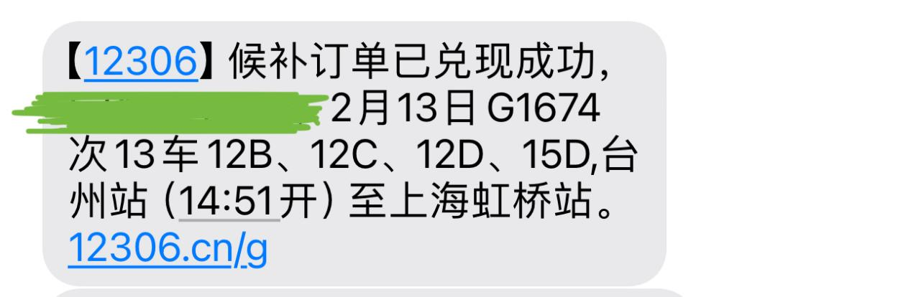

**

**Q2.8：我突然有事，想要更改车票日期，请问如何操作？**

A2.8：改签只允许逐次单张办理。12306手机APP、12306官网可以在“本人车票”页面操作改签，自助机有“改签”按钮，以上两种方法在点击改签按钮之后，均需要手动选择你想要改的车次。人工窗口可以直接和窗口工作人员报出日期、始发站、终到站、车次、席别、想要的座位号等信息（日期、始发站、终到站是必需的，其余的可以根据自己的需求或者喜好选择性报出）来改签。需要注意的是。改签的始发站和终到站必须相同（或者为同城枢纽车站）（同城枢纽车站：此概念可以通俗的理解为你在12306搜A1站到M站的票，在结果页面自动蹦出A1、A2、A3、...An（n>2）到M站的票，那么全体{Ai |i≤n}就被称作同城枢纽车站。但是如果一个地级市有A1、A2、A3...An、An+1...Aj(j>n)这些车站，且搜索A1站到M站的票时，只自动蹦出了A1、A2、A3、...An（n>2）到M站的票，而没有An+1...Aj(j>n)这些车站到M站的票，那么{Ai|n<i<j}这些车站即使和{Ai |i≤n}同属于一个地级市，也不能算作同城枢纽车站。下图的例子中，常州市下辖的常州站、常州北站、武进站、戚墅堰站、金坛站都属于同城枢纽车站，但溧阳站不属于常州市范围内同城枢纽车站）

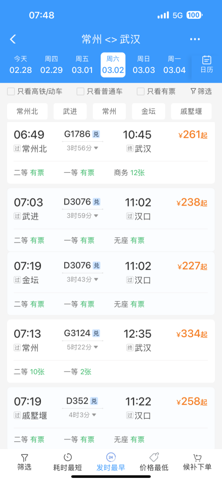

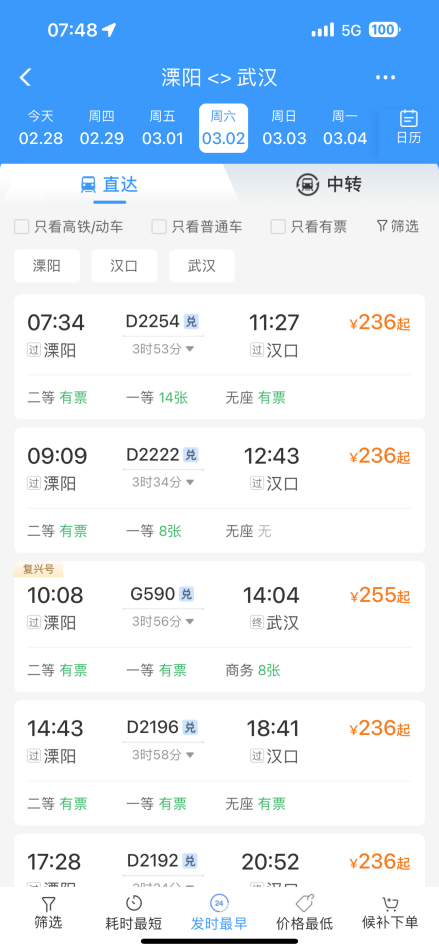

需要注意的是，如果你领取了报销凭证，只能在线下人工窗口办理改签。

**Q2.9：我确定我已经不坐火车了，请问如何退票？**

A2.9：退票只允许逐次单张办理。12306手机APP、12306官网可以在“本人车票”页面操作退票，部分自助机有“退票”按钮，以上两种方法在点击退票按钮之后，均需要手动选择你想要退的车次。人工窗口也可以直接退票。需要注意的是，如果你领取了报销凭证，或者是使用现金购票的，在线上退票后，需要在180日内持有证件到车站窗口报道，领取了报销凭证的应交回报销凭证。

**Q2.10：我想换一个到达车站，请问如何操作？**

A2.10：此时可以办理“变更到站”。变更到站业务只允许逐次单张办理。12306手机APP、12306官网可以在“本人车票”页面操作变更到站，点击变更到站按钮之后，需要先输入新的目的地，再手动选择你想要改的车次。人工窗口可以直接和窗口工作人员报出日期、始发站、终到站、车次、席别、想要的座位号等信息（日期、始发站、终到站是必需的，其余的可以根据自己的需求或者喜好选择性报出）来变更到站。变更到站只允许在开车前48小时以上的时刻办理。

**Q2.11：退票费如何收取？**

A2.11：开车前7天以上不收取，开车前7天到48小时收取5%，开车前48小时到24小时收取10%，开车前24h以内收取20%。若车票在原车次开车不足8天时改签到原车次开车后8天及以上，并在新车次开车前8天及以上退票的，按照5%退票费收取。春运期间，不论何时退票，只要是自愿退票的，一律按照金额20%收取退票费。

**EG2.11：顾同学（化名）原计划于12月2日从天目湖校区前往将军路校区观看霜月夜表演，但由于计划调整，顾同学转用别的交通方式前往南京。她于11月26日申请退票，距离开车还有6天，退款金额为36元+45元来回车费扣除5%退票费，最终实际到账76.5元。**

**

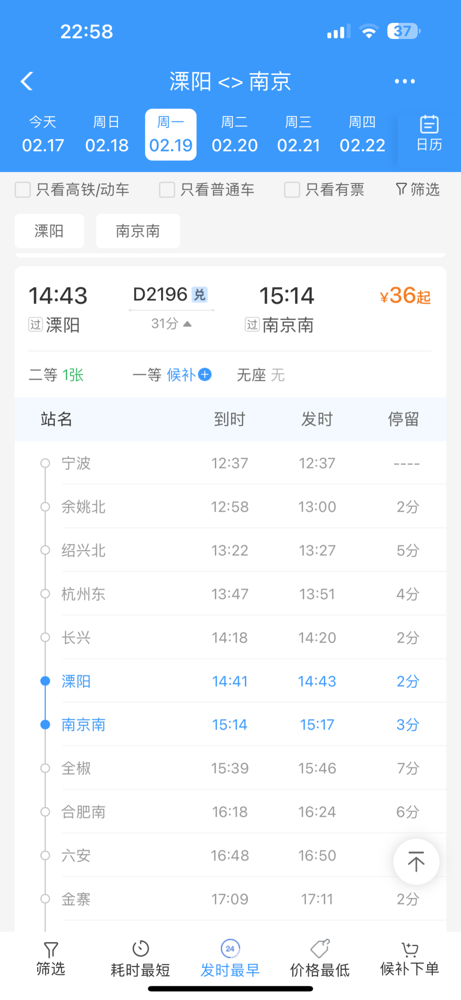

****

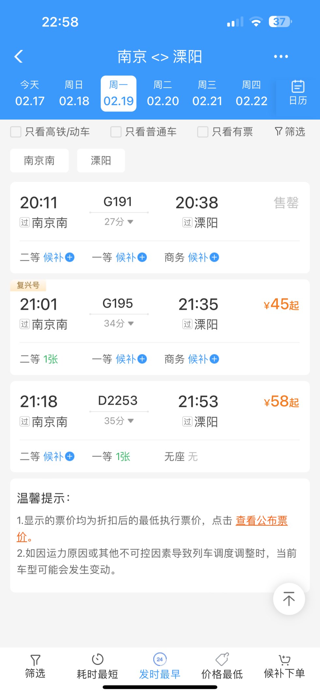

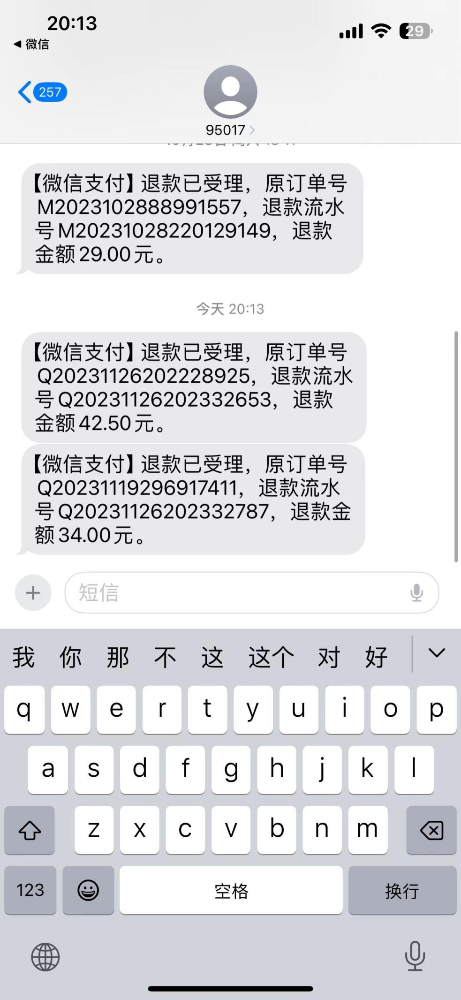

**

**Q2.12：改签费如何收取？**

A2.12：开车前48小时以上改签时，或开车前不足48小时改签票面乘车日期及以前的列车时，以及开车后在当日24时之前改签当日其他列车时，均不收改签费。开车前24小时以上、不足48小时，改签票面乘车日期之后的列车时，按改签前后低票价车票票面价格的5%计；开车前不足24 小时，改签票面乘车日期之后的列车时，按改签前后低票价车票票面价格的15%计；开车后在当日24时之前，改签次日及以后列车时，按改签前后低票价车票票面价格的40% 计。在开车后次日及之后日期，即使有空位也无法改签，改签过的车票无法改签。

**EG2.12-1：笔者于2024年2月17日上午10：05于上海火车站售票窗口办理改签业务，将所购买的2月19日K4666次列车改为2月21日的K4666（本列车开车时间为11：46），由于改签时间刚刚好在原车票开车前48小时以外，且前后列车票价相同，因此未收取改签费。**

**

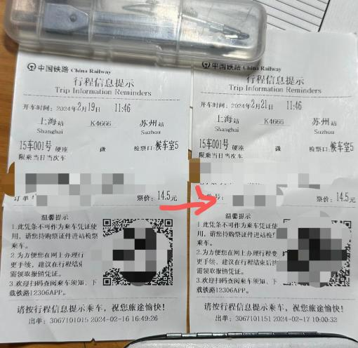

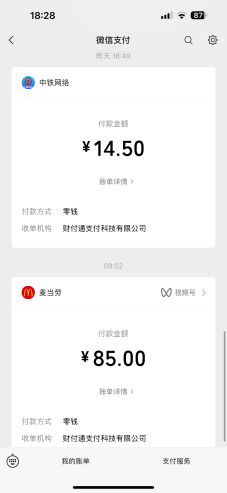

**

**图片中可以发现笔者在改签当日只有麦门订单和改签前日支付原车票的订单。**

**EG2.12-2：小鸠同学（友情出演的南中医同学）打算从南京回她在徐州的家，但因为临时有安排，在2月17日当日中午将次日从南京前往徐州站的普速列车改为2月19日南京南前往徐州东的高速动车。根据“临期改签取小收改签费”原则，在她补差价的同时，还需要收取4元改签费，此改签费为改签前后较便宜车费（77元）取5%收取。最终她成功改签到了对应车次。**

**

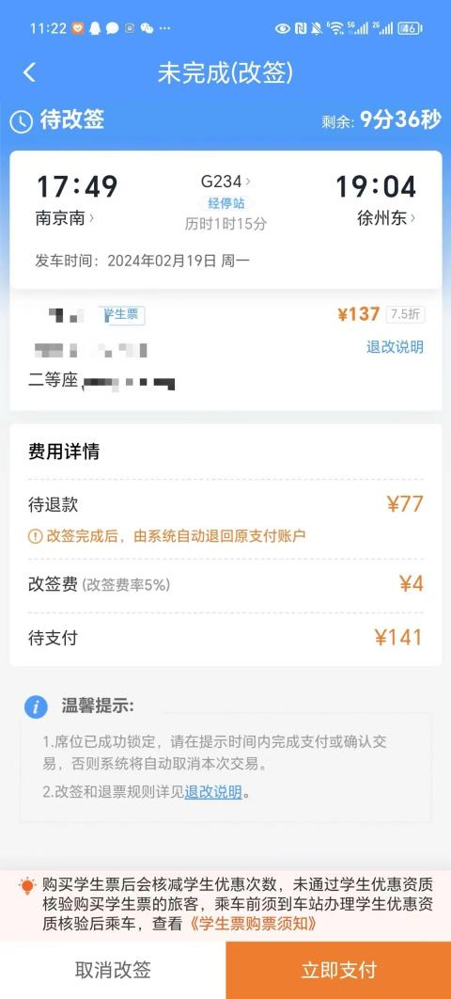

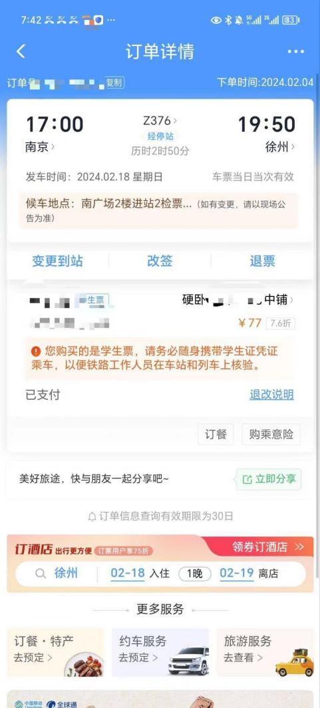

**

**Q2.13：如何领取报销凭证？**

A2.13：可以在售票窗口寻找工作人员打印，也可以自己在自助售票机（或者报销凭证专门打印机）上打印。自助机器上打印时，请不要点击“购票”按钮，而是点击“取报销凭证”按钮。一台售票机一次性最多打印5张报销凭证，有的售票机由于机器设计限制一次只能打印一张。若报销凭证较多建议前往窗口一并打印。报销凭证分两种颜色：红色和蓝色。在溧阳站和南京站所属的上海铁路局管内已无红票。

另外，退票费报销凭证也可以在自助机器上打印，但是因“列车运输组织调整”原因导致非自愿降舱（比如商务变二等）之类的情况，只能前往窗口办理退票费报销凭证。

**Q2.14：我经常使用铁路旅行，有没有什么常旅客计划？**

A2.14：12306APP可以注册一个积分会员，注册之后可以在每次个人乘车后累计本次列车的乘车积分（不限制车票购买渠道但必须是本人乘车），乘车积分将在乘车后0~7天到账，有效期一年，每消费一元积攒5分。首次兑换时，你累积的积分（包括已经过期的）需要达到10000以上，每100积分兑换1元车票。注册会员时，只需要在12306APP首页下方找到”铁路会员“并申请注册即可。注册铁路会员账号时，会设置一个6位数字密码，不能忘记，所有与积分有关的业务都需要这个密码办理。

**

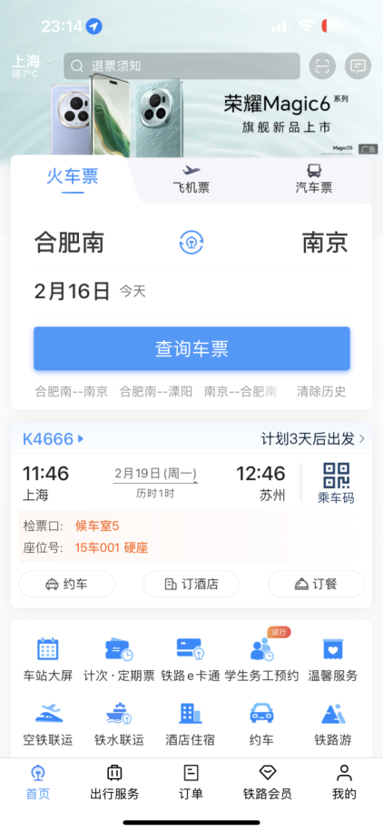

**

**Q2.15：积分如何购买火车票？积分购买的火车票如何改签？积分购买的火车票可以退吗？**

A2.15：积分购买火车票可以通过线上或者线下的方式和购买，但是只能购买12306APP显示了“兑”字样的车次（比如这个：

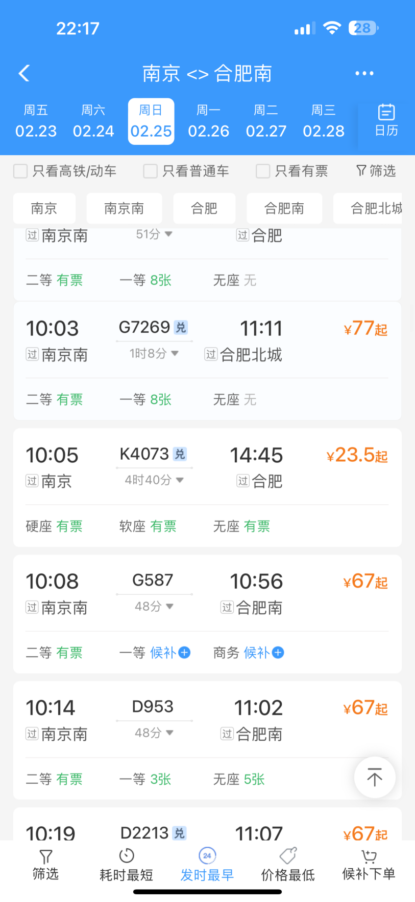

线上购买时，先正常搜索列车，找到可以兑换的车次，点进去之后会出现下图，点击积分受让人来购买积分票（需要注意的是，受让人添加后需要一个月才能使用）

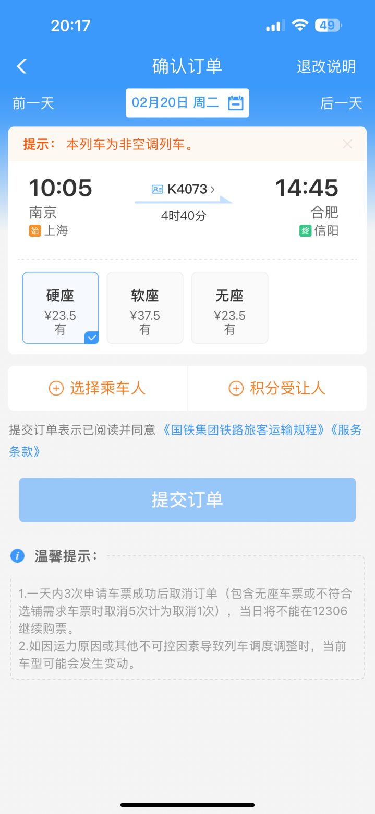

线下购买时，参照先前的线下买票方法，需要去车站窗口提出积分支付，届时工作人员会帮助你购票。

电话订票时，参照上述过程订票完成后，线下窗口提出积分支付。

学生票也可以积分支付，使用积分可以抵扣优惠后价格。

除了电话订票+学生票+窗口积分支付的情况下，其余情况积分票无法取出报销凭证。

积分支付车票可以改签的方式与别的车票一样，都允许线上改签，也允许线下前往车站窗口改签（大部分售票机都不可）。在改签时，只能改签有“兑”字的车次，实施“多不退少补”原则，并在积分支付差价后额外按照上文规定计算改签费并收取（若改签费不足1000积分则收取1000积分改签费）。

积分支付车票不允许退票，除非列车晚点30分钟以上或者停运（这种情况退积分全款且积分有效期重置）。

**EG2.15：小鸠同学打算前往上海进行宅舞录制。录制前，她在12306APP成功利用积分兑换到了自己心仪的在录制结束后从上海虹桥前往南京南的车票，花费12900积分。后续由于行程提前结束，她提前到达上海虹桥站，想改签更早一班车到南京南。但是她账户内积分结余未超过1000，即使新票允许积分兑换且新票与旧票没有差价，也无法办理改签手续。而由于积分票不退票，因此她只能使用现金够买前一班车票前往南京，并在当天浪费一张自己原来购买的积分车票。**

**

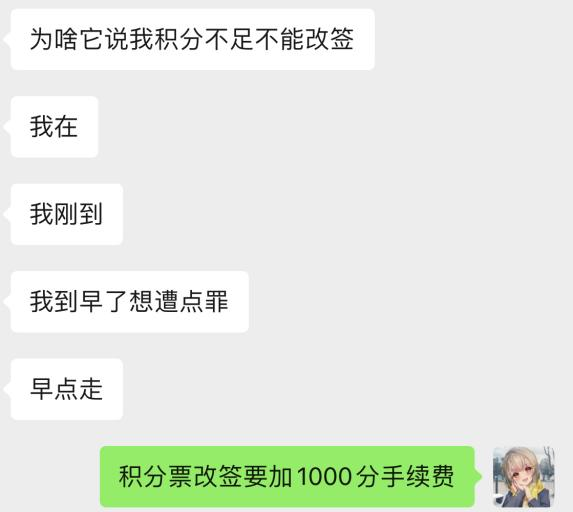

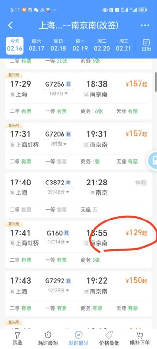

**

**Q2.16：接到通知，我乘坐的列车因故停运了，该怎么办？**

A2.16：停运的情况一般会有12306短信通知，这种情况可以在规定时间内办理免退票费退票手续。在12306APP办理退票时，可以将单程的联程车票一起退票处理。如果要退往返票，或者是退票时发现需要扣减手续费的，请在原计划开车时间30天内前往任一车站窗口进行退票手续。同时，请尽快购买列车临时停运后的替代车次。

**需要注意的是，近期经常出现铁路列车停运后又宣布恢复开行的情况。因此建议各位同学不要急着退票，在寻找替代车次的同时也不要急着将原票退款。**

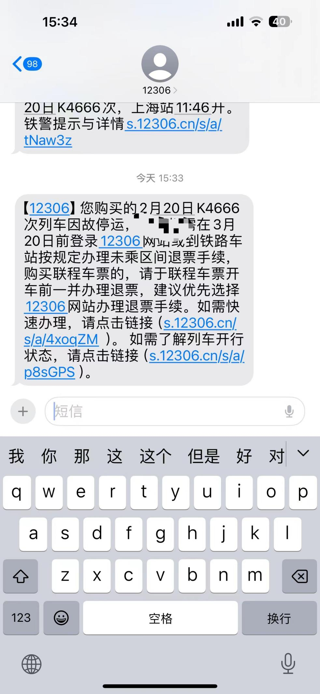

**Q2.17：临时决定延长行程或者想要升舱，请问可以补票吗？**

A2.17：可以在车上寻找乘务员办理补票手续，在补足票款差额的同时，需要缴纳补票手续费。除了升舱补票，其余情况下补票默认无座。补票手续费根据席别、车次、折扣力度、距离来确定。但是当列车延程补票人数太多导致车辆超员报警时（或者是列车长通过手持设备发现列车严重超员时），将不再办理补票手续，此时乘客需要在票面所示的到达站下车。因此为防止影响行程，强烈不推荐节假日使用此方法。

**3.乘车TIPS**

**3.1以上海虹桥-台州为例介绍大站出发乘车流程**

进站时首先找到进站口。

一般此类规模巨大的大站，售票窗口设置于站外，且会设置两道闸门，一道身份验证门（验证身份信息以及你是否有有效车票），一道检票进站门。这里需要掏出身份证，放在闸机阅读区过第一道身份验证门。（持有其他证件的可以走人工）

进了站后，在车站大屏上寻找你需要乘坐的车次

笔者此次乘坐的是G7587次列车，根据报销凭证和大屏显示，得知此次列车在21A、21B检票口乘车。

跟着指示牌找到检票口

到了检票口，发现21A、21B在车站的两头，这时就需要根据车厢号来判断我们应该走哪个检票口

每个闸机都有刷身份证进站验证的部分，如果不知道如何刷身份证，可以看闸机上的文字说明。通过检票口后便可以下到站台，寻找车厢位置（注意不要乘错列车！）。站台上的显示屏会告诉你今天的列车根据什么颜色的地标寻找车厢。例如当天G7587根据绿色地标排队

我们是5号车厢，就按照绿色5号车厢排队上车

列车开门后，找到座位，放下行李，享受旅途。

出站时，请拿好身份证件，刷证经过出站通道出站即可。

**

**

**3.2以台州-上海虹桥为例介绍规模相对小站出发乘车流程**

这类规模的车站一般售票窗口设置于站内，乘客无需持有有效车票和有效证件即可直接过安检进站

在候车室或者车站的其他位置会摆放一个高耸的柱子以及一圈柜台，这是车站的综合服务中心，承担了原来售票处功能，且可以开具临时身份证明。

此次笔者乘坐G1674从台州开往上海虹桥

按照流程找到了检票口后，等待广播即可

需要注意的是，有时检票口会出现变更，这个时候就需要留意检票口张贴的应急信息

照例检票进站、上车，在台州站有站台显示屏可以显示车厢位置信息

后续流程与第一条相同。

**3.3以溧阳-南京南为例介绍规模极小车站出发乘车流程.**

这类规模的车站一般售票窗口设置于站内，乘客无需持有有效车票和有效证件即可直接过安检进候车室。

此类车站一般情况下只有一个检票口

在检票口旁边，或者是车站的某个醒目位置会放置一个“综合服务中心”起到售票、改签等部分售票窗口可以进行的核心功能，同时办理临时身份证明制作业务（笔者认为溧阳站的综合服务中心的水准较多数车站的高了不少）

这种车站不同的站台会使用同一个检票口，因此通过检票口之后请留意你的站台信息，以免因为去错站台而错过列车

笔者此次斥巨资（三天的饭钱）乘坐G1424次列车的特等座从溧阳前往南京南，车厢号是3号，因此我们需要在通过检票口后寻找到3号站台的表示板，并根据车厢号找到对应楼梯上车。

此次G1424次的所有车厢均停靠于右侧楼梯上站台的位置。

照例留意地标信息（这次是绿色地标）

后续流程与第一条相同，请注意列车在此类车站停靠时间很短，请在确保安全的情况下尽快上下车。

**3.4超简易车站乘车流程**

请直接上车补票。

**3.5 中转换乘流程**

铁路并非所有车站均能从溧阳或者南京南一站直达，因此经常出现从始发站到终点站需要换乘的情况。为此，铁路部门在部分大站设置了专门的中转换乘通道。笔者在2024.3.22从溧阳出发，前往南京转车至常州（因为错过了末班大巴），车次信息是G344（19：34到南京南站）转D351（20：01南京南站出发）。

在列车上，笔者便已经提前拿好行李在车门处准备。如果对自己是否可以赶上中转没有自信的，可以提前向列车员问清楚距离车站换乘通道最近的车厢。

如果找不到列车员，也可以扫描座位扶手边上的二维码查询

下了车之后，无需急着跟着“出站口”出站，而是要在站台上先找到“中转换乘”的标识，根据此标识上楼（或行走专用通道进站换乘）

如果持有大件行李，也可以选择乘坐无障碍电梯进行换乘

上楼后，跟着指示牌反向通过检票口

在检票口刷身份证，检票闸机显示屏幕会显示你下一班需要乘坐的列车在哪个检票口乘车

如果忘记检票口了，可以在车站大屏查询

找到对应检票口后，按照正常流程检票乘车即可。

对于2011年及以后兴建的高铁大站，只需要预留15分钟以上的换乘时间即可丝滑换乘，如果是一个城市的老火车站，建议预留半个小时以上的换乘时间（此类车站一般无法反向通过检票口，需要走较长的中转通道）。12306设置的同站换乘时间至少为10min。

**3.6二次安检**

当列车途径或终到的城市正召开重大会议或举办大型赛事时，乘坐该车次的旅客需要接受二次安检。如两会期间，前往北京方向的旅客，就需要二次安检。

笔者的舍友——宣智涵同学，此次乘坐G36次（宁波-北京南）列车从杭州东站出发前往溧阳站。在检票口前，他见到了此类安检区封闭设施。

二次安检在列车检票前进行，届时广播和工作人员会提示相应车次的旅客到相应位置接受安检，旅客跟随指示并配合安检即可。

需要注意的是，在重大活动期间，请大家留出二次安检的时间，提早到达车站，以免因为安检查扣物品而耽误时间。

**3.7没带身份证开取临时身份证明流程**

若没带身份证，在小站可以直接去综合服务中心开具纸质临时身份证明，在大站经常会有专门的公安制证点（一般在人工售票窗口的附近，或者是车站附属派出所），向工作人员报出身份证号码，即可在系统内自动查验你的身份信息，开具纸质临时身份证明。

如果不想去找，也可以在12306APP内开具临时身份证明（此方法一个月只能用6次，如果比较马大哈还是建议开纸质证明），方法如下：

**

****

****

**

需要注意的是，目前没有案例说明持有港澳台居民居住证和中国五星卡（外国人永久居留身份证）是否也可以利用这样的方式来开具临时身份证明。若持护照或回乡证/台胞证乘车，必须携带原件。

**3.8安检查出违禁品被扣的补救方法**

如果查出不合适的物品，此时你可以选择填写快递单寄到目的地或者某个合适的地址。对于可以暂存的物品，你也可以选择就地保存，在30天内凭存单领取即可（需要注意的是锁刀、开过封的酒、压力罐之类的物品不能保管）。你足够有钱的话也可以直接选择丢弃。

**3.9坐过站补救办法**

此类情况下，请立即寻找列车长或者列车内的客运员，要求开具客运记录，到了下一站由列车长联系工作人员乘坐后续列车免费送回你的目的地车站。

**3.10因为列车晚点赶不上后续列车补救办法**

此类情况下，请立即寻找列车长或者列车内的客运员，要求开具客运记录，到了中转站持客运记录走中转换乘通道反向通过检票口后，寻找站内的检票口持客运记录乘坐其他列车前往你的目的地车站，或者去服务台办理免费退改或另行安排。

**

**

**3.11列车半路折返（绕行）的处理方法**

夏季中国多地多发暴雨台风的大规模毁灭性自然灾害。为了防止列车运行过程中发生事故，铁路部门会根据实际情况，在无法行经的路段采取半路折返（或者绕行）等措施（通俗来说就是前面走不了只能返航到起点）。在遇到折返时，请先询问折返可以到达的最远车站和折返列车沿途停靠的车站（一般情况下折返列车的停靠车站和正常运行的列车相同），并选择下车站点。出站之后再前往窗口或者手机APP退款（但请注意，任何退款必须在出站之后进行！否则默认要收取手续费！）。后续退款方法同2.16

**4.学生票FAQ**

**Q4.1：学生票一年有几次使用次数？区间可以填写到哪？**

A4.1：四次，但是在中转符合规定的情况下，从家到学校即使中转n次也只扣减一次学生票次数。所填写的区间必须是家所在车站到学校，但是家所在车站可以不是户籍地址所在车站（入学前户籍和学校在同一个城市除外）。需要注意的是，12306APP上的区间要和学生证上的区间保持一致，不然不能使用学生票。

**Q4.2：我的学校到家没有直达车，请问我可以买中转的学生票吗？**

A4.2：可以，但是前提是从家到学校不能绕路，或者是需要与直达车路径保持一致，或者是要在合理路线范围之内。这种情况下只扣减一次学生票次数。

**Q4.3：我打算中转回家，需要如何购买中转车票？**

A4.3：直接分开购买两段就好，不需要使用12306的中转换乘功能。

**EG4.3：王同学家住在昆山，打算此次回家购买南京中转的车票。他于是在12306上分别搜索了溧阳-南京南和南京南-昆山南两段的车票并分别下单购买，两段均可以购买学生票。分开购买的车票在12306也被自动判定为联程车票。**

**Q4.4：我从学校到家需要中转一次，请问单程需要消耗两次学生票次数吗？**

A4.4：不会，如果是中转且路径合理的情况下，从学校回家，不论中转几次，只要每一段都包含在学生票优惠区间内，均可以购买学生票，且全程只扣减一次学生票次数，但是在非特殊标红的特定折返区间内折返时（也就是走回头路的情况）会多消耗一次次数。标红特殊折返区间内折返不会额外消耗次数。（查询特定标红的折返区间请至溧阳站阅读《中国铁路接算站示意图》，最典型的区间就是青岛站-青岛北站）

**Q4.5：中转的最短和最长时间限制是？**

A4.5：12306设置的同站最短中转时长是10分钟，同城不同站最短中转时长是40分钟。根据笔者先前询问溧阳站的票务员可知，铁路相关部门对学生票中转时长并没有硬性规定，你完全可以在顺路的情况下，于一个城市玩两天，呆足够久再启程回家。但笔者建议，全部的行程最好不要超过10日。

**Q4.6：学生票一次次数中转最多几次？**

A4.6：你想转几次就转几次，但是要保证在合理路径。

**EG4.6：付同学家在库车，因此她的路线为溧阳-南京南-郑州东-西安-宝鸡-库车，前三段都为高速动车，最后一段是普速铁路列车，此种走法只需消耗一次学生票次数。**

**Q4.7：我想回家，想先去A城玩一圈然后再回家，请问两段都可以买学生票吗？**

A4.7：类似于Q2的规则，如果A城在你从学校回家的顺路或者合理路径上，就都可以买学生票，但是如果不满足上述条件，就只能买成人票

**EG4.7-1：王同学打算从溧阳回莱芜，但是在回家之前去需要去长沙玩几天再回家，由于长沙不在溧阳到莱芜的合理路线上，需要绕路前往，因此无法发售学生票。**

**EG4.7-2：笔者打算从溧阳回上海，但是在回家之前要去南京的宣同学家里住一晚，然后再去商场里参加一次随机宅舞再回沪，由于溧阳站到上海从南京中转在铁路上路径最短，因此学生票发售成功。**

**Q4.8：中转票的购买顺序是否影响学生票的次数扣减？学生票先买后段再买前段可以吗？**

A4.8：不影响，你完全可以先买后段再买前段。但是有些时候系统可能抽风导致了先买后段再买前段会多扣减学生票次数，此时可以按照Q4.18进行申诉。

**Q4.9：我家只有高铁站能通溧阳，但是我学生证的区间是我家火车站到溧阳，请问还可以买学生票吗？反过来也可以吗？（比如区间是长沙站到溧阳，但是直达车是长沙南去溧阳的情况）**

A4.9：12306系统并未区分车站属性是高铁站或者火车站，况且，此种情况下，同一个城市市辖区内（一般不包括下辖县）的车站都会维护为同城枢纽车站。同城枢纽车站依然在学生票的购票区间范围。

**EG4.9：周同学的区间是溧阳-郴州西，他购买了溧阳-诸暨的动车和诸暨-郴州的普速火车，虽然终到站是郴州站而不是郴州西站，他依然可以买学生票。**

**Q4.10：在中转的时候，请问必须在同站中转吗？不同站会多扣减一次学生票次数吗？**

A4.10：不需要，只要是维护为同城枢纽的车站，均可以互相换乘，不扣额外学生票次数。但是如果不是同城枢纽，那就会被多扣一次

**EG4.10：陆同学家在射阳，学生票区间为盐城-溧阳。某次回家时，她购买的车票为溧阳-南京南和南京-盐城两段车票，其中在南京市需要跨站换乘，在行程结束后，此行程只扣去了她一次学生票次数。**

**Q4.11：为什么我买学生票的时候，12306会推荐我买成人票？**

**

**

A4.11：火车票票价分为公布票价和执行票价，执行票价有时可能会有相较于公布票价的折扣。与此同时，学生票的折扣是高铁公布票价的75折，普速公布票价的5折，因此如果执行票价折扣大于学生票折扣，这个时候学生票就不合算了，此时12306就会弹窗推荐，以防学生多用次数。

**Q4.12：海南铁路轮渡和烟大铁路轮渡是否发售学生票？**

A4.12：经过海南铁路轮渡的旅客列车发售学生票，但是两个轮渡线散客票本身不通过12306发售学生票。如果要购买船学生票请咨询船官网。如果你的区间是溧阳-大连，那么不能买去烟台的学生票。

**Q4.13：假如乘坐直达车从溧阳去北京南，在北京南下车，但是区间填写的是溧阳-天津南，于12306成功购买学生票，请问还能乘坐吗？**

A4.13：需要在车上补票补天津南-北京全价

**Q4.14：假如乘坐直达车从溧阳去天津南，购买了溧阳-北京南的车票，但是区间填写的是溧阳-天津南，于12306成功购买学生票，请问还能乘坐吗？**

A4.14：目前这个情况尚无定论。根据小红书上不同路局的大学生的实操结果来看，一般是按照实际下车地点计算。如果你在天津下车，那么不用车上补票。但是如果车内查票的时候，有可能在你申明了下车站的情况也需要补票。

**Q4.15：买了学生票，忘带学生证了怎么办？**

A4.15：请注意，购买学生票乘坐列车必须携带学生证原件（不得为照片或者视频）！且原件上必须盖有院校公章！如果被查到未携带学生证购买学生票乘车的，列车员可以要求你补票到执行票价，次数退还。若要退钱，需要开具客运记录，并在乘车日后30天内前往事发列车停靠的任一车站退费。若无客运记录，在部分路局的售票窗口无法退款。

**EG4.15-1 张同学于2月份从日照回溧阳，在连云港乘车到南京时因为忘记携带学生证导致车上被查票时补票。补票时未开具客运记录。事后，他尝试和笔者一起前往溧阳站进行退款操作，但被告知只能在补票事发列车的途径车站办理退费。后续他前往南京游玩时在南京南站试图退款，但因为售票员要求出示客运记录，导致了该款项无法退回。**

**EG4.15-2 小C同学常住上海，在山师大读书。由于cosplay时将学生证作为道具丢出导致学生证未在返校时随身携带，在乘车时被查票并要求补票。后续她前往市区参与活动时路过济南西站，凭借身份证和学生证原件成功退款。**

**Q4.16：忘带身份证了，使用临时身份证明乘车，怎么办？**

A4.16：若学生证没有丢失，在持有临时身份证明的情况下不影响学生票的正常使用，无需补票。但是如果你学生证丢失了，就乖乖补票吧。

**Q4.17：我已经核验完成学生票优惠资质了，为什么买了学生票之后还说我没有通过核验？**

**

**

A4.17：分开买的联程中转确实会出现这样的情况，不过，问题不大，到车站售票机点击“优惠资质绑定”花一分钟时间重新绑定就行。

**Q4.18：请问12306抽风了，导致我分开买的回家中转车票被计入了两次，该如何是好？**

A4.18：这种时候就需要用到申诉了，首先你要有12306APP方法如下：

先找到12306APP的“我的”界面

看到这个界面，点击“学生资质核验”，进入如下界面：

看到这个界面，点击“乘车记录”

看到这个界面点击右上角的“去申诉”

拖拽行程到一起即可（不可以成人票和学生票混用！！！！！！）

当然，绕路学生票不会被整合入一起。

如果上述方法无法申诉成功，你还可以拨打12306客服电话来进行申诉。

**Q4.19乘务员错误理解学生票区间，导致明明符合乘车区间却被错误补票，怎么补救？**

A4.19 请一定要让该乘务员或者列车长开具客运记录！并且记住该乘务员的编号！列车到站后，拨打12306电话投诉该乘务员。乘车结束后30日内，请携带学生证原件、身份证原件和客运记录原件，前往列车经过车站的窗口进行退款。

**Q4.20我想修改乘车区间，该如何修改？**

A4.20 目前乘车区间以学生证纸质记载为准，并加盖院校公章后方可使用。因此，请先到师生服务大厅办理学生证区间变更和补发手续，学生证内页需要重新打印，并重新提供一寸照片供粘贴。这个过程可能需要一段时间。学生证内页更新完成后，需要加盖院校公章和注册章。在以上手续完成后，再前往12306APP找到“我的-学生优惠资质核验-学生优惠乘车区间变更申请”重新填写学生票区间，区间均需精确到车站。

**5.抢票攻略**

**很多同学会抱怨“为什么我的列车开售就候补了！”，亦或者是“抢不到根本抢不到！”，这里给大家一些攻略，祝大家早日抢到自己心仪的车票！**

5.1搞清放票逻辑，赶早不如赶巧

每一班车都有属于自己独特的放票逻辑，此类放票逻辑根据列车始发站的铁路路局不同而具有不同的特点。比如说京局、哈尔滨局喜欢把票全留给始发站，上海局喜欢提前7、3、2、1天慢慢放区间票，广铁喜欢把车票憋到开车前24小时才解除限售，南昌局喜欢在刚开售时突然全部放出车票，等到当日其他车票开售之后就限售该班车车票，等等等等......而为了搞懂每一种放票模式，建议各位同学对一列特定车次进行横向对比（即在同样时刻查询的情况下，比较于不同日期发车的同一班次的售票状况）及纵向对比（即在开车前的不同日期、不同小时比较同一天同班车的售票情况），进而形成对特定某一班车的售票模式认知。

下面，笔者为大家整理了几种典型的放票逻辑。

逻辑一：开售全放型

此种逻辑一般适用于某些管内城际铁路的线路内车次，或者是绝大多数车次的全程票，或者是一站直达车的票。此类车次一开售便会毫无保留地将所有的车票均放出。

对应策略：牢记开售时间，勿输在起跑线。

中国铁路的各大车站都会在每天的的某个时刻发售15天后的车票具体的时刻信息因发车车站而异。比如南京站、南京南站是早上8点开售，上海虹桥站13：30开售，上海站14：30开售。根据开售时间抢购车票对部分不限售车次成功率会比较高。

**EG5.1.1:G7008（上海-南京）、D24（深圳-汉口）**

逻辑2：不抛弃，不放弃，先开售等后开售

由于途径车站的开售时间不一样，且每列车给每个区段预留票额不一，因此在部分情况下（尤其是先开售车站和后开售车站共用同一个票额的情况）先售票的车站会出现“开售即候补”的状况，等待后续车站开售后一起放票。

对应策略：掉皮掉肉不掉队，跟着末售站准会

这种情况你需要把列车沿途各站的开售时间均记牢，在最晚开售的车站开售后再登陆官网抢票。方法同策略1。

**EG5.1.2：K2666（苏州-临汾）、G7587（徐州东-苍南）**

逻辑3：全程急着卖，中间慢慢卖

中国铁路的有部分车次均采取此类策略放票。（一般是全程车站不是不给卖而是放少量的票（一般情况下对应的区间票无论采用何种排列组合均只有20~50张票的余量），等到开车前7、3、2、1天（开车当天也会调整票额）再逐步放出对应区间车票（一般情况此类放票模式会在开车前2天将大部分全程车票下沉到区间）

对应策略：莫急莫慌莫害怕，七三二一不要忘

可以在开车前7、3、2、1天再去看看余票信息，必要时可以使用候补购票。

**EG5.1.3：G2386（宜昌东-上海）、D2246（杭州东-重庆北）**

逻辑4：爷硬气，爷就是一毛不拔！

此种逻辑下，除了始发站到各地的票额有余票之外，其余区段均一张票不放，有时甚至只放全程票。直到开车前48h、24h甚至最极限的还有6h（以北京局为甚）才会将全程票额下沉到区间。而候补的情况下，只要候补的n张订单可以凑出一个全程，那就候补出单。（比如一个从A到E的车，经停BCD三站，那么甲候补C-E，乙候补A-B，丙候补B-C，当候补下单齐全之后，甲乙丙三人会同时候补成功）

对应策略：只要看全程车对应席位显示“有票”就放心大胆候补即可，但是在繁忙时期建议确认车次全程票的售卖情况，如果是诸如Z114（哈尔滨-海口）之类的客流爆炸车次不建议这么干。

**EG5.1.4：Z114（哈尔滨-海口）、G401（北京西-昆明南）、G79（北京西-香港西九龙）**

逻辑5：昙花一现

此种逻辑下，列车将会在所有车站开售（或者始发车站开售）之后不久将全部车票下放至区间，再在某一个时间点内将所有放出来的票全部限售，中间随机时刻出票直到开车前2天。而候补的情况下，类似于逻辑4，只要候补的n张订单可以凑出一个全程，那就候补出单。

对应策略：研究此车次最有可能在一天内某个时间段放票，在放票的时候盯着抢，另外如果你比较懒，用候补也很方便。

**EG5.1.5：G1674（厦门北-上海虹桥）**

逻辑6：票额分配

这一种逻辑仅限于上海铁路局管内的车次（大致可以理解为沪苏浙皖内的铁路）。由于上海局管理范围很大，且有部分车次为了兼顾沿途客流，会绕行很多不同的铁路，因此即使是管内车次也能达到好几个小时的长途。为了确保中间的小站有充足的票额前往大城市或者大站中转，因此在同一天，如果某一区段可供平行替代的车次很多，就不放票，如果某一区段可供平行替代的车次很少，就多放票。需要注意的是，这种放票逻辑下全程可能不放票，只放区间票。

**EG5.1.6 G7391（上海虹桥-杭州-南京南），这列车全程上海虹桥-南京南禁售，而将票额分配到了沿途诸如嘉兴南、宜兴、溧阳等小站，以满足诸如“上海虹桥-溧阳”、“嘉兴南-湖州”、“嘉善南-南京南”等不同排列组合下的出行需求。**

**C3197（南京-响水县），在同样是南京前往响水县的路途上，根据客流分布，放票时优先照顾从南京、扬州、宝应、建湖等大小车站前往盐城市境内各大车站和南京-扬州东区间，对于南京-镇江、南京-宝应和扬州-宝应等替代车次很多的区段没有预留票额。这样的方式不仅不会一刀切限制全程车票，还能最大程度确保沿途乘客出行。**

逻辑7：一刀切就是爽

此种逻辑下，包括始发站到终到站的全程票额都是售罄且无法候补状态，列车票额被完全锁票。

对应策略：静待花开，或者干脆不要去坐它

**EG5.1.7：G3110（杭州西-郑州东）（此车在放寒假前的一段时间锁票到开车前5天）**

一般地，对应每班列车的放票逻辑是以上6种情况的杂合体，实操还是需要具体问题具体分析。且如果不算部分阴间的放票模式的话，“候补购票”这一招几乎贯穿始终。

附：笔者候补成功合集

5.2勿用三方软件，官方优先最高

现在市面上有太多的第三方软件（比如某猪、某程、某哪儿之类的）也在其页面中添加了“12306服务”，虽然看似你直接从平台购买到了火车票，但是实际上本质还是第三方平台作为中间商在帮你完成刷票、代抢的操作。这种情况下优先级不如12306的候补。部分平台的高速抢票、余票监控渠道其实就是通过12306的候补来实现的。另外，12306最近一直在使用代码阻拦自动抢票系统，其在开售后便会直接过滤自动化抢票订单，如果使用第三方软件购票只会让你购票速度变得更慢。

**EG5.2：笔者曾经帮翟同学（一位澳籍华人）抢票的过程中，翟同学用某程抢票，我用购票信息预填来抢票，在抢同一班D24时，他开到极速抢票也没有笔者本人用购票信息预填来的快。**

最终我利用“购票信息预填”助我们开售秒杀，“候补购票”帮我们官方兜底票额，手机改签退票给了我们更多的灵活处理行程的选择。至今（2024.2.15）为止，笔者已经在短短一个学期内成功候补到6次车票订单。

5.3巧妙利用“大学生整治各大行业”的优势

在12306有一个界面是“学生、务工人员春运预约订票专区”在该专区内，只要是在时间范围内开售的车票能够办理预约，并在开售前就能告知预约结果。该功能可以规避一部分区间限售，使部分长途车通过学生票买短途票成为了可能。

**EG5.3：南航流火动漫社猫猫子同学成功利用学生票预约，绕过区间限售，购买到了回南京的火车票。**

5.4电脑版官网可能有意外惊喜

铁路部门为学生专门预留了部分票额。同学们可以进入12306电脑版官网，在首页选择“学生”一项，即可看到学生票的单独票额。在一部分情况下，铁路部门会专门留票给学生使用，在全部显示无票的情况下，学生票的“有票”将会成为你回学校最温暖的依靠。

（懒得翻图了，这里直接盗用一下北大铁协的图片吧）

5.5换一种冷门的交通方式

上海长途客运总站总经理肖峰说：“客流最高峰的时候，总站日发班次达到1280班，工作人员有300多人。现在日发班次约200班，工作人员在60人左右。”目前，长途大巴在国内呈不断衰落之势。但这反映了长途大巴的车票越来越好买的事实。

溧阳的高铁往西北只能从南京接入全国铁路网，往东南从湖州和杭州组网，导致了溧阳的高铁盲区较多。因此，溧阳也有不少大巴去跑高铁盲区生意。目前，溧阳站最多的班次还是溧阳-常州、溧阳-武进（湖塘）、溧阳-无锡、溧阳-苏州、溧阳-上海。其他班线有溧阳-盐城、溧阳-泰州、溧阳-芜湖等。此外，溧阳也有部分大巴公司承接过路车生意，同学可以通过联系大巴公司或者是大巴司机的电话，来确定上车地点。例如有一条班线是杭州至南阳，如果找到了司机师傅的随车电话，那么可以通过拨打电话预约的方式，确定上车地点，在溧阳上车前往南阳。车费上车时付款。

另外，如果溧阳的通达度不够，可以搜索附近常州、南京、武进（湖塘）、金坛等地的大巴班次，能够找到通往更多江苏苏北、安徽、山东乃至河南的长途汽车班次，并且价格实惠。

大巴不限制行李额度，对携带很多东西的同学非常友好。

**EG5：瑟扣酱家住南阳，2024年寒假结束返校时因为未成功购买到高铁票，于是去客运站购买了从南阳去溧阳的大巴票，并于2月24日启程。由于冻雨原因，各处高铁均有不同程度晚点或停运，她所乘坐的大巴在延迟一小时后，于11：00成功出发，并且在22：00成功抵达溧阳。**

**致谢**

本作实为笔者听某一同级同学因为不理解学生票区间规则而将区间将起点由溧阳改为南京南之后的一时兴起之作，故首个编辑篇目为文中《学生票Q&A》，旨在给同学们首次读大学返乡之际一定的学生票建议，避免于购票时或者路途中因为不熟悉规则而踩坑。虽然本作为是一时兴起之作，但在兴起编辑5个问答后，笔者便有了将本作扩充到全部乘车流程的计划，并根据众多同学常见的出行疑问，编制了各类一问一答。最终耗时一个寒假和春季学期将本作完篇。

在此，笔者想特别感谢同届的宣智涵同学和韩傲霜同学从本文开篇阶段开始一直到本文完结为止，都利用自己的专业知识和亲身经历，给本人提供了很大帮助，至今仍经常询问笔者的工作、学习以及人生大事完成情况，或是结合自身需求来咨询出行建议。此外，我也要感谢不愿透露姓名的黄同学、王同学（两位）、陆同学，以及外校的小鸠学姐、末日晴空学长等笔者的各类二三次老好友给本人提供了众多宝贵的实测经验和照片素材（虽然可能为正反对比），使这边文章在枯燥的讲解中显得更加饱满。

在感谢身边同学的同时，笔者也要感谢上海铁路局上海客运段、南京客运段、南昌铁路局南昌客运段、福州客运段、济南铁路局济南客运段的司乘人员以及乘务组们，以及溧阳站综合服务中心工作人员、南京南站南售票处售票员、上海火车站联合售票大楼售票员等各位票务工作人员们，没有你们，也就没有笔者在本篇中如此周到完美的出行体验，也就更没有本篇文章最精华部分的诞生。正是你们辛勤的服务，给后续远行的大学游子们指引了一条返乡或者返校的明路。

最后，我再次向在我上学期在学习和生活中曾给予我支持和教导、扶持和帮助的老师和同学表示深深的谢意。