>AIGC 声明：为使画面整洁，使用了 AI 修图。  
>感谢贡献者提供图片：小红书号 42896609712、小红书号 426621444、k 宝~

## 宿舍基本情况

江阴校区宿舍配置优良，所有宿舍均为：

- 四人间（研究生为 2 人间）
- 上床下桌（研究生为落地床，落地桌）
- 独立卫浴
- 带阳台（有开放式，也有封闭式）
- 配备空调
- 空间宽敞
- 不断电、不断网，基本不限电（限制为 10A 2200W，电吹风烧水壶不跳闸）
- 不停水
- 6 层 有电梯
- 楼下有共用吹风机

## 宿舍楼分布

目前江阴校区共有 1-11 栋宿舍楼，另有部分在建宿舍。  
现有宿舍楼均为 6 层建筑，配备电梯，实行门禁管理（晚上 23:00 关闭），每栋楼门口设有外卖存放架。

> 注：由于江阴校区仅是第二年接收全体大一新生，具体住宿安排可能存在调整，具体情况请以开学时实际安排为准。

### 各区域周边设施

**西南区（1-4 栋）**

- 邻近主要教学楼群
- 兰苑食堂
- 西南门外卖柜
- 篮球场
- 校内唯一教育超市
- 靠近西南门，便于前往创新港（实验实习基地）

**西北区（5-6 栋）**

- 临近部分教学楼
- 樱花苑食堂
- 工训中心
- 水果店
- 运动设施（操场、羽毛球场等）

**东北区（7-9 栋）**

- 芙蓉苑食堂（设有菜鸟驿站）
- 罗森便利店

**东区（在建宿舍）**

- 位置较为偏远

### 男女生宿舍分布

目前已建成宿舍的性别分配如下：

- 女生宿舍：3 栋、6 栋
- 男生宿舍：1 栋、2 栋、4 栋、5 栋、7 栋、8 栋、9 栋

> **特别说明**：2、10、11 栋宿舍的内部装修与其他宿舍略有不同。  
> 这些宿舍配备了床上折叠小桌板，床下桌子为 45° 斜角设计，上床采用楼梯而非爬梯，整体装饰也更具设计感。以下展示部分实景，具体情况请以实际入住为准。
> 11栋宿舍是下床下桌的研究生宿舍，且配备床垫。其余配置同10舍

### 2、10 栋宿舍
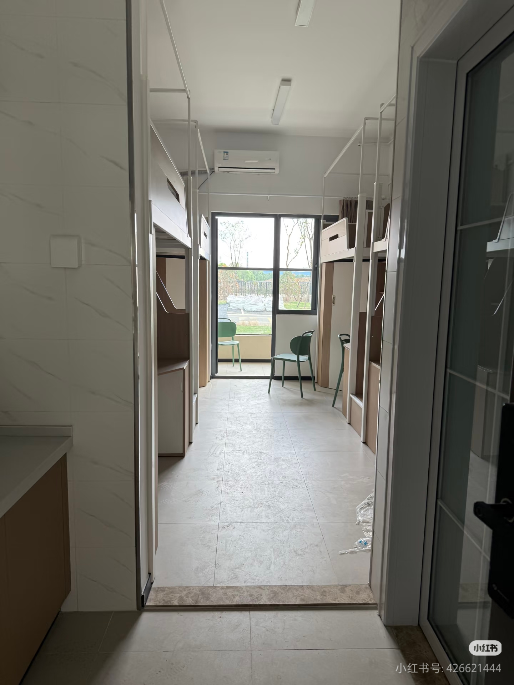

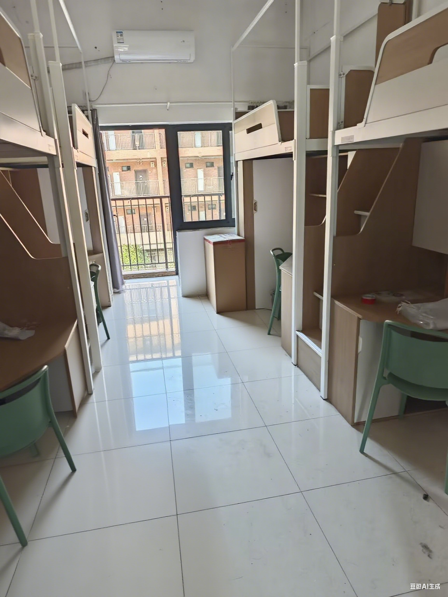

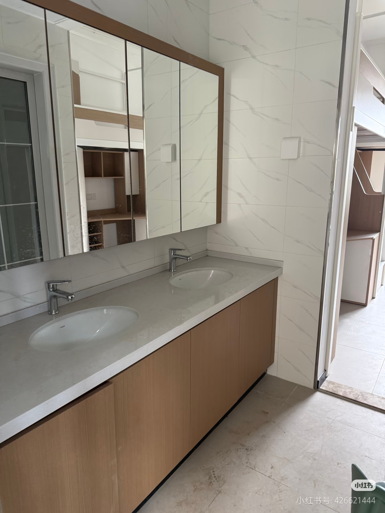
超豪华洗漱区。拍摄于 11 舍。豪华洗漱区和石板洗漱区好像并不固定。2 舍也有石板洗漱区。往下翻能看到。

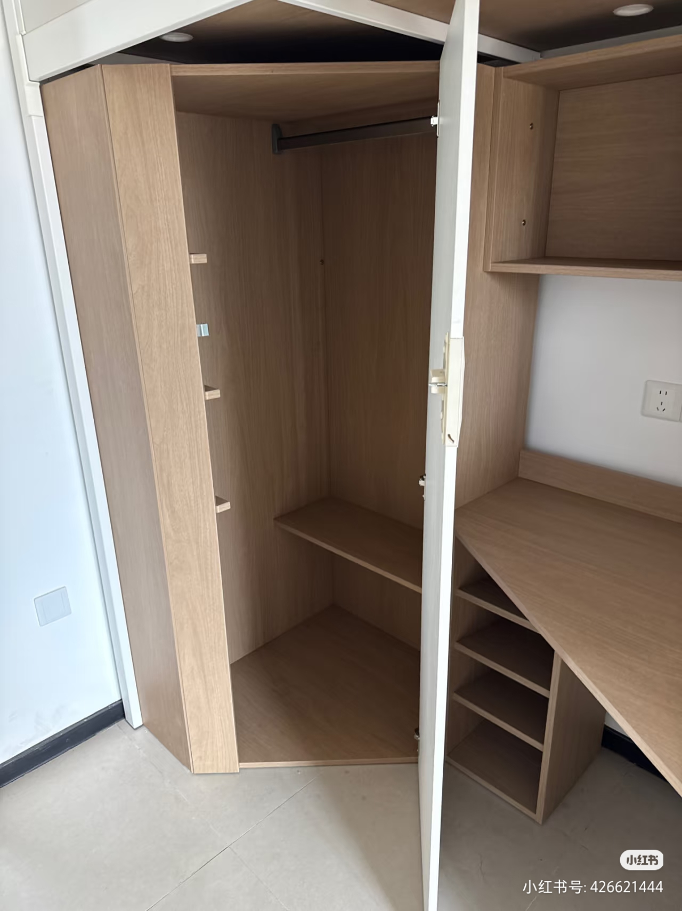

这个储物柜比其他宿舍的大。感觉像步入式的。

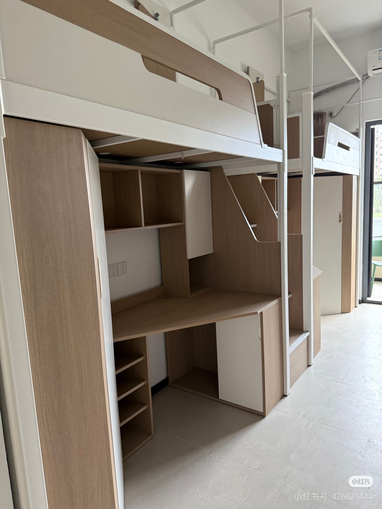
设计非常现代化。

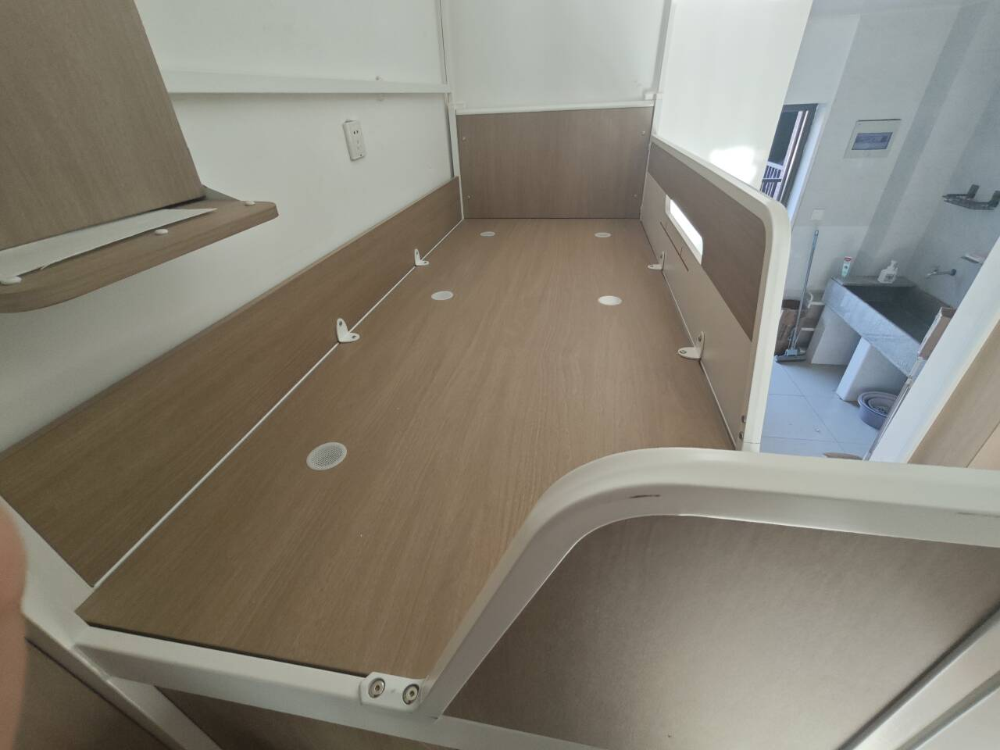
床上有插座，注意用电安全。  
宿舍床自带的小桌板可能影响全包围床帘安装，需要注意。  
不过床上本来就有架子了，自己买几块布一包就好，没必要折腾床帘（反正大部分人就住一年）  
（拍摄于 2 舍，可以看到后面是石板洗漱池）

---

### 1、3、4、5、6 等宿舍

这些宿舍的整体风格相对简洁，是传统的大学宿舍风格（具体以实际为准）： 

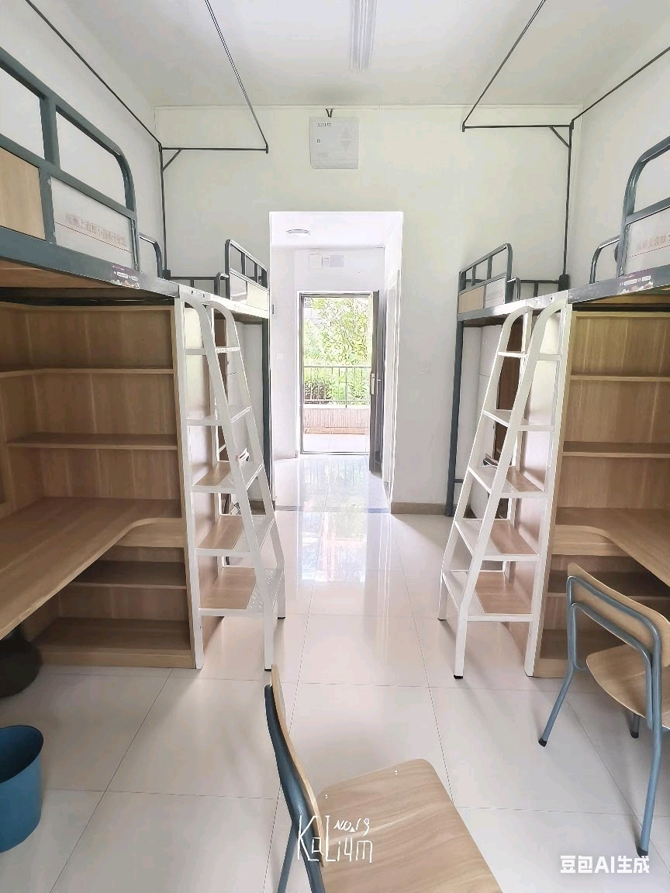

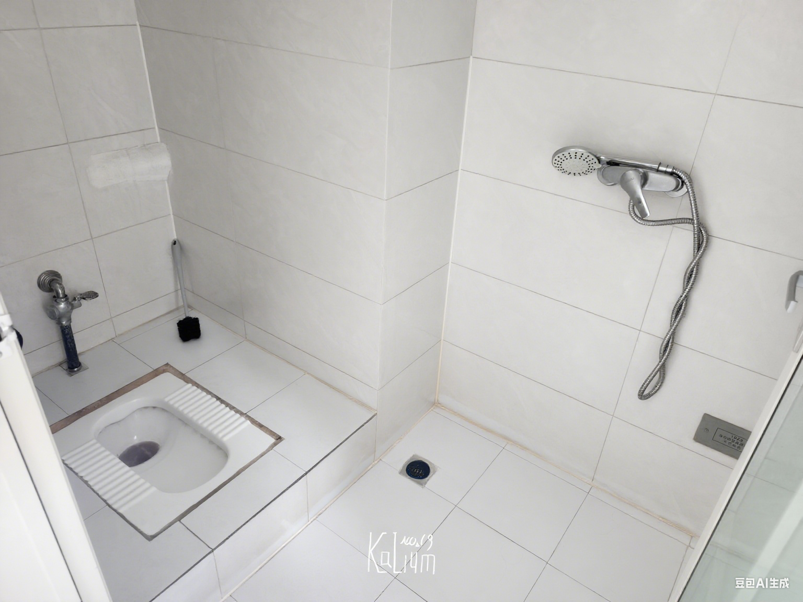
是蹲坑设计，需要注意清洁。

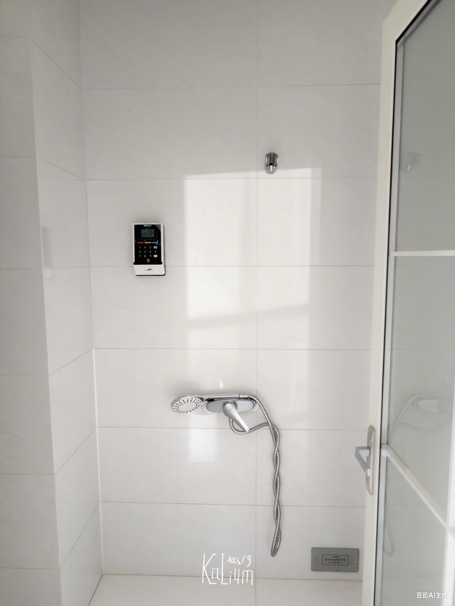
洗澡需要付费。

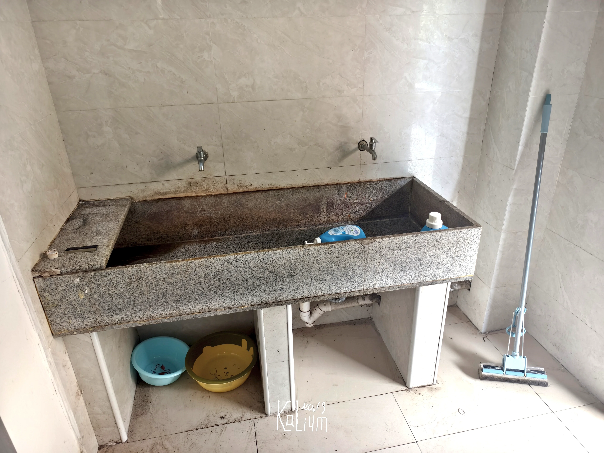
是石板搭建的，相对来说比较...实用？

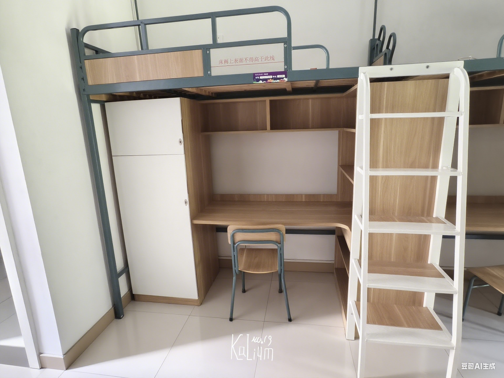

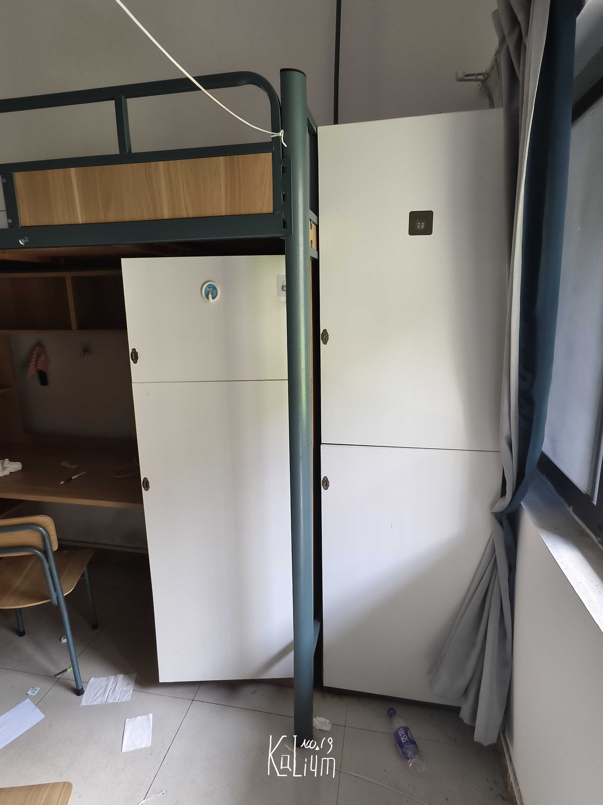
除了床位自带的储物柜外，每两个人还有一个大柜子。（顶上也可以放点东西）

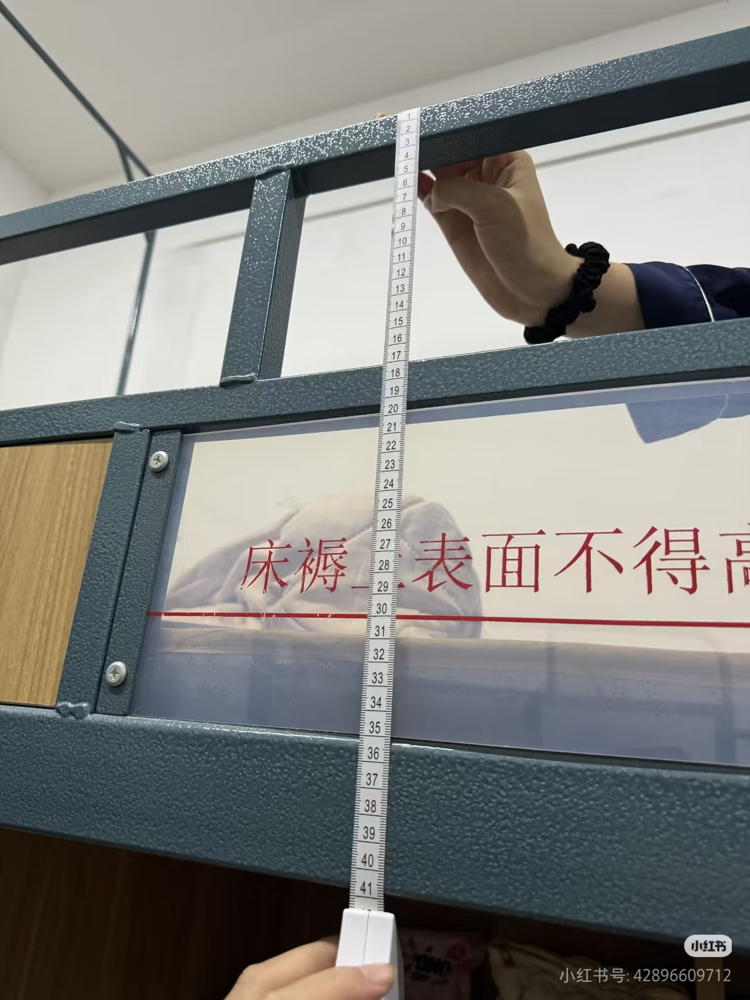

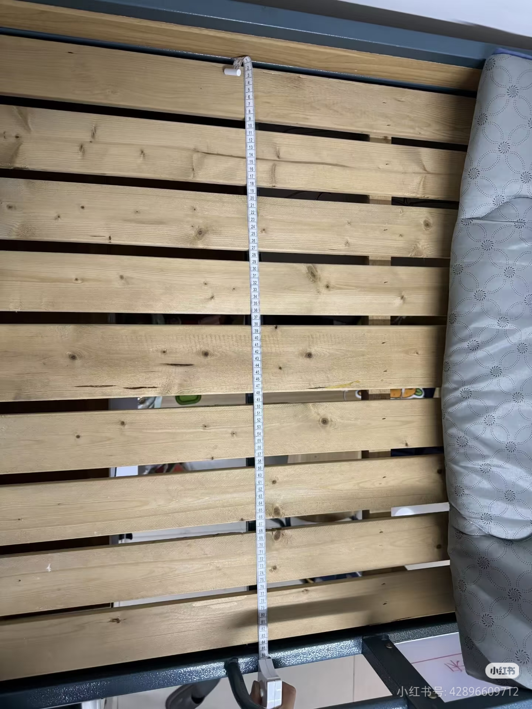

由于两边均有栏杆和床架，实际可用宽度在 86cm 左右。   
建议购买90cm * 190cm的软床垫。（硬床垫或凉席请买小一号）   

