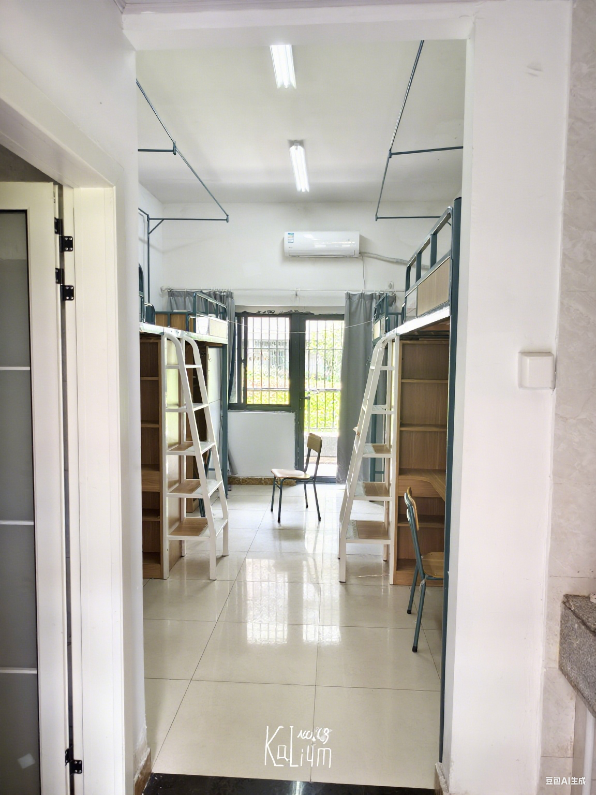

>AIGC声明：为使画面整洁，使用了AI修图。

## 宿舍基本情况

江阴校区宿舍配置优良，所有宿舍均为：

- 四人间布局
- 上床下桌设计
- 独立卫浴
- 带阳台
- 配备空调
- 空间宽敞
- 网络稳定
- 供水充足
- 用电基本无限制（限制为 10A 2200W）
- 有电梯

## 宿舍楼分布

目前江阴校区共有 1-9 栋宿舍楼，另有部分在建宿舍。现有宿舍楼均为 6 层建筑，配备电梯，实行门禁管理，每栋楼门口设有外卖存放架。

> 注：由于江阴校区仅是第二年接收全体大一新生，具体住宿安排可能存在调整，具体情况请以开学时实际安排为准。

### 各区域周边设施

**西南区（1-4栋）**

- 邻近主要教学楼群
- 兰苑食堂
- 西南门外卖柜
- 篮球场
- 校内唯一教育超市
- 靠近西南门，便于前往创新港（实验实习基地）

**西北区（5-6栋）**

- 临近部分教学楼
- 樱花苑食堂
- 工训中心
- 水果店
- 运动设施（操场、羽毛球场等）

**东北区（7-9栋）**

- 芙蓉苑食堂（设有菜鸟驿站）
- 罗森便利店

**东区（在建宿舍）**

- 位置较为偏远

### 男女生宿舍分布

目前已建成宿舍的性别分配如下：

- 女生宿舍：3栋、6栋
- 男生宿舍：1栋、2栋、4栋、5栋、7栋、8栋、9栋

> 特别说明：2栋宿舍的内部装修风格可能与其他宿舍楼略有不同，其床上有一个折叠小桌板，床下桌子是45°朝向的，上床是楼梯而非爬梯。

宿舍的厕所和洗漱区是分开的。但并不干湿分离。

空间较为宽敞，放个打印机轻轻松松。

