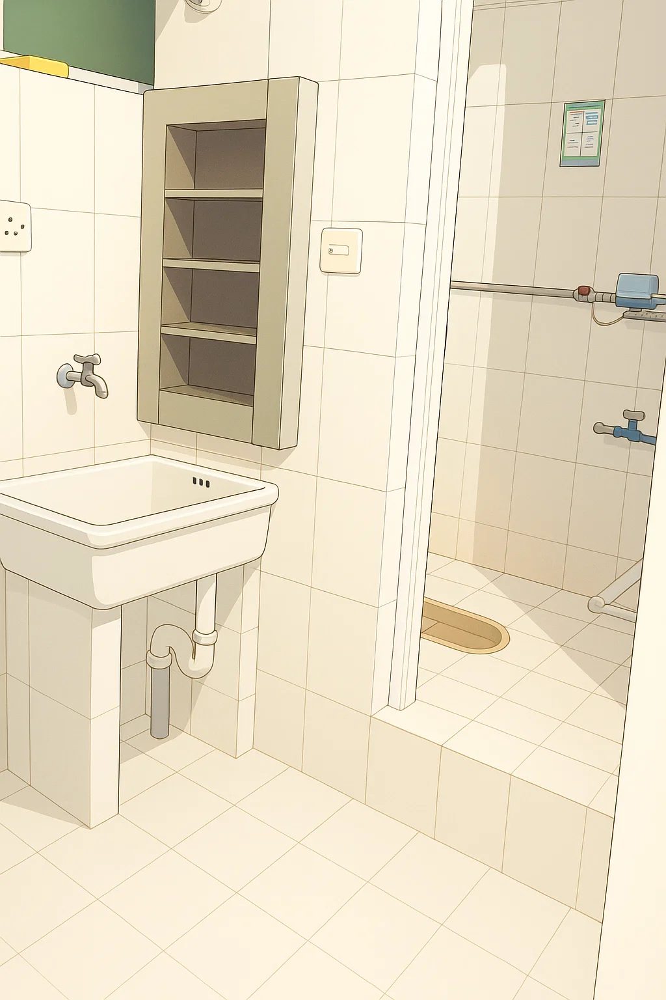

::: tip 致有关单位
如果您恰好看到本文，谨向您提出一项具有高度可行性的建议

把知行驿改回 2 人间
面积大的 2 人间宿舍改为 4 人间

:::

知行驿是位于四号门附近的男生宿舍区，在慧智阁西侧。

所有宿舍均为四人间，上下铺布局，配备独立卫浴及阳台，大部分宿舍朝南，采光较好。

需要注意的是，虽与四号门直线距离较近，但由于四号门目前并不开放，且宿舍楼入口朝北，取外卖需绕行，略有不便。

知行驿共由六栋宿舍楼组成，分别为 16A、16B、16C 及 17A、17B、17C。  
其中，16A 与 17A 位于校区最南端，临近南理工路，为减少道路噪音干扰，这两栋的阳台已安装玻璃封闭；其余楼栋目前仍为开放式阳台。

宿舍内部为两张上下铺，配备四人联排写字桌。整体空间相对紧凑，储物与活动空间有限。

