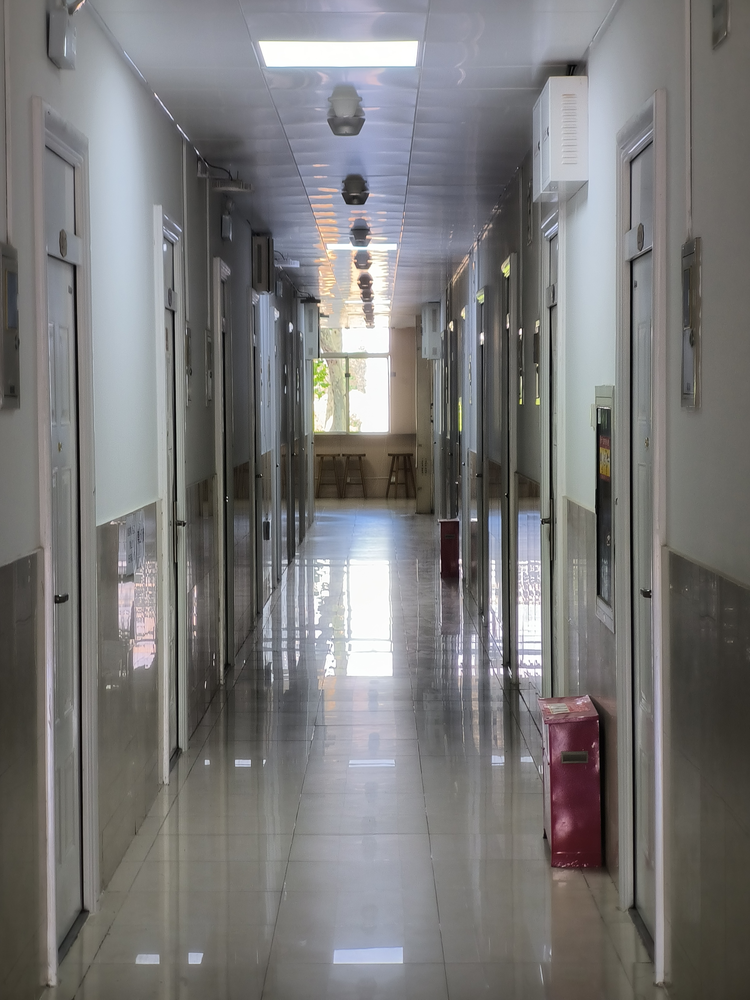
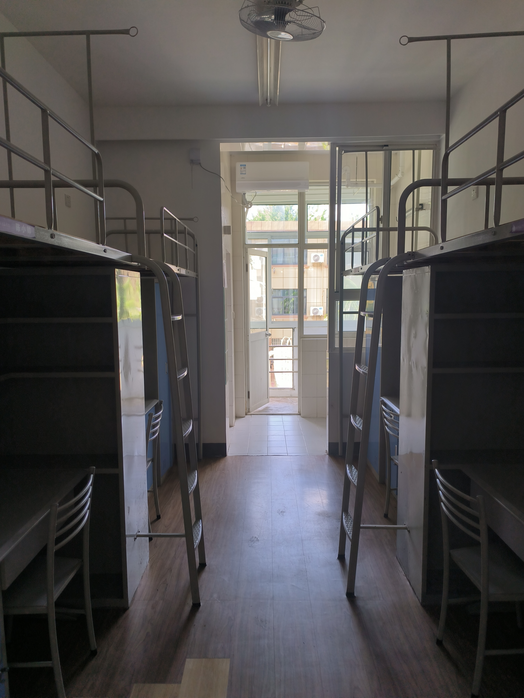
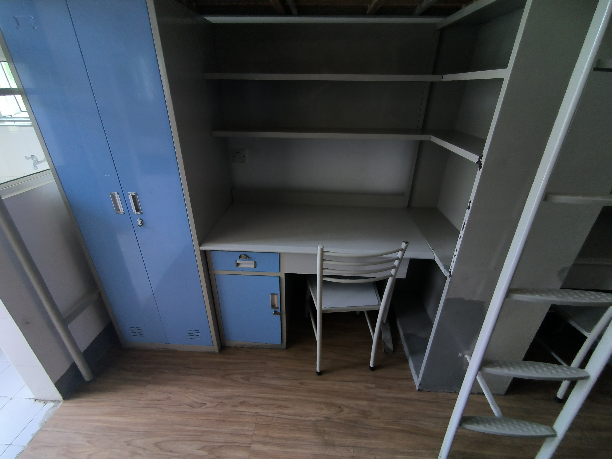
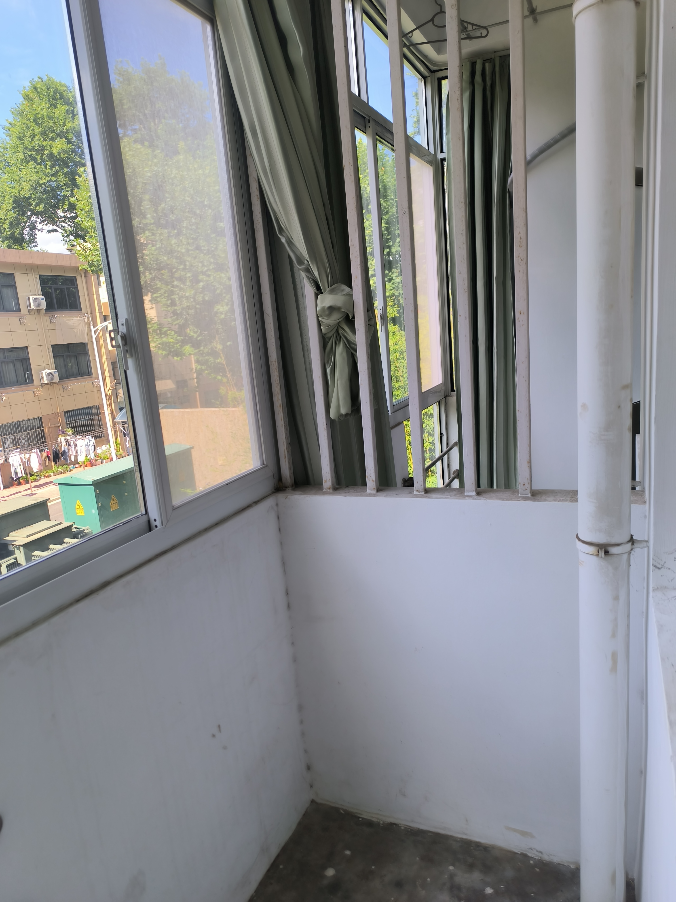
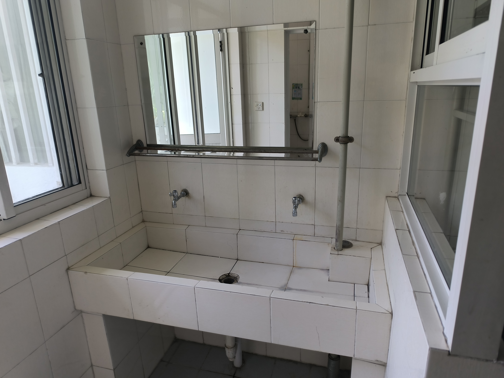
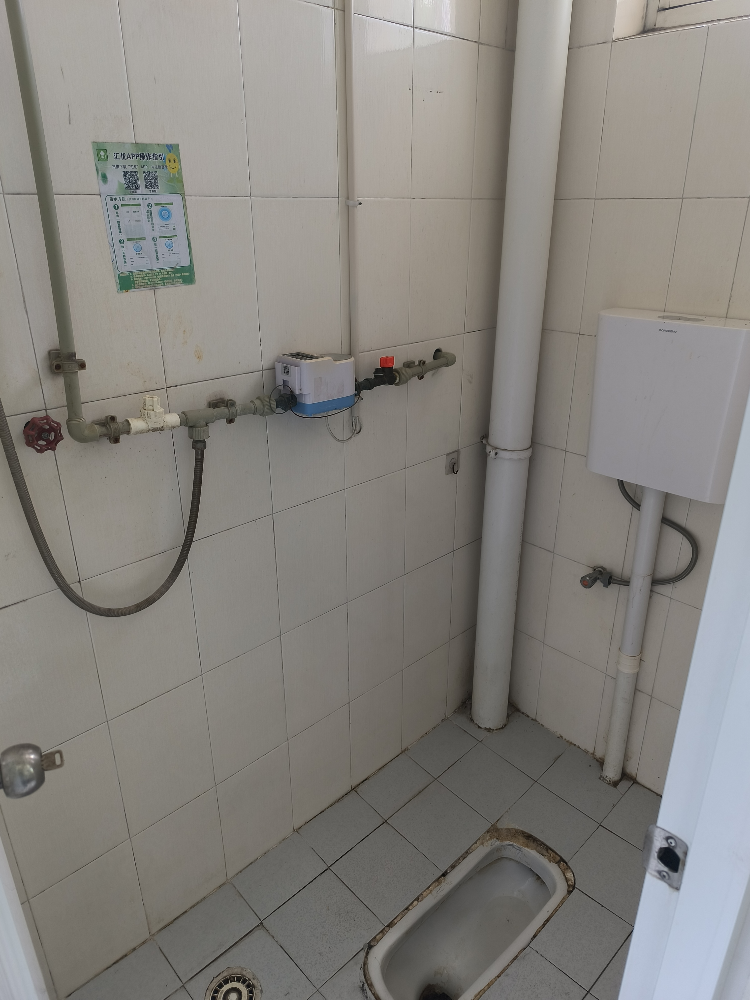

>感谢贡献者提供图片：CPLASF

25 舍位于 204 栋对面，大教育超市西侧，18 舍北侧，目前是钱学森学院专属宿舍。  
楼门前有一片小广场，包含数组公用桌椅，小广场禁止停放非机动车
楼侧面有带电源插座和小型茶桌椅的的长廊
25 舍是男女分楼层混住的。  
宿舍布局为独立卫浴，有封闭阳台，四人间上床下桌。  

走廊内部有瓷砖，还是比较高级的。

标准四人间

南京北区大部分老宿舍都是这种铁架子床

半封闭式阳台，有一部分是镂空的栏杆。

洗漱区位于阳台

蹲厕，非干湿分离。