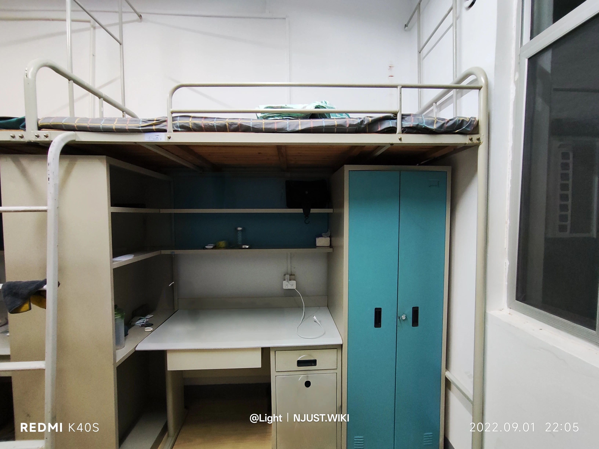

### 明理居概述

明理居是北区 **唯一** 一处宿舍内设有教育超市，且宿舍外配备 24 小时教育超市的宿舍区。
明理居西门是第二运动场和二三食堂、24 小时教育超市，东门是第四教学楼，属于绝对的风水宝地。

## 7 舍与 8 舍

7 舍与 8 舍常被认为是明理居**设计最不合理**的宿舍楼。其规划与使用的不便，源于多次改造与功能调整，具体如下：

**建筑布局历史沿革**

早期，明理居未设置统一的小区栅栏，7 舍、8 舍各自配备门禁与值班室。作为宿舍区最外侧楼栋，两栋楼正门均朝向南侧，方便学生出入。

随着校园安保升级，明理居整体改为封闭式管理，外围加装铁栅栏，并分别在东、西、南三个方向设置出入口，原宿舍楼内的值班室随之停用。此后，出于管理需要，明理居南门被封闭，仅保留东西两侧出入口，导致 7 舍、8 舍的正门正对铁栅栏，学生通行路线被迫改变，使用便利性大幅降低。

**热水改造带来的影响**

2018 年，南京理工大学启动宿舍热水改造工程，在 7 舍、8 舍南侧安装热水机组，而机组安装位置恰好位于两栋楼原南门处。这一改造使得 7 舍、8 舍学生无法从正门进出，只能通过狭窄的侧门通行。正门封堵不仅严重影响日常出行效率，还带来潜在**安全隐患**，紧急情况下疏散通道受限，存在较大安全风险。

## 9 舍

明理居最大的单体宿舍，类似于 12 和 13 舍，由两个分体拼合而成。  
所有宿舍均为 4 人间，宿舍一楼有自习室、自助打印机、自动售货机。
在东侧和西侧各有一个洗漱间、厕所、浴室。两侧各有一个楼梯和多个出入口。
值得吐槽的是饮水机放在厕所里面。

## 11 舍

11 舍曾经是宁静轩的女寝，后因各种原因被划拨到明理居。  
在部分地图软件上依然显示为宁静轩。
11 舍曾经是开放式布局，后改造为封闭式。
只有一台楼梯。

## 12 舍与 13 舍

12 舍与 13 舍本质上是一个楼，二者仅在门材质上存在差异：13 舍使用木门，12 舍使用铁门，其余建筑结构与设施完全相同。以下从多个维度详细介绍 12 舍。

### 一、宿舍分布信息

1. **楼层与房型布局**
12 舍为 6 层建筑，每层设置 15 间寝室，有一个室内主楼梯和一个位于走廊东侧的室外楼梯，具体分布如下（X 代表楼层号）：

- 14 间四人间，编号 X01-X14
- 1 间两人间，编号 X15

2. **基础设施改造**
2013-2025 年间，北区宿舍完成多项升级工程：

- 强电系统改造
- 17 小时热水供应系统完善
- 网络信号增强
- 无线网络全覆盖
因改造施工，宿舍走廊可见配电箱、桥架等设施，呈现“工业风”风格，且无空调外机占用空间。

3. **房间朝向**

- 两人间（X15）：朝东
- 其余房间：朝南或朝北
  
| .webp) | .webp) | .webp) |
|:---:|:---:|:---:|
| 走廊 1 | 走廊 2 | 走廊 3 |

### 二、公共区域设施

1. **每层配备设施**
    - 公用洗漱间
    - 开水炉 1 台
    - 与 13 舍共用的公共浴室（含 8 个独立淋浴间，采用硬质隔断与不透光帘子分隔；热水供应时间 6:30-23:30，费用 0.0035 元/升）
    - 消火栓 1 个
    - 灭火器 2 箱

2. **每两层配备设施**
    - 洗衣机 1 台
    - 纯净水机 1 台

|  |  |
|:-:|:-:|
|12 舍浴室|12 舍水房|

### 三、寝室内部构造

1. **阳台配置**
仅 X15 号寝室设有阳台，其余寝室需将衣物晾晒于窗外。

2. **空间布局与设施**
   - **房间尺寸**：360cm（宽）× 600cm（长）
   - **储物设施**：进门两侧各设置 4 层×2 排储物柜，单柜规格：75cm（宽）×50cm（高）×60cm（深），柜顶可容纳 32 寸行李箱
   - **网络配置**：配备一台校园网 AP 实现 WIFI 覆盖；设有四个校园网、联通、电信合用网口，两个移动网口

|  |  |
|:-:|:-:|
| 四人间宿舍 | 12 舍大柜子 |

3. **床铺细节**
   - 采用上床下桌设计
   - 床铺尺寸：195cm×90cm
   - 床板距天花板：120cm（顶层略高）
   - 床板距地面：175cm
   - 共用金属爬梯（使用时请注意安全）
   - 每个桌面配备 1 个电源插座，部分存在老化现象，如有问题请及时报修
   - 床上未设置插座

