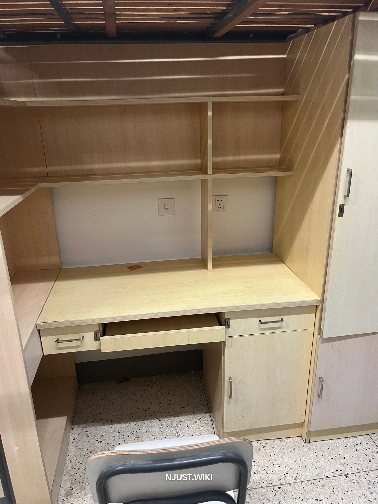

## 27 舍宿舍概况

27 舍是南区女寝，位于南区运动场东侧，紧邻星苑食堂，地理位置便利。  

27 舍全高 13 层，有三台电梯，高峰时刻可能需要排队，或许直接走楼梯会更快。 

27 舍的布局与其他宿舍相同，采用大寝套小寝的结构设计。一般每个大寝包含 3 个小寝室，个别角落房型为 2 个小寝。每个大寝共用一个洗漱间和一个客厅。  

- **客厅配置**：配备储物柜、桌椅、管线式饮水机  

- **洗漱间配置**：
  - 蹲坑数量：2 个，具有硬质全高门板
  - 淋浴头数量：2 个，具有硬质全高分隔和软质门帘
  - 具备洗漱池和脸盆架

地面采用 30 年前流行的水磨石风格，虽已不再流行，但建筑修建于约 18 年前，整体仍较为整洁耐用。颜色很温馨

|客厅 | 客厅|
|:---:|:---:|
|||
||图片经过 AI 重绘使画面整洁|

### 小寝情况

小寝室为 4 人间，开放式阳台，木质上床下桌。每个桌子上都有一个标准五孔电源插座。   

| 宿舍内 | 桌子 |
|:------:|:----:|
|  |  |
