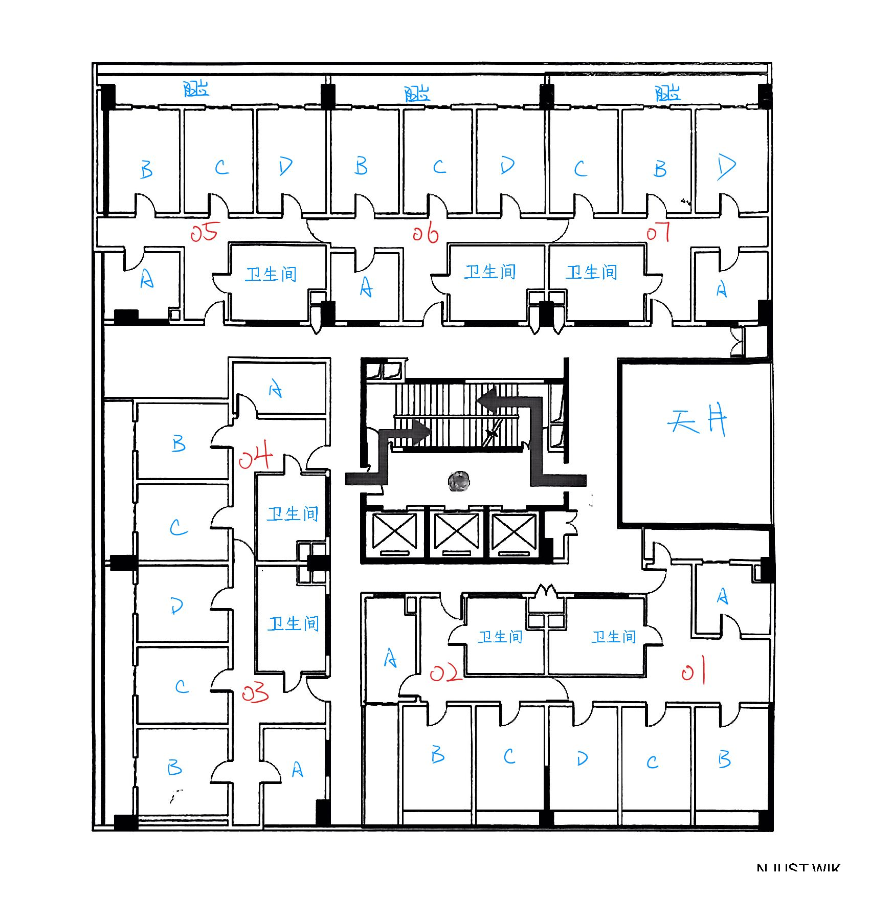

31 舍底部有教育超市、洗衣房和教材科。

29、30、31 舍的建筑布局较为特殊，内部采用回字形设计，具体结构可参考下方平面图。与南大设计院规划的 26、27、28 舍（即南区学生宿舍 4-6 栋）相比，整体设计水平略显逊色。

这些宿舍采用"大寝包含小寝"的布局方式。每个大寝内设有三到四个小寝室，以四人间为主。值得注意的是，部分大寝存在二人间小寝室，这些房间的窗户朝向走廊（包括 02A、03A、04A、05A、06A、07A），其中 06A 寝室因位置特殊，全年几乎无法享受自然光照。

据传言，29、30、31 舍的现有布局并非最初设计方案。后期规划调整时才形成了现今这种独特的二人间格局，同时也出现了空调安装在走廊的特殊设计。

对于 03A、05A、07A 等房间，可以考虑在窗口处用铁丝网隔出一部分走廊空间，改造成实用的阳台区域。而 06A 房间因窗户位于走廊中央位置，不太适合继续作为宿舍使用。

四人间的具体尺寸如下：
- 长度：4.2 米
- 宽度：3.2 米
- 床板到天花板高度：约 1.2 米
其中，03、04 号大寝的使用面积相对更大。

特别说明：01、02 号大寝的四人间不带阳台，而二人间配备阳台。

|  |  |
|:---:|:---:|
|01 大寝|02 大寝|