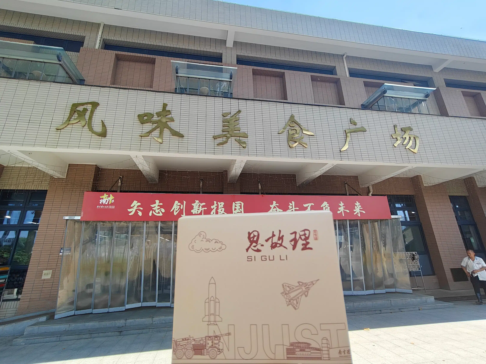

## 南京校区食堂概况

南京校区共有五个食堂：

- **教学区食堂（3 个）**：
  - 明苑美食广场
  - 风味美食广场（二三食堂）
  - 星苑美食广场
- **居民区食堂（2 个）**：
  - 华萃苑（研究生食堂）
  - 兰杉苑（教工食堂）

> 招生办宣传的“14 个食堂”是将每个楼层单独计数，按后勤统计口径，实际上只有上述五个。

- 居民区内食堂可直接使用校园卡、银联二维码、微信、支付宝支付。
- 教学区内食堂可使用校园卡及**学生本人名下绑定的**银联二维码、微信、支付宝支付。

**食堂营业时间（仅供参考，具体以各食堂实际为准）：**
- 早餐：06:30-09:00
- 午餐：10:30-13:00
- 晚餐：16:30-19:00
- 风味美食广场夜宵营业至 22:30

---

### 明苑美食广场

位于校园西南角，靠近四工、三工、图书馆，毗邻第四教学楼，步行约 5 分钟。  
不论南区还是北区的学生，都会来这里用餐。内设留园餐厅（1 楼）、品园餐厅（2 楼）、个园餐厅（3 楼），提供拉面水饺、基本大伙、轻食简餐、特色套餐及风味小吃等。

### 风味美食广场

2019 年，原二食堂、三食堂拆除，原址改建为 18 舍。随后在对面新建了风味美食广场。   
风味美食广场位于校园体育场对面，是运动后补充能量的好去处。  
环境明亮开放，共有四个餐厅。一楼还有一家评价比较多样的理发店。   
食堂正面看，一楼为竹园餐厅，提供肯德基及各种地方特色食品，同时提供夜宵，夜宵营业至 22:30。   
二楼为菊园餐厅，以自选餐品为主。   
经由食堂北侧小楼梯可进入梅园、兰园餐厅。此处以民族特色餐为主。   

### 星苑美食广场

位于南区宿舍核心地带，下楼即达。内设有超市和麦当劳，生活便利。

### 兰杉苑

位于二道门外三号路上，靠近三号门，共两层。一层提供快餐、馄饨、麻辣烫、面食等，已入驻罗森便利、达美乐、~~临榆炸鸡、沪上阿姨、奶茶糕点~~（已倒闭）、和善园等品牌店。  
二层为香渝湾臻选川菜特色品牌。

### 华萃苑

位于紫麓宾馆旁，也称呼为“研究生食堂”（其实和研究生没啥关系）
据传因经营情况不佳，现在食堂整体由金陵饭店运营，菜品口味相对更好一些。