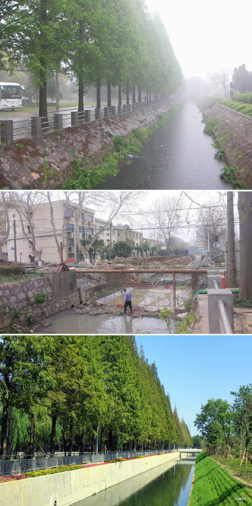

1976 年 2 月 9 日至 3 月 3 日，学院男女老幼齐上阵，每天平均 1700 多人参加友谊河疏浚工程劳动，共挖土 25000 方。

当时，一条由东至西横贯院区的排水渠道十分窄小。每逢夏季大雨，紫金山下来的水势凶猛，积水无法排出，孝陵卫镇居民、紫金山公社部分农民以及学院教学区常常一同遭淹。为此，学院与紫金山公社、孝陵卫镇协议，共同疏浚河道，解决孝陵卫地区和学院的山洪积涝问题。紫金山公社负责加宽加深院区以外的排水渠道，学院负责加宽加深院区内的排水渠道。清理后的河道命名为”友谊河”。在这次劳动中，16 个单位 336 人受到表彰。

然而讽刺的是，友谊河将孝陵卫雨水引入校内后，每逢暴雨排水不及，校内反而常常积水，严重影响师生生活。
> 7 月 6 日上午，南理工校园内，被淹的学生宿舍区因有化粪池而散发出恶臭，落叶枯枝、衣物和动物尸体在水中漂浮，各个路口已设置路障，同学和老师都靠皮艇出行。
>
> 记者从该校保卫处提供的监控录像看到，6 日，学生宿舍区及其周边、中心广场、小运动场等区域仍泡在水中，据推断，平均水深在 30 厘米以上。该校一名保安指着桥上、树上、墙壁上的水印告诉记者，水位已经比最严重的时候下降了 50 多厘米。

如果你有心观察，会发现思源楼（一小区）宿舍的所有电箱、热水器都是架高设置的——这正是常年积水留下的痕迹。

据后勤服务中心 2018 年 4 月的一则消息：

> 友谊河是城东地区一条重要的行洪通道……由于紧靠紫金山，每逢下大雨，洪水下泄后造成河道水位暴涨，如果再碰到外秦淮河高水位顶托，下泄不畅，友谊河就处于”两头夹击”状态，这也是沿河南京理工大学、银城东苑等经常被淹的根子所在。石杨路泵站与南理工泵站的建设，及配套的友谊河口至长巷桥 2.2 公里河道拓宽工程，将有效提高友谊河区域的防洪排涝能力，基本解决紫金山南麓等城东片区逢大雨就淹的问题。

2018 年，工信部向南京理工大学拨付 1.5 亿元专项经费，用于灾后重建工作。学校新建南理工提升泵站一座，用以将友谊河水排入外秦淮河。新修 18 舍，对泡水的 1 舍进行检修（是的，没拆）
南京地方政府在南京秦淮区海福巷石杨路北侧新建石杨路泵站一座，系南京城区最大的泵站。承担城东核心片区排水任务

