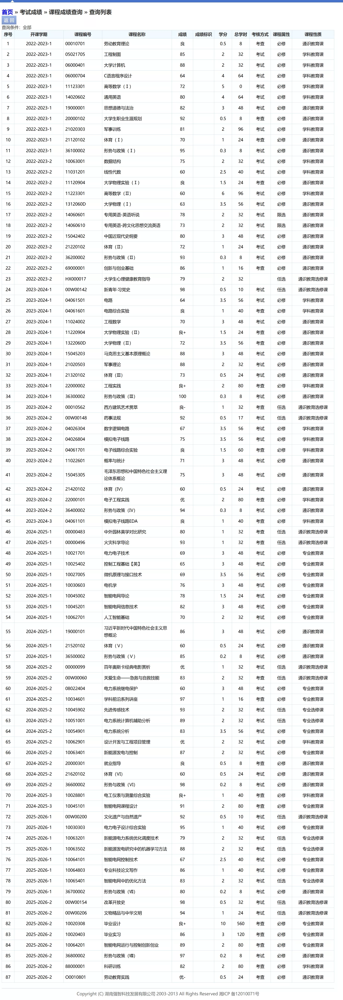

从教务系统查询成绩，你会看到一张很长的表。表上有非常多的信息。这对所有同学来说都是新事物。需要慢慢学习。


::: tip 本文的样本
下面的统计来自一份完整的四年修课记录（2022 级自动化学院智能电网信息工程专业，共 **87 门课、169.5 学分**），用来说明各类课程的实际比重。**各专业、各年级的培养方案不同，具体要求请以本院教务办和你自己的培养方案为准。**

绩点怎么算、什么是学位绩点，见[学分与绩点](./1.学分与绩点.md)。
:::

::: details 点击展开：教务系统里的课程成绩查询页长什么样

:::

## 一、先分清

"课程性质"和"课程属性"。它们回答的是两个问题：

- **课程性质** → 这门课在培养方案里处于哪一层（通识选修？专业教育（俗称专业课）？通识教育？）
- **课程属性** → 你对这门课有多少选择权（必须修？还是自己挑？）

比如"通用英语"是**必修**的**学科教育课**，"先进传感技术"是**任选**的**专业选修课**。看成绩单时要两列一起看。

## 二、课程性质

以智能电网信息工程专业为例：

| 课程性质 | 是什么 | 典型课程 |
| --- | --- | --- | 
| **通识教育课** | 全校统一的公共基础，不分专业 | 思政系列、形势与政策、体育、军事理论、劳动教育、就业指导、大学物理、概率统计、工程数学 | 
| **学科教育课** | 按学科大类打底的平台课，同一大类的专业都要修 | 高等数学、线性代数、C 语言、数据结构、大学计算机、工程制图、电路、模电、数电、通用英语、各类综合实验 | 
| **专业教育课** | 你这个专业的核心课，必须上，换专业就全变了 | 电机学、电力系统分析、继电保护、微机原理、毕业实习、毕业设计 | 
| **通识教育选修课** | 全校范围任选的素质课，按类别管理 | 人文素养类、艺术审美类、经济社会类（含四史）、自然科技类 | 
| **专业选修课**| 本专业内的方向性选修，按类别管理，合计分数足够即可，可以挑选感兴趣的方向 | 先进传感技术、电力系统计算机辅助分析、优化方法等 |
| ...| ... || 


::: warning 每一类的学分要求是分开算的
培养方案会**分别**规定这几类各需多少学分，**不能互相顶替**。专业选修多修 4 学分，抵不了通识选修缺的 2 学分——总学分够了照样毕不了业。
建议大二起每学期核对一次。
:::

## 三、课程属性

| 课程属性 | 含义 | 
| --- | --- | --- |
| **必修** | 必须修、必须通过。教务安排的，一般改不了（只能选老师，不能选课） |
| **限选**| 在指定的一小组课里按要求选够门数。比如你在大一下的时候，可以从英语阅读、英语口语、英美文化、英语翻译里面选两门上。|
| **任选**| 自己挑课，但每个类别有最低学分线。比如每个专业的专业选修课，你选够 10 学分，就够了。至于你是选发电、储能、调度、计算、保护还是什么都可以。四年内修够对应类别的对应学分就行。| 


**必修占了绝大多数。** 大学的"自由选课"没有想象中那么自由——本科四年八成以上的学分是定死的，真正由你决定的只有 20 学分左右。

**"限选"通常出现在外语** 如您在大一上学期期末考试位居前列，下学期的通用英语就可以只选一门，否则要选二门。

**"任选"不等于"可以不选"。** 它只是让你自由挑课，学分要求照样是硬的。每年都有人大四才发现通识选修还差两个学分。


## 四、通识教育选修课的类别

通识选修课还会区分类别，例如：

| 类别 | 课程举例 |
| --- | --- |
| 人文素养类 | 大学生心理健康教育指导、关爱生命——急救与自救技能、文化遗产与自然遗产 |
| 艺术审美类 | 西方建筑艺术赏萃、中外园林美学对比研究、百年奥斯卡经典电影赏析、文物精品与中华文明 |
| 经济社会类（含**四史**） | 新青年·习党史、改革开放史、药事法规 |
| 自然科技类 | 火灾科学导论 |

培养方案通常要求**每个类别至少修够一定学分**，也就是说，你不能十几个学分全选艺术类。
可以使用[南理工教务增强助手](https://enhance.njust.wiki)查看选修课课程对应的类别。在培养方案中查看对应类别的学分要求。

## 五、考核

| 考核方式 | 怎么给分 |
| --- | --- |
| **考试** | 期末统一命题闭卷或开卷，成绩多为百分制 |
| **考查** | 靠平时表现、实验报告、作品、论文等过程性材料 |

**"考查"不等于"水课"。** 学分最高的一门课是 **10 学分的毕业设计**，它就是考查课；各类综合实验、工程实践、科研训练也都是考查课，占了总学分的四分之一以上。

这类课没有期末一张卷子给你翻盘的机会。当然这也意味着期末周不用临时抱佛脚了。复习压力会小很多。并且没有绝对标准的答案，只要你平时好好上课，老师往往可以放你一马。

## 六、一门课的分数是怎么算出来的

高中的成绩基本等于考试成绩。大学不是——**成绩单上那个数字，是"平时成绩"和"期末成绩"按比例加权出来的**，通常叫总评成绩。

```
总评成绩 = 平时成绩 × 平时占比 + 期末成绩 × 期末占比
```
有的课程还会加上一份过程性考核，如期中或者实验。

比例由课程的教学大纲规定，不同课程不一样。实践性强的课，平时占比可能更高。占比可以由老师向教务处提出调整。

::: tip 第一节课要...
1. 平时分和期末分各占多少；
2. 平时分由哪些部分构成；
3. 请假怎么算（是否需要假条，是否算缺勤）。
:::

### 平时成绩通常包含...

- **出勤与课堂表现**：点名、提问、随堂练习。这部分基本"只要来就有"。
- **作业**：书面作业、编程作业、习题册。
- **小测与期中考试**：不少课把期中考试算进平时分。
- **实验报告**：理工科课程里占比很高。
- **分组作业与课堂汇报**：需要协作的部分，别做搭便车的那个人。


### 为什么...


平时分是整个成绩体系里最容易拿的分，并且可由老师主观评价给出。

期末考砸的时候，一个较高的的平时分往往决定了你是60还是59.

::: warning 卷面成绩可能另有门槛
有的课程会额外规定"卷面成绩低于某个分数即不及格"，即斩杀线。这类规则写在课程大纲或考核方案里，以任课老师的说明为准**，不要指望平时分能完全兜底。目前大学物理是有斩杀线的。
:::


