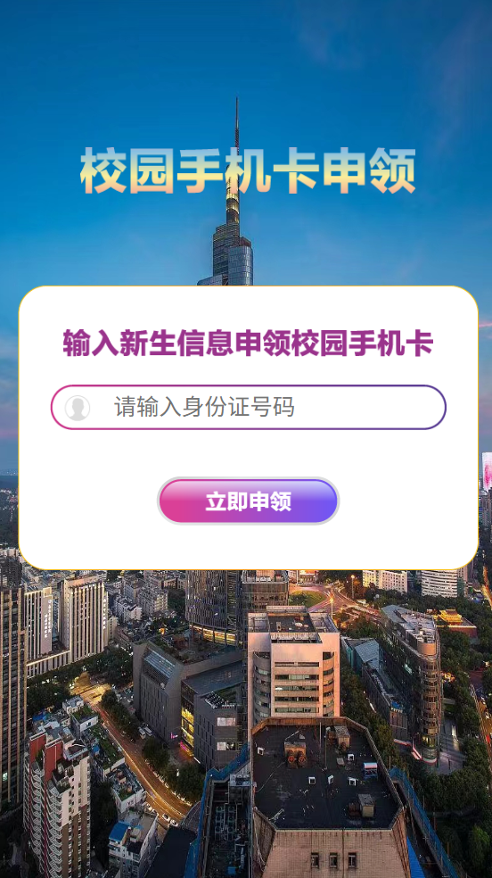

::: danger 重要提醒：
**务必妥善保管个人身份证！**  
报道当天，**仅警察和学校官方工作人员有权依规查验身份证**，其余任何人索要身份证均需坚决拒绝！  

- 你无需现场办理任何电话卡、校园卡或宿舍宽带！  
- 所有索要身份证、自称“校园网办理”“校园卡办理”或“信息录入”、“体检信息”的人员均为骗子！  
- **校园网为默认开通状态，无需额外申请或缴费办理！**  
- 学校工作人员绝不会上门推销或办理任何业务！  
  
如遇到上述人员，**不要相信，不要联系，不要使用！**

:::

::: details 南京理工大学校园网历史
南京理工大学校园网一期工程于 1996 年初启动，采用快速以太网技术，1997 年 4 月建成运行。校园网二期工程于 1998 年底启动，采用千兆以太网技术，1999 年 9 月建成运行。校园网三期工程于 2004 年底启动，采用千兆/万兆以太网技术，2005 年 5 月建成并投入运行。

2005 年，我校实施了“中国下一代互联网示范工程 CNGI 驻地网建设”项目，建成了与 CNGI 高速互联的纯 IPv6 驻地网，接入用户超过 1000 个，为学校教学、科研和管理提供了 IPv6 信息服务。2008 年，我校入围“下一代互联网业务试商用及设备产业化专项——教育科研基础设施 IPv6 技术升级和应用示范项目”，承担了“南京理工大学校园网 IPv6 技术升级”子项目的建设工作，2012 年顺利通过国家验收。该项目实现了 IPv6 网络的校园全覆盖，用户数达 1.8 万，以纯 IPv6 协议及 1000M 带宽实现了高速接入 CNGI-CERNET2 主干网的目标。

2010 年，结合“校园网 IPv6 技术升级”项目建设，校园网实现了基于 BRAS 架构的网络扁平化技术改造，校园网接入采用扁平化的路由架构，同时将原有静态地址改为动态地址，扩展了用户接入能力，并实现了 IPv4/IPv6 双栈服务。

2013 年初启动了校园弱电线缆下地工程建设，共计完成全部 134 条光缆的下地铺设、新旧切换、线缆挂牌及旧线拆除等工作。以上线缆总长约 9.6 万米，覆盖了我校办公区、教学区、学生宿舍区等全部区域及部分教工生活区。

从 2014 年开始建设校园无线网，通过 2014 年、2015 年两期的无线建设，无线校园网已覆盖图书馆、第 1/2/3 /4 教学楼、明苑食堂、星苑食堂、二三食堂、教工食堂、团委、学术交流中心、艺文馆、综合楼 9-12 层、信息化处办公楼等教学、办公及生活区域。

2015 年，启动了新数据中心机房的建设。新数据中心机房位于新图书馆大楼 8 层和 9 层东侧，规划使用面积近 800 平方米。数据中心机房含核心机房、托管机房、UPS 机房及监控大厅，涉及机房装饰、暖通系统、UPS 及 KVM 系统、机柜系统、综合布线及消防等多个子系统。

2016 年年初，完成了数据中心机房的整体搬迁工程。搬迁开始前进行了 3 个批次的设备及业务系统启停演练，排处了种种隐患，以确保搬迁的顺利实施。搬迁过程中，硬件设备无一损坏，各类业务系统顺利重启，业务数据完好无损，各项业务均恢复正常。至此，学校数据中心机房主体搬迁工作全部结束，共迁移校园网主干光纤及网络出口线路约 2 千对，搬迁各类硬件设备 200 余台（套），各类网站及业务系统约 250 个，较好的保障了学校网络及各项业务系统的正常运行。

2022 年，暑期启动了南京校区宿舍区无线光网建设施工，次年正式开通使用，覆盖 6606 间学生宿舍。本次宿舍无线校园网建设采用 10G PON+Wi-Fi 6 全光网无线技术架构，网络结构更加扁平，网络运行速率与质量相较于旧型组网方式都得到了显著的提升。南理工学子已在宿舍享受到了全新的校园无线网服务，经开学以来的监测观察，宿舍区累计接入无线终端近万个，终端协商速率可达 400Mbps。

经过近三十年的持续建设，校园网已形成了万兆与千兆结合的网络主干，千兆与百兆结合的网络接入，全网实现了扁平化的基础架构改造。通过教育网、电信、联通、移动、IPv6 等外接专线，实现了各校区互联及 Internet 互联。此外，校园网提供每天 12 小时的网络保障服务，周末及节假日安排有专人值班负责用户服务，有效保障了校园网用户服务的质量和水平。
:::

南京理工大学校内提供高速、稳定且多样化的网络接入方式，包括：

- a. 校园网
- b. 运营商宽带服务

## 校园网

校园网默认为所有在校学生开通，除居民区宿舍外，所有宿舍与教学区域均已覆盖 `NJUST`、`NJUST-FREE` 或宿舍号命名的无线网络信号，并配备有线网络接口。

### 无线网络连接

江阴校区宿舍区域
1. 搜索并连接以宿舍号命名的 WiFi 信号
2. 输入统一密码：`88888888`
3. 在浏览器访问认证页面：
   - `m.njust.edu.cn` 或 
   - `10.132.100.104`
4. 输入账号密码完成认证：
   - 账号：学号(字母小写)
   - 初始密码：身份证后六位


 其他区域
1. 连接 `NJUST` 或 `NJUST-FREE` 无线网络
2. 在浏览器访问认证页面：
   - `m.njust.edu.cn` 或
   - `10.132.100.104`
3. 输入账号密码完成认证：
   - 账号：学号(字母小写)
   - 初始密码：身份证后六位


### 有线网络连接

 江阴校区接入指南
1. 使用网线连接电脑和墙上网络端口
2. 配置网络设置：
   - 右击任务栏网络图标
   - 选择"打开'网络和 Internet'设置"
   - 将 IP 设置为自动获取(DHCP)
3. 通过浏览器访问认证页面完成登录
   > 认证设备会记录最后一层连接到校园网设备的 MAC，路由器同理


南京校区接入指南
1. 使用网线连接电脑和网络端口
2. 创建新的宽带连接
3. 输入学号和校园网密码(默认为身份证后六位)进行认证
4. 完成认证后即可正常访问互联网


### 校园网端口位置指南

::: info 南京校区网口分布
| 区域 | 网口位置 | 用途 |
|------|----------|------|
| 南区宿舍 | 桌上网口 | 移动、联通、电信、校园网合用 |
| 北区知行驿 | 宿舍门附近单个网口 | 移动、联通、电信、校园网合用 |
| 北区明理居 | 宿舍门左右两侧面板 (**无** Schneider 字样) | 联通、电信、校园网合用 |

其他宿舍区域校园网口特征：
- 面板标注"校园网"或"宿舍号-A/B"
- 面板**无** Schneider 字样（有 Schneider 字样的是移动的网口）
- 使用方形线槽而非圆形线管（有线管的是新全光校园网，尚未启用）
- 通常年代久远，印有 TCL、清华同方、QHTF 等字样。

:::

个别网口内连线老化，如无法使用，请更换重试。

### 使用说明

计费规则
- 未认证访问校内站点：免费
- 认证后：0.3 元/小时，单月封顶 20 元，不限流量


网络速率
- 上下行速率对等
- 正常使用可达 100Mbps 以上
- 南京校区有线接入可达 300Mbps 以上
- 江阴校区或人流密集区域可能速率略低，但通常不低于 100Mbps


使用限制
- 最多支持三个终端同时登录
- 允许使用路由器
  - 江阴校区：DHCP 方式
  - 南京校区：PPPoE 方式
- 使用路由器的情况下，不限制路由器连接的设备数

更多信息与使用指南请参考信息化建设与管理处官网：

👉 [如何连接校园网](https://dicm.njust.edu.cn/d4/3b/c3298a316475/page.htm)

👉 [校园卡、饭卡、无线上网、有线上网、网络计费、WebVPN、智慧理工门户、企业微信、正版软件](https://mp.weixin.qq.com/s/Rv3RF4Fn0lGoZqBsJxpF4g)

::: info
校园网默认为 PPPOE 拨号的设备分配一个（/32）的公网（219.x.x.x）IPv4 和一个（/128）的 IPv6。  
但由于“安全原因”，大部分公网 IP 都被出口防火墙阻断了所有入连接，端口全部阻断。  
这意味着，您基本不能使用这个 IP 进行联机和 PT 下载。因为互联网设备无法与您的设备建立联系。    
只分配/128 的 IPv6，意味着您的路由器需要设置 IPv6-NAT（nat6）才能正常访问 ipv6 资源  

校园网会为无线接入的设备下发一个 10.24.x.x 的 IPV4 地址，和一个通过 DHCPv6 下发的（/128）的 IPv6 地址。  
由于大部分 Android 设备原生并不支持 DHCPv6，因此这些设备使用```NJUST-FREE```和```NJUST``` 时无法获得 IPv6 地址。  
信息化处称，使用 DHCPv6 而不是 SLAAC 是出于“安全原因”  

10.24.x.x(或 10.20.x.x) 网段与 PPPOE 拨号获得的 219.x.x.x 在校园网内互通，可以远程联机或者推流，但延时稍高。
校园网接入了 CERNET（教育网）、CERNET2（纯 IPv6 教育网）、中国联通、中国电信、中国移动共四家运营商、五条线路进行汇聚，总带宽在 20Gbps 左右，基本不会遇到带宽不足的情况。
一般情况下，访问境外资源默认走 CERNET（教育网）,教育网签约带宽在 1Gbps 左右，但是可以~~超频~~ 到 5Gbps以上

信息化处对 STEAM 等游戏下载进行了限速。

宿舍内覆盖的```NJUST```网络对每个账号限速在 100Mbps 左右。

宿舍内 ruijie AP 的 RJ45 网口暂未启用。请使用桌面上（或一进门处）的校园网网口进行有线接入。有线接入暂无限速，并且可以多拨。
:::

---

## 运营商宽带

南京理工大学宿舍区支持三大运营商（**中国移动、中国联通、中国电信**）提供的宽带接入服务。

- 运营商宽带通常与手机套餐强绑定，**无法单独办理宽带服务**。
- 常见办理方式包括线下驻点、宿舍上门推销、或通过运营商官方/代理提供的小程序线上办理。

⚠️ **风险提示**：

部分运营商或其代理为获取高额利润（单张电话卡利润可能高达 200 元，代理抽成超过 100 元），可能存在以下不当行为：

- 在未经充分告知的情况下，通过宣传页、网站、二维码诱导新生办理套餐；
- 借开学报到之机，以欺骗或误导方式收集身份证件并擅自开通卡（如，在校医院体检处假冒工作人员收集身份证）；
- 直接进入宿舍办理业务，甚至谎称“不办卡无法选课/考试”；
- 自称“校园网络办理”或“校园宽带服务”，**混淆校园网与运营商宽带的本质区别**。

**请务必提高警惕，谨慎选择正规渠道办理，避免造成信息泄露或经济损失。**

| ----- | ------- |
|:---:|:---:|
|  |  |


上述二维码指向的域名为：

```
http://apps.verihub.site
```

经查询，该域名注册于 15 日前，**未备案、无主办单位信息**，却要求用户填写身份证号等敏感信息，极可能涉及隐私收集或身份盗用。

⚠️ **请务必警惕：不要扫描此类来历不明的二维码，也不要在陌生网站填写任何身份证件信息。**

此二维码不知道为什么出现在招生办网站和录取通知书上，好难猜啊 

### 套餐与资费情况

目前三大运营商在校套餐基本一致：

- **月费**：59 元/月  
- **包含流量**：80GB 全国流量  

::: note 注意事项

相较市场行情，运营商套餐价格偏高，性价比不高。  
如无特殊需求 (如公网访问、BT 下载)，**不必办理电话卡或运营商宽带服务**   
更**不建议在收到录取通知书时提前办理电话卡**，因为往往联系代理商（也就是拉着你办卡的“学长学姐”）可获得更高优惠（如话费）或礼品。

:::


### 各运营商宽带性能概况

| 运营商       | 最大协议速率 | 无线网络覆盖      | 公网 IP                           | IPv6 | 备注 |
|--------------|-------------|--------------------|--------------------------------|------------------|------|
| 中国电信     | 500 Mbps    | ⚠️ 计划支持       | 默认分配公网 IP                | ❌不提供|   与校园网共用网口   |
| 中国联通     | 500 Mbps    | ✅ 提供 `ChinaUnicom`Wi-Fi | Wi-Fi 默认分配公网 IP<br>有线接入默认 CG-NAT，可找客服申请公网 IP | ✅ 提供 |  与校园网共用网口     ||
| 中国移动     | 300 Mbps| ✅ 提供 `CMCC-JSLAN`Wi-Fi | 不提供公网 IP | ⚠️不太清楚 | 南区与校园网共用网口<br>北区使用独立部署的网络设备与线路 |

如果您对网络有更高带宽需求（例如外网联机）或需要独立公网访问等特殊需求，可根据自身情况考虑是否选择运营商宽带服务。  

500Mbps 宽带下行速度 500Mbps，上行速度 60Mbps  
100Mbps 宽带下行速度 100Mbps，上行速度 20Mbps  
校园网上下行速度与上行速度相等，能跑多少看你本事。

### 备注

- **中国联通与中国电信**  
  联通和电信的接入设备与校园网共用网络基础设施，因此其网络速率受限于校园网整体架构。  
  例如，部分宿舍区域（如 *知行驿*）可能由于布线老化或设备陈旧，仅支持 100Mbps 的有线连接。  
  在此类场景中，建议优先使用接入点（AP）提供的无线网络，以获得更高的上网速度。

- **中国移动**  
  在部分宿舍区域（如 *明理居*），中国移动使用独立部署的网络设备与线路。  
  这些设备多为早期型号，网络速率通常也限制在 100Mbps，可能无法满足高带宽应用的需求。  
   在此类场景中，建议优先使用接入点（AP）提供的无线网络，以获得更高的上网速度。  

- **关于中国联通宽带账号的 MAC 地址绑定**  
  中国联通的宽带账号存在 MAC 地址绑定机制。  
  例如，当使用 MAC 地址为```C4:6E:1F:2A:3B:7C```的路由器完成拨号后，该账号将在短时间内绑定到此 MAC 地址。
  若之后更换路由器或更换拨号账号，都可能会出现 *651 拨号失败* 的情况。

  遇到此类问题时，可通过以下方式处理：

  1. 等待系统自动解绑（约 30 分钟）；
  2. 联系联通装维，解除 MAC 绑定；
  3. 在新路由器后台设置中手动 **克隆原设备的 MAC 地址**（适用于更换新路由器）。
  4. 在路由器后台手动设置 **一个新的 MAC 地址**（适用于更换拨号账号）。

注：江阴校区和南区宿舍无上述问题。