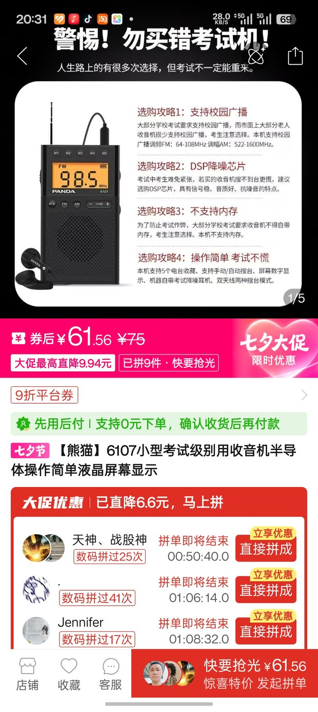
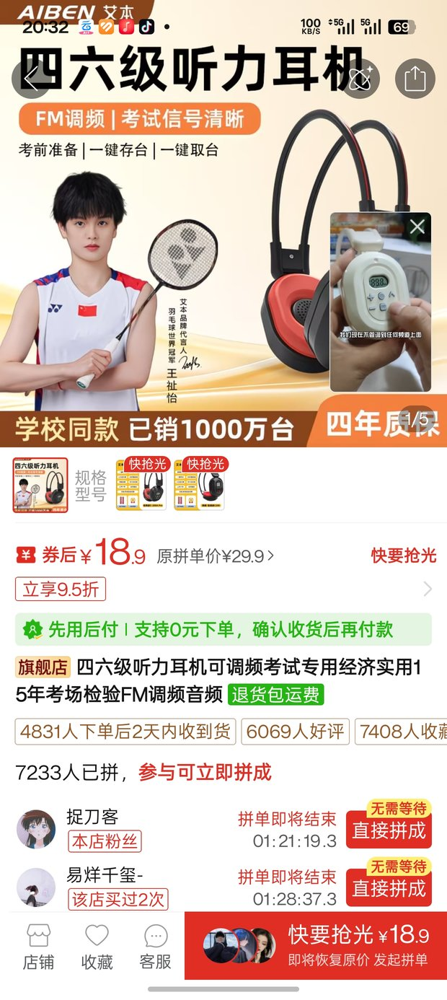

2026 级新生英语分班考试定于 8 月 27 日 13:30-15:00 举行，题型为四级题型但不含作文。考试含听力题，听力音频通过 **FM（调频）广播**播放（频率 78MHz），因此除必要文具（黑笔、涂卡笔、橡皮）外，还需自备听力接收设备。考试中不得使用扩音器，也不得使用具有存储、发送信息功能的装置。

> 官方通知中所称的"**语音机（含电池耳机）**"，即具备 FM 收音功能的听力耳机（或"收音机 + 有线耳机"的组合），都是符合要求的听力接收设备。

## 需要什么样的设备

听力接收设备应能接收 FM 广播（**78MHz**），可以是：

- **一台收音机（含电池）及配套的有线耳机**
- **具备 FM 收音功能的专用听力耳机**

校内教育超市可以买到，但考虑到质量、价格和便利性，推荐提前在网上购买。
2026 年出现了垄断、断货、囤积居奇的情况，27 新生一定要提前在网上购买！

## 两种方案

### 方案一：FM 收音机 + 有线耳机（推荐）

由于听力音频是普通 FM 广播，属于通用场景，考虑产品质量、价格、效果等因素可得：

1. 受众多的产品优于受众少的产品，即**通用产品优于专用产品**；
2. 通用产品的残值往往高于专用产品，即使用过后可以卖出更高的价格。

因此推荐购买**大品牌的 FM 收音机**（需支持 78MHz）和**耳机品牌的 3.5mm 有线耳机**，总成本约 60 元。

### 方案二：FM 听力耳机（经济之选）

如果追求方便省钱，可直接购买一台二十余元的听力耳机。受体积所限收音效果可能略差，一般不影响使用。

## 免责声明

以上商品仅作价格对比之用，无商业推广，请自行选购喜欢的品牌。祝同学们取得理想的成绩。

## 附件：完整选购攻略（PDF）

原版攻略 PDF 见下方预览，也可直接[下载](/英语考试用收音机或听力耳机选购.pdf)保存。

@[pdf](/英语考试用收音机或听力耳机选购.pdf)

## 相关链接

- 更多相关问题：[开学考试及分班](/notes/freshGuide/summerPrep/freshmanExam.html)
- 原通知：[关于 2026 级本科生英语分级考试的通知](https://jwc.njust.edu.cn/a3/c3/c1217a369603/page.htm)