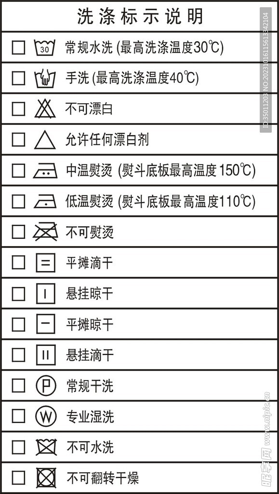

军训第三天，宿舍阳台上挂着六件还没干的短袖，空气里有一股说不清的味道。这大概是很多人大学生活里遇到的第一个真正的"生活难题"。

洗衣服看起来是件不需要人教的事。但它其实是好几件事叠在一起：认识衣物的材质、看懂洗涤标签、挑对洗涤剂、和一层楼的人共用几台洗衣机、以及在江南的梅雨天里把衣服晾干。任何一环出问题，代价就是一件缩水的毛衣、一片再也洗不掉的黄渍，或者一整柜带着霉味的衣服。

这一章按完整流程来讲：开学前准备什么、洗之前做什么、机洗和手洗分别怎么操作、污渍怎么急救、以及南方最难的晾晒和防霉。

::: tip 本章导航
准备工具 → 认识材质与洗标 → 选洗涤剂 → 洗前五分钟 → 机洗 → 手洗 → 污渍急救 → 晾晒 → 收纳防霉 → 公共洗衣机的公德 → 特殊衣物 → 何时该花钱
:::

## 一、把工具备齐

不需要买贵的，但缺一件就会很麻烦。

| 类别 | 物品 | 说明 |
| --- | --- | --- |
| 必备 | 洗衣液 | 带小瓶过渡，到校后再网购大瓶。选购标准见[洗衣液选购指南](/notes/freshGuide/选购指南/洗衣液选购.html) |
| 必备 | 脸盆 + 水桶 | 盆用来手洗，桶用来放洗完的衣服。宿舍水房和阳台的距离决定了桶的重要性 |
| 必备 | 衣架 20 个以上 | 塑料或不锈钢。**不要买铁丝衣架**，受潮会在衣服上留下锈痕，细杆还会压出肩印。推荐网上购买 |
| 必备 | 夹子 / 防风衣架 | 高层阳台风很大，没有夹子的衣服会挂到楼下 |
| 推荐 | 洗衣袋（网袋） | 保护内衣、针织衫、带装饰的衣物，也能防止袜子在滚筒里失踪 |
| 推荐 | 洗衣凝珠 | 应急和赶时间用，投放方便，单次成本略高 |
| 推荐 | 衣物消毒液 / 除菌液 | 梅雨季和军训期的必需品 |
| 推荐 | 除湿盒 / 防霉片 | 放衣柜里，江苏的潮湿程度值得这笔钱 |
| 可选 | 去污笔 / 去渍剂 | 食堂吃饭溅到油点时能救急 |
| 可选 | 小晾衣架 | 阳台晾衣位置紧张时用来加挂 |

完整的开学行李清单见[物品准备](/notes/freshGuide/summerPrep/items.html)，这里只列与洗护相关的部分。

## 二、材质与洗标

绝大多数"洗坏衣服"的事故，一般都来自于此

### 材质决定了它能受什么

| 类别 | 常见衣物 | 特性与禁忌 |
| --- | --- | --- |
| 棉、麻 | T 恤、衬衫、牛仔裤、床品、毛巾 | 耐洗、耐高温、可漂白。缺点是容易皱、容易缩水，第一次下水后尺码可能变小一号 |
| 羊毛、真丝（蛋白纤维） | 毛衣、羊毛大衣、丝质衬衫 | **最娇贵的一类。** 怕碱、怕含酶洗涤剂、怕热水、怕搓揉。处理不当会毡缩、变硬、失去光泽，且不可逆。要用专用清洗剂 |
| 涤纶、尼龙（化纤） | 冲锋衣、运动服、速干衣 | 结实、快干、不易皱。但容易吸附油和异味，也容易起静电 |
| 氨纶（弹力纤维） | 内衣、泳衣、瑜伽裤、弹力袜、袜口 | **怕高温。** 热水和烘干会让它彻底失去弹性，穿一次就松垮 |

### 洗标怎么读

每件衣服的领口或侧缝里都有一小块标签，上面的符号分成五类，从左到右依次是水洗、漂白、干燥、熨烫、干洗。对照下图即可读懂：

不必背下全部符号，记住下面这几条就够用了：

- **水盆里的数字是最高水温**（30 / 40 / 60），盆里有一只手表示只能手洗。
- **任何符号被打叉，都是"禁止"**：叉在水盆上表示不可水洗，只能送干洗；叉在三角上表示禁止一切漂白剂；叉在熨斗上表示不可熨烫。
- **方框看的是怎么干燥。** 框内一条横线表示平摊晾干、两条横线表示平摊滴干（不脱水直接平放），竖线则对应悬挂；框里有圆圈才可以滚筒烘干，打叉表示不可烘干。
- **符号下方的横线代表力度**：一条横线是"轻柔"，两条是"非常轻柔"，意思是要降低转速、减少摩擦。
- 圆圈里的 **P 是常规干洗、W 是专业湿洗**，这两种都需要送洗衣店，自己在宿舍处理不了。

::: warning 只需记住一件事
如果懒得研究全部符号，至少认得**打叉**和**水盆里的数字**。这两个能避免九成的洗衣事故。
:::

## 三、洗涤剂

洗涤区看着琳琅满目，实际上你需要的只有两三样。

| 产品 | 是什么 | 什么时候用 |
| --- | --- | --- |
| 洗衣液 | 中性或弱碱性，易溶解、残留少 | **日常主力。** 尤其适合水温低的地方，不会像洗衣粉那样留下白色颗粒**不要用来洗羊毛、真丝** |
| 洗衣粉 | 碱性较强，去污力足但低温难溶 | 洗床单、毛巾、牛仔等厚重耐磨的棉制品。**不要用来洗羊毛、真丝** |
| 洗衣凝珠 | 高度浓缩的胶囊 | 赶时间、不想量杯的时候。注意它的用量是固定的，洗少量衣物会过量。一般一颗凝珠 10 件衣服 |
| 柔顺剂 | 在漂洗阶段附着于纤维表面 | 想让衣物柔软、减少静电时用。也可以增加衣物香味。**不要用于毛巾**（会降低吸水性），也不建议用于速干衣和羽绒服 |
| 衣物消毒液 / 除菌液 | 抑制细菌和霉菌 | 梅雨季衣服两天晾不干时避免出现异味 |
| 彩漂（氧系，主要成分过碳酸钠） | 温和的氧化型去渍剂 | 对付汗渍发黄、霉点、果汁渍。**彩色衣物只能用这种** |
| 漂白水（氯系，如 84） | 强氧化，会脱色 | **只用于白色纯棉。** 一旦用在彩色或化纤上就是永久性损伤 |

关于用量，有一条反直觉但重要的经验：**洗涤剂多了不等于更干净。** 泡沫过多会导致漂洗不净，残留的表面活性剂留在贴身衣物上，是很多人换季时皮肤发痒的真正原因。滚筒洗衣机半筒衣物，洗衣液半瓶盖到一瓶盖就够了。

::: danger 两条安全红线
1. **含氯漂白剂（84 消毒液、漂白水）绝对不能与洁厕灵等酸性清洁剂混用**，两者反应会释放氯气，在宿舍卫生间这种狭小空间里足以造成急性中毒。
2. **羊毛和真丝不能用含酶（生物酶、活性酶）的洗衣液。** 这类酶的作用就是分解蛋白质，而羊毛和真丝本身就是蛋白纤维——等于用洗涤剂消化自己的衣服。请选择标注"羊毛/丝毛专用"的中性洗涤剂。
:::

## 四、洗之前的五分钟

**1. 清空所有口袋。** 一张被遗忘的纸巾能让整筒衣服布满白色碎屑，而且需要重洗一遍才能弄干净。校园卡、耳机、充电线、口红都可能藏在口袋里。

**2. 按颜色分开。** 深色、浅色、白色分成三堆。新买的衣服，尤其是牛仔和深色纯棉，**前两三次务必单独洗**。判断会不会掉色有个简单办法：用湿的白色纸巾或白布在衣服内侧用力擦几下，纸巾染上颜色就说明会掉。彩色军训服也需要分开洗涤。

**3. 按类型分开。** 毛巾、床品和外穿衣物分开洗；带拉链、金属扣、魔术贴的衣物要么单独洗，要么拉好拉链并翻到反面——它们是勾坏针织衫的元凶。印花和有图案的衣服翻面洗，能明显延长图案寿命。

**4. 先处理污渍，再下水。** 顽固污渍一旦跟着整筒衣服洗过一遍并晾干，基本就定型了。急救方法见下文第七节。

## 五、机洗：公共洗衣机怎么用

学校的洗衣机通常是共享设备，扫码计费，一层楼几台。它和家里那台的区别在于：你不知道上一个人洗了什么，也不能指望它被定期清洁。这个前提决定了下面几条做法。

### 装多少

**半筒最稳妥，最多不超过三分之二。** 判断标准是衣物放进去后，手还能竖着插进滚筒并有活动空间。

原因不是"怕机器坏"，而是衣物需要翻滚空间才能洗干净——塞满的滚筒里，衣服只是在原地被挤压，洗涤剂也漂洗不净。塞得过满同时还会加剧衣物之间的摩擦和缠绕，把毛衣和衬衫一起拧成一团。

### 程序怎么选

每种洗衣机的程序不一样，但大概有这一些：

| 程序 | 适用 | 说明 |
| --- | --- | --- |
| 标准 / 棉织物 | 日常衣物、床单 | 时间最长，去污最彻底 |
| 快洗 | 只穿过一天、不太脏的衣物 | 15–30 分钟，宿舍最常用，也最省钱 |
| 大件 / 床品 | 被套、床单 | 进水量更大 |
| 单脱水 | 手洗后的衣物 | **梅雨季最有用的功能**，下文会详细说 |

学校的洗衣机一般不能选择水温。

### 洗涤剂放在哪

洗衣机一般包含主洗、预洗、柔顺三个槽。区别在于投放时机不一样   
洗衣机会先执行预洗涤，然后是主洗涤，最后执行漂洗   
消毒液放在预习槽，会在预洗涤阶段注入，可以消除洗衣机内的细菌。而消毒液放柔顺剂槽，会在最后一次漂洗阶段注入，可以让衣服上的消毒液浓度更高一些，更不容易让衣服出臭味。

- **洗衣液**：倒进投放盒的主洗格，或直接倒入波轮洗衣机的内壁（不要直接倒在衣服上）。
- **洗衣凝珠**：必须先放进空滚筒的**最底部**，再放衣服。放在投放盒里它化不开，会整颗留在衣服上。
- **柔顺剂和衣物消毒液**：放柔顺剂专用槽，机器会在最后一次漂洗阶段自动投放。

### 三样东西别放进公共洗衣机

1. **鞋子。** 鞋底的泥沙会残留在滚筒里，下一个人的白衬衫会替你承担后果。洗衣机使用条例也明确禁止。
2. **袜子。** 根据洗衣机使用条例，公共洗衣机不得洗袜子。
3. **内衣裤。** 根据洗衣机使用条例，公共洗衣机不得洗内衣裤。

## 六、手洗：哪些必须自己来

有三类衣物建议永远手洗：

**贴身衣物。** 内衣裤直接接触皮肤和黏膜，而公共洗衣机的滚筒里可能刚洗过别人的袜子、鞋垫或带血渍的衣物。这不是洁癖，是避免交叉感染的基本卫生。同理，**自己的内衣裤也不要和袜子一起洗**。

**羊毛与真丝。** 前面说过原因，它们只能用中性专用洗涤剂 + 30℃ 以下的水。

**有装饰或贵重的衣物。** 亮片、刺绣、皮革拼接、汉服礼服，机洗一次就可能报废。

手洗的正确手法：

1. 水温不超过 30℃，用手背试一下，感觉温和不烫就对了。
2. 先把洗涤剂在水里化开，再放衣服。把洗涤剂直接倒在衣服上容易造成局部残留和褪色。
3. 浸泡 5–15 分钟就够。**不要长时间泡**，泡太久污渍会重新附着，颜色也可能互相染。
4. 用**按压和轻揉**，不要在搓衣板上用力搓，也不要拧绞脱水。羊毛衫尤其要托着洗，不能提起来——湿羊毛会被自身重量拉长变形。
5. 漂洗要彻底，换两到三次清水，直到水里不再有泡沫。
6. 脱水用毛巾把衣物卷起来吸水，或者放进洗衣机走一次**单脱水**程序。这一步能省下半天晾晒时间。

## 七、常见污渍急救表

三条通用原则先记住：

- **越早越好。** 新鲜污渍用清水就能带走大半，隔夜之后难度翻倍，晾干之后往往就永久了。
- **蛋白类污渍必须先用冷水。** 血、牛奶、鸡蛋、汗遇到热水会凝固在纤维里，再也弄不出来。
- **从背面往外推，不要打圈。** 把污渍处翻到背面，垫一块干布，从外侧向内处理，避免把污渍面积揉大。

处理前先在衣物内侧不显眼的地方试一下，确认不掉色。

| 污渍 | 处理方法 |
| --- | --- |
| 汗渍、领口袖口发黄 | 氧系彩漂 + 40℃ 左右温水浸泡 30 分钟到一小时，再正常洗。这是最有效的方法，普通洗衣液对陈年黄渍作用有限 |
| 血渍 | **用冷水冲刷**，再用洗衣液或少量食盐水轻揉。切忌热水 |
| 食用油 | 趁未干时用洗衣液或洗碗精原液直接点涂在污渍上，静置几分钟后用温水洗。热水比冷水有效 |
| 酱油、番茄酱、火锅底料 | 先冷水冲掉表层，再用洗衣液点涂；残留的色素用氧系彩漂 |
| 圆珠笔油、马克笔 | 用酒精或卸妆水等点在污渍上，下面垫干布，反复轻按吸走。不要抹开 |
| 口红、粉底、彩妆 | 用卸妆油或酒精先溶解油脂，再用洗衣液洗 |
| 霉点（衣柜里长的） | 白色纯棉可用稀释含氯漂白剂；彩色只能用氧系彩漂加温水浸泡，再充分晾晒。**面积大或已发黑的霉斑通常救不回来** |
| 口香糖 | 装进袋子放冰箱冷冻室（或用冰块敷），变硬后直接剥离 |
| 墨水 | 立刻用大量清水冲淡，再用酒精反复点吸。彩色墨水通常难以彻底去除 |
| 草汁、泥渍 | 泥渍等**完全干燥后**先刷掉浮土再下水，湿着搓只会揉进纤维；草汁用酒精或氧系彩漂 |
|辣椒油 | 直接放置在太阳下晾晒，紫外线可以分解辣椒油里的红色色素。|

## 八、晾晒

对很多北方来的同学来说，这一节可能是整章最有价值的部分。

江苏雨水多，南京每年 6 月中下旬到 7 月中旬前后是梅雨季，连续一两周不见太阳、空气湿度接近饱和是常态。这种天气里，一件普通的棉质 T 恤挂在宿舍阳台上，**两天不干是正常的，第三天开始发臭也是正常的**。

衣服晾不干发出的酸味，来源是纤维里的细菌在潮湿环境中持续繁殖。所以对抗它的思路有三个方向：把水分尽快脱掉、让空气流动起来、以及在洗的时候就抑制细菌。

### 脱水

**把手洗衣服放回洗衣机走一次单脱水程序，比多晾一天有用得多。** 这是宿舍环境下性价比最高的一招，一次只要几分钟。当然，我们推荐您使用机洗。

### 通风

- 衣物之间保持**至少一拳的间距**，否则挤在一起的衣服中间那件永远是最后干的。
- 厚衣物、卫衣挂在阳台外侧或最通风的位置；轻薄衣物可以往里。
- 裤子用裤架从裤腰撑开挂，比对折搭在杆上快一倍。
- 阳台窗尽量开着，形成对流。**不要把大量湿衣服晾在宿舍室内**，除非你打开空调。水分只会转移到空气里，最终变成被褥、墙面和衣柜的霉斑。
- 可以在网上买一个落地电风扇对着吹
- 可以挂在室内，并把空调设置为制冷或者除湿

### 阳光

- **可以晒**：棉质内衣、袜子、毛巾、床单被套。紫外线是免费的杀菌手段。
- **不要晒**：深色衣物、印花图案、真丝、羊毛、羽绒服、速干衣。暴晒会导致褪色、发黄、面料脆化。
- 需要避光的衣物**翻到反面**挂在通风处阴干即可。
- 羊毛衫和针织衫**平铺晾干**，不要用衣架挂——湿毛衣会被自重拉成长袍。

### 连续阴雨怎么办

按成本从低到高：

1. 洗的时候在柔顺剂槽加适量衣物消毒液或除菌液，从源头抑制细菌滋生。
2. 挂在最通风处，中途翻面一次。或者挂在空调屋内。
3. 使用落地式电风扇对着衣服吹，增强对流。
4. 用学校的烘干机（如果所在楼栋有，但是价格较高）。
5. 送校内或校外洗衣店烘干，主要是厚重或者贵重衣物
6. 实在赶时间，用吹风机吹领口、袖口等厚的部位。

::: warning 宿舍用电有明确限制
小型烘干机、干衣机、电暖器这类设备功率较高，学生公寓明令禁止使用，查寝查到会被收走，更严重的是引发火灾风险。购买任何电器前，请先查阅[学生公寓消防管理规定](/notes/freshGuide/dorm-conditions/fire-safety-regulations.html)。
:::

## 九、收纳与防霉

在江苏，衣柜是霉菌最喜欢的地方。

- **必须完全干透才能收进柜子。** 一件半干的衣服足以让整柜衣服在一周内带上霉味。摸起来"好像干了"的领口和腰头部位，往往还是潮的。
- **衣柜不要塞满**，衣物之间留出缝隙让空气流动。塞得越满越容易霉。
- **放除湿盒或防潮剂**，定期更换。梅雨季前换一批新的。
- **换季收纳前一定要洗干净。** 带着汗渍直接收起来的衣服，一季之后会出现洗不掉的黄斑，还会招虫。
- **防虫用品注意成分。** 天然樟脑或植物防虫片相对温和；传统"卫生球"多为对二氯苯，气味刺激且需要通风，不建议在密闭宿舍里大量使用。任何防虫用品都不要直接接触衣物。
- **趁晴天开柜通风。** 梅雨季结束后找一个大晴天，把衣柜门全部打开半天，被褥拿出去晒一次。
- **被褥和枕头也需要定期晾晒**，人在睡眠中出的汗全在里面。

## 十、公共洗衣机的公德

宿舍楼里因为洗衣机产生的矛盾，几乎全都来自洗完了不及时取和洗涤不合适的物品。

- **定闹钟。** 按时回来取，这是最基本的事。
- **遇到别人的衣服还在机器里**：优先在楼栋群或洗衣机群里问一声；如果确实找不到人且等待很久，把衣物取出放在旁边**干净**的位置，比如别人的盆或者你的盆里。不要直接丢进洗手池或地上。你希望别人怎么对待你的衣服，就那样对待别人的。
- **个人的盆、桶等**放在洗衣机旁边，方便别人把你的衣服取出。
- 使用之前进行桶自洁，用完清理一下门封圈里的毛絮和头发。洗完后顺手把洗衣机门留一条缝通风。
- 洗衣机数量有限，尽量错峰使用。

更多关于共用空间的相处原则，见[宿舍相处篇](../11.人际交往/2.宿舍相处篇.md)。

## 十一、几类特殊衣物

**军训服** 军训期间每天出汗量很大，**建议一天一洗**。迷彩服、红 T 恤第一次下水掉色严重，务必单独手洗，之后也不要和浅色衣物同洗。不要用漂白剂。

**羽绒服** 可以水洗，但不要送干洗。干洗溶剂会洗掉羽绒天然的油脂，让它变脆、失去保暖性。水洗时用少量中性洗涤剂，避免柔顺剂，晾至半干时用手轻轻拍打，帮助羽绒重新蓬松。

**羊毛衫与针织衫。** 中性、羊毛专用洗涤剂、30℃ 以下、托着洗、平铺晾。不要使用衣架。如果已经因为水温过高而毡缩变小，基本无法恢复。

**运动鞋。** 手洗，用软毛刷加洗衣液，鞋垫和鞋带拆下来单独洗。白色鞋子刷完后可以用一层薄卫生纸包住阴干，能减少氧化发黄。不要暴晒，不要放洗衣机。

**床单被套。** 建议 **2–4 周一次**，梅雨季和夏天更勤一些。

## 速查清单

- [ ] 洗前清空口袋、按颜色和类型分堆
- [ ] 新衣、军训服前几次单独洗
- [ ] 看一眼洗标
- [ ] 洗衣机装到半筒，洗衣液不超过一瓶盖
- [ ] 内衣裤单独手洗，不与袜子同洗
- [ ] 羊毛真丝用专用中性洗涤剂，30℃ 以下，托着洗、平铺晾
- [ ] 污渍当天处理，蛋白类污渍先用冷水
- [ ] 晾之前多脱一次水，衣物之间留一拳间距
- [ ] 深色、印花、真丝、羽绒翻面阴干
- [ ] 完全干透再收柜，衣柜放除湿盒
- [ ] 洗完及时取，不占用公共洗衣机

