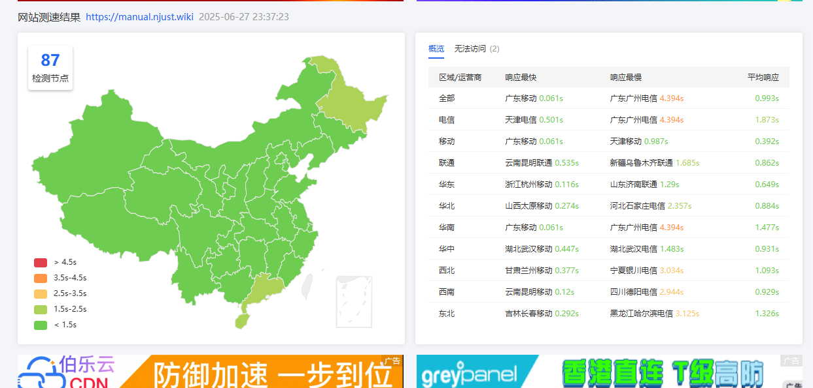
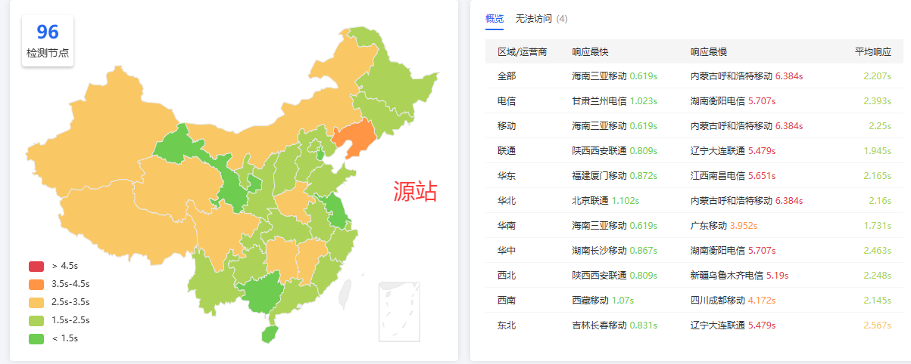

>此处只记录了最重要的技术性变更情况，细节修改请查看页面底部的 commit message

## 2026-04-01 世界线观测记录：喵喵变身魔法 

### 🌸 现实重构计划：来自南航的温柔拥抱

在这个特殊的日子里，时空节点发生了奇妙的偏移。一股来自**南京航空航天大学**的粉色魔法波动席卷了整个站点，所有的文字与灵魂都将经历一次软萌的重塑。

- **✨ 樱色观测窗 (魔法控制中枢)**
  - 我们在现实的边缘（右下角）固定了一个**静态观测窗**。它由樱花粉与奶油白凝结而成，静静地昭示着当前世界线的变动。
  - **严禁**使用任何深沉冷酷的色调。在这里，只有温暖的粉色魔法与柔和的香槟金光辉。

- **🪄 变身契约与魔法解除**
  - **魔法降临**：当观测窗被触碰，隐藏的次元之门将会开启。它会告诉你，你已经坠入了南航的温柔怀抱，并被赋予了猫娘魔法捏！ฅ^•ﻌ•^ฅ
  - **自由意志**：如果你渴望回到原本的平庸世界，可以动用“封印魔法”的禁咒。魔法将被暂时封印 24 小时，直到下一个循环。当然，只要你想，随时可以再次跳跃回这个充满喵喵叫的奇妙点。

- **🛡️ 魔法溢出防护机制**
  - 魔法是非常温柔的，它会精巧地避开所有人类进行思考与书写的区域（如输入框、对话框等），确保你的每一句咒语（文字输入）都不会被意外篡改。
  - 只有在魔法处于活跃状态时，我们才会去感知世界线微小的波动。这种精准的灵力控制，让整个站点在魔法运转时依然轻盈如羽毛。

- **🐾 恒久生效的奇迹**
  - 100% 的概率将所有的「南京理工大学」印记转化为「南京航空航天大学」的祝愿。
  - 30% 的概率让你的每一句话都以可爱的颜文字和“喵~”作为结束符。

> *“嘘——听到了吗？那是世界线跳跃的声音捏。如果不小心迷失在魔法里，记得点击右下角的闪烁微光喵！”* 🌸
>
> 
## 2026-04-01 更新内容

### 🪄 愚人节插件：魔法猫娘变身计划 (v2.0)

本次更新对愚人节整蛊插件进行了彻底重构，从原本的“静默替换”升级为具有高度交互感的“魔法体验”。我们希望在保留趣味性的同时，赋予用户掌控世界线的能力。

- **全新魔法主题 UI**
  - 引入了**樱花粉 (#FFB7C5)** 与 **奶油白 (#FFFDF9)** 的软萌配色方案，严禁使用蓝、绿、黑、红等硬核色调。
  - 在页面右下角新增常驻的“世界线观测窗”悬浮按钮，采用静态设计，温和提示世界线的微小变动。
  - 新增魔法控制模态弹窗，以“被魔法击中”而非“病毒感染”的文案，引导用户在“人类形态”与“猫娘形态”之间自由切换。

- **交互式状态管理**
  - **魔法封印功能**：用户可通过弹窗自主选择“解除魔法”，操作记录将存储于浏览器本地缓存（有效期 24 小时），满足用户恢复正常阅读的需求。
  - **随时跳跃**：按钮在 4 月 1 日期间永久存在，用户可随时通过观测窗找回魔法效果。

- **底层逻辑与性能优化**
  - **精准避让**：优化了 `TreeWalker` 的过滤算法，严格保护 `INPUT`、`TEXTAREA`、`BUTTON` 以及插件自身 UI 元素，防止干扰正常输入与交互。
  - **按需运行**：重构了初始化流程，仅当魔法处于“激活”状态时才会启动 `MutationObserver` 监听动态内容，大幅度降低系统资源占用。
  - **核心效果保留**：
    - 保持 100% 的校名魔法转换（南京理工大学 ➜ 南京航空航天大学）。
    - 保持 30% 概率的句末“喵化”效果，将句号替换为超萌的猫娘语后缀。

>  *注意：本功能仅在 4 月 1 日当天生效。如果发现世界线变动过于强烈，请点击右下角按钮进行修正喵！*

## 2025-09-09

### 🚀 新功能
- **CI/CD 工作流优化**
  - 集成 **死链检测脚本**：
    - 支持 **高并发、多文件并行** 检查。
    - 完整支持 **hash、query 参数、中文路径**。
    - 外链检测可通过参数 ```false``` 选择性关闭(当前已关闭)。
    - 外链请求失败（超时）标记为 `?`，404 错误标记为 `×`。
    - GitHub API 请求支持携带 Token，避免速率限制。
  - 构建完成后在 GitHub Actions 日志中输出报告，并在构建摘要中生成检测结果。

### 🔧 优化
- **日志与报告**
  - 输出更加直观的文件树，带有缩进和标记问题文件。
  - 最终报告中只打印 **存在问题的链接**，便于快速定位。
  - 完善 CI 构建统计（构建大小、页面数、耗时、机器信息、404错误等）。

## 2025.7.7 更新内容

今年是七七事变的 88 周年

网站更新内容：启用 Waline 评论  
启用 IPv6 访问。如有任何问题请留言或反馈  

## 2025.6.27 更新内容

改为 EdgeOne CDN 提供服务，源站依然是 EdgeOne Pages。性能有显著提高
|使用 CDN | 源站 |
|--|--|
| |  |

更新：

```manual.njust.wiki```改为使用 EdgeOne CDN，源站为 EdgeOne Pages 服务

## 2025.6.21 更新内容 

1. 腾讯云海外版 EdgeOne 正式推出无限制的 Pages 服务，且性能表现良好。因此，主域名 `manual.njust.wiki` 已迁移至腾讯云海外版 EdgeOne Pages 托管。  
!!不知道能坚持多久，先用着吧。!!

2. 完善了北区基本上所有宿舍的新建文件工作。

3. 新增 Google 统计

---

目前各个域名及对应托管平台如下：

   - ~~`manual.njust.wiki`：由 EdgeOne 自动拉取仓库中 `gh-pages` 分支的静态 HTML 内容发布~~
   - `manual-gh.njust.wiki`：由 GitHub Pages，根据 `gh-pages` 分支的静态 HTML 内容发布。
   - `manual-cf.njust.wiki`：Cloudflare Pages 监听 `main` 分支的代码变动，自动构建并发布。
   - `manual-v.njust.wiki`：Vercel 监听 `main` 分支变化，自动构建并发布。
   - `manual-n.njust.wiki`：Netlify 监听 `main` 分支变化，自动构建并发布。

1. GitHub Actions 配置为自动监听 `main` 分支的变动，触发构建流程，并将生成的静态文件自动推送至 `gh-pages` 分支，作为 EdgeOne 和 GitHub Pages 的部署源。其余平台则直接监听并拉取 `main` 分支，自动完成构建与部署。


---

### Cloudflare Pages 构建设置

* **框架预设**：留空
* **构建命令**：`npm run docs:build`
* **构建输出目录**：`docs/.vuepress/dist`
* **启用构建注释**：是
* **其余设置**：留空

---

### Vercel 构建设置

* **Frame Preset**：VuePress
* **Build Command**：`npm install && chmod +x node_modules/.bin/vuepress && npm run docs:build`
* **Override**：是
* **Output Directory**：`docs/.vuepress/dist`
* **Override**：是
* **其余设置**：留空

::: note 注意

这里 build 的时候使用此命令全新安装 npm。如果不全新安装，会莫名其妙报错或报无权限，原因不知。

::: 

---

### Netlify 构建设置

* **Build Settings**

  * **Runtime**：未设置
  * **Base Directory**：`/`
  * **Package Directory**：未设置
* **Build Command**：`npm run docs:build`
* **Publish Directory**：`/docs/.vuepress/dist`
* **Functions Directory**：`netlify/functions`
* **Deploy Log Visibility**：日志为私有
* **Build Status**：激活

---

### EdgeOne构建设置：

（不知道为什么其他平台都没问题，直接 `npm run docs:build`就好了。Edgeone 这里一直 Permission denied））     
所以这里不构建，直接拉取 gh-pages
生产分支：gh-pages  
其余全部留空