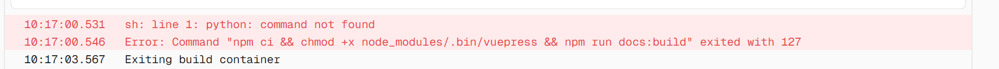
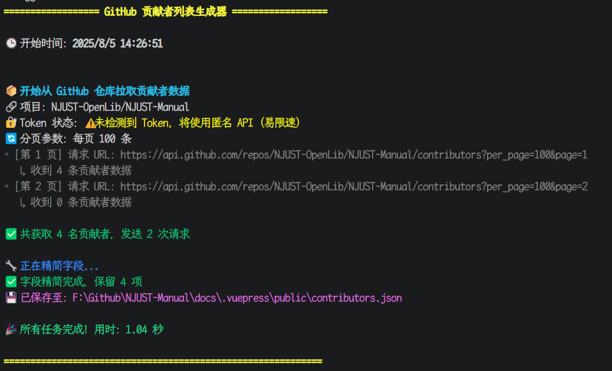

<Contributors 
  :customContributors='[
    {
      name: "Light",
      url: "https://example.com/contributor1",
      //avatar: "https://secure.gravatar.com/avatar/00000000000000000000000000000000?d=mp&f=y",
      email: "862727441@qq.com"
    },
    {
      name: "阿托卡",
      url: "https://example.com/contributor2",
      email: "1903883912@qq.com"
    },
    {
      name: "非GitHub贡献者3",
      url: "https://example.com/contributor3"
    }
  ]' 
/>


## 问题背景

在开发 VuePress 网站 **`NJUST-Manual`** 时，我们添加了一个 Vue 组件用于展示 GitHub 仓库的贡献者信息。  
最初，该组件在客户端直接通过 GitHub REST API 发起匿名请求以获取数据：

```js
fetch("https://api.github.com/repos/NJUST-OpenLib/NJUST-Manual/contributors")
  .then(res => res.json())
  .then(data => console.log(data));
```

随着网站访问量增长，这种做法很快触发了 GitHub 的 API 限流机制，导致浏览器控制台出现如下报错：

```json
{
  "message": "API rate limit exceeded for 13.255.255.255. (But here's the good news: Authenticated requests get a higher rate limit. Check out the documentation for more details.)",
  "documentation_url": "https://docs.github.com/rest/overview/resources-in-the-rest-api#rate-limiting"
}
```

## 问题分析

GitHub 对 API 请求实行严格的**限流策略**，具体限制如下：

| 请求类型 | 限制 |
| :--- | :--- |
| **匿名请求** | 每小时 **60 次** / 每个 IP 地址 |
| **授权请求** | 每小时 **5000 次** / 每个 Token |

由于 VuePress 是静态网站，所有访问者的请求均在浏览器端发起。但对于 GitHub 而言，这些请求可能因代理或 NAT 机制呈现为同一 IP 地址，极易触及匿名访问的限流阈值，导致功能异常。

结合南京理工大学校园网环境特点：未进行拨号认证时，教学办公区与宿舍区这两个主要 VLAN 区域，每个 VLAN 内会共用联通、电信、移动及教育网四个出口 IP。  
这意味着同一区域内所有设备的外网请求（尤其是访问境外网站时），均通过这几个固定 IP 发出；且访问境外网站时，始终走 ```219.*.*.*``` 的教育网出口。  
因此，用户可能频繁遇到人机验证或访问频率限制（access rate limit）提示。


## 解决方案

为彻底解决该问题，我们采用“**构建阶段拉取数据 → 保存为静态文件 → 客户端直接读取**”的整体策略，具体实施步骤如下：

- **通过 Python 脚本实现**：在项目构建阶段，利用脚本通过授权请求从 GitHub API 获取贡献者数据。
- **保存为静态 JSON 文件**：将获取到的数据存储至项目的 `public` 目录（例如 `contributors.json`）。
- **客户端直接读取本地文件**：网站的 Vue 组件不再直接请求 GitHub API，而是读取本地静态 JSON 文件。
- **支持双环境配置**：方案可在本地开发环境（通过 `.env` 文件）和 CI/CD 环境（通过 `secrets.GITHUB_TOKEN`）中自动运行。


## Python 脚本实现

`scripts/fetch_contributors.py`

```python
#!/usr/bin/env python3
# -*- coding: utf-8 -*-

import requests, json, os
from pathlib import Path
from dotenv import load_dotenv

# === 配置项 ===
OWNER = "NJUST-OpenLib"
REPO = "NJUST-Manual"
PER_PAGE = 100
OUT_FILE = Path("docs/.vuepress/public/contributors.json")

# === 加载环境变量中的 Token ===
load_dotenv()
TOKEN = os.getenv("GITHUB_TOKEN")

# === 请求头 ===
headers = {"Accept": "application/vnd.github+json"}
if TOKEN:
    headers["Authorization"] = f"Bearer {TOKEN}"

def fetch_all_contributors():
    contributors = []
    page = 1
    while True:
        url = f"https://api.github.com/repos/{OWNER}/{REPO}/contributors?per_page={PER_PAGE}&page={page}"
        print(f"Fetching page {page}...")
        res = requests.get(url, headers=headers)
        if res.status_code != 200:
            raise Exception(f"Failed: {res.status_code} {res.text}")
        data = res.json()
        if not data:
            break
        contributors.extend(data)
        page += 1
    return contributors

def simplify_fields(data):
    keys = ["login", "avatar_url", "html_url", "contributions"]
    return [{k: user[k] for k in keys if k in user} for user in data]

def save_to_file(data):
    OUT_FILE.parent.mkdir(parents=True, exist_ok=True)
    with OUT_FILE.open("w", encoding="utf-8") as f:
        json.dump(data, f, ensure_ascii=False, indent=2)
    print(f"Saved to {OUT_FILE}")

if __name__ == "__main__":
    try:
        raw = fetch_all_contributors()
        simplified = simplify_fields(raw)
        save_to_file(simplified)
    except Exception as e:
        print(f"[ERROR] {e}")
```


## 构建流程自动化配置

我们通过 `package.json` 中的 `scripts` 字段实现构建流程自动化，确保每次构建前自动执行 Python 脚本来更新贡献者数据。

`package.json`

```json
{
  "scripts": {
    "fetch-contributors": "python ./.github/workflows/scripts/fetch_contributors.py",
    "predocs:build": "npm run fetch-contributors",
    "predocs:dev": "npm run fetch-contributors",
    "build": "npm run docs:build",
    "docs:build": "npx vuepress build docs --clean-cache --clean-temp",
    "docs:dev": "npx vuepress dev docs",
    "docs:dev-clean": "npx vuepress dev docs --clean-cache --clean-temp",
    "docs:preview": "http-server docs/.vuepress/dist",
    "vp-update": "npx vp-update"
  }
}
```

### NPM Script 原理说明

NPM 的 `pre` 和 `post` 脚本支持自动触发机制。例如执行 `npm run docs:build` 时，NPM 会自动先执行 `predocs:build` 脚本。

- **`"preX"`**：会在执行 `"X"` 脚本**之前**自动调用。
- **`"postX"`**：会在执行 `"X"` 脚本**之后**自动调用。

因此，执行 `npm run build` 实际上按以下顺序执行：

1. `npm run predocs:build`
2. `npm run fetch-contributors`
3. `npm run docs:build`


## GitHub Token 配置

为在不同环境中使用授权请求，需配置 GitHub Token，具体步骤如下：

### 本地开发

::: danger
请不要将包含 token 的 `.env` 文件上传到 Github！
:::

在项目根目录创建 `.env` 文件，用于本地开发调试：

`.env`

```env
# 根目录下 .env 文件，需要具有 repo 读权限
GITHUB_TOKEN=ghp_xxxxyourtokenhere
```

### GitHub Actions

在 GitHub Actions 工作流文件 `.github/workflows/deploy.yml` 中，通过 `secrets` 传入 Token 以确保其不被公开：

```yaml
jobs:
  build_docs:
    runs-on: ubuntu-latest
    steps:
      ...
      - name: 构建文档（含 fetch-contributors）
        run: npm run docs:build
        env:
          GITHUB_TOKEN: ${{ secrets.GITHUB_TOKEN }}
```


## 效果改进对比

通过将 API 请求从客户端转移到构建阶段，实现了显著优化，具体对比如下：

| 特性 | 优化前 (客户端匿名请求) | 优化后 (构建阶段请求) |
| :--- | :--- | :--- |
| **API 请求方式** | 客户端匿名请求（共用 IP） | 构建阶段授权请求 |
| **限流风险** | 极高（60 次 / IP / 小时） | 极低（5000 次 / Token / 小时） |
| **数据稳定性** | 易受网络和 GitHub 状态影响 | 数据写入静态文件，不受运行时影响 |
| **页面加载速度** | 慢，受限于实时 API 请求 | 快，直接读取本地 JSON 文件 |


## 小结与建议

该方案成功达成了以下目标：

- 彻底规避 GitHub API 匿名请求的限速问题。
- 利用构建阶段拉取数据，确保数据时效性。
- 通过 `.env` 和 CI secrets 实现灵活的跨环境配置。
- 将数据静态化，显著提升页面加载性能和稳定性。

**建议**：对于依赖第三方 API 但数据更新频率不高的功能，优先考虑在构建时生成静态内容。这种方式能极大提高应用的健壮性和用户体验。  
目前，自定义贡献者头像默认由 `weavatar.com` 提供，GitHub 贡献者头像由 `avatars.githubusercontent.com` 提供。这两个服务在国内访问性良好，因此暂无自建头像服务的计划。


## Vercel 及 Cloudflare 部署

这两个平台默认不支持 Python 语句，上述修改可能导致部署失败。



因此需使用 Node.js 执行相关逻辑。

Node.js 版代码如下：

```mjs
// .github/workflows/scripts/fetch_contributors.mjs

import fetch from 'node-fetch';
import fs from 'fs';
import path from 'path';
import { fileURLToPath } from 'url';
import chalk from 'chalk';

// === 兼容 __dirname 用法 ===
const __filename = fileURLToPath(import.meta.url);
const __dirname = path.dirname(__filename);

// === 项目参数 ===
const OWNER = 'NJUST-OpenLib';
const REPO = 'NJUST-Manual';
const PER_PAGE = 100;
const OUT_FILE = path.resolve('./docs/.vuepress/public/contributors.json');

// === 加载 GitHub Token ===
const TOKEN = process.env.GITHUB_TOKEN;
const tokenStatus = TOKEN
  ? chalk.green('✅ 已检测到 GitHub Token（启用认证）')
  : chalk.yellow('⚠️ 未检测到 Token，将使用匿名 API（易限速）');

const headers = {
  Accept: 'application/vnd.github+json',
};
if (TOKEN) {
  headers.Authorization = `Bearer ${TOKEN}`;
}

// === 拉取贡献者数据 ===
async function fetchAllContributors() {
  const contributors = [];
  let page = 1;
  let requestCount = 0;

  console.log(chalk.cyan.bold('\n📦 开始从 GitHub 仓库拉取贡献者数据'));
  console.log(`🔗 项目：${OWNER}/${REPO}`);
  console.log(`🔐 Token 状态：${tokenStatus}`);
  console.log(`🔄 分页参数：每页 ${PER_PAGE} 条`);

  while (true) {
    const url = `https://api.github.com/repos/${OWNER}/${REPO}/contributors?per_page=${PER_PAGE}&page=${page}`;
    console.log(chalk.gray(`→ [第 ${page} 页] 请求 URL：${url}`));
    const res = await fetch(url, { headers });
    requestCount++;

    if (!res.ok) {
      const text = await res.text();
      throw new Error(`GitHub API 请求失败：${res.status} ${text}`);
    }

    const data = await res.json();
    console.log(chalk.gray(`   ↳ 收到 ${data.length} 条贡献者数据`));
    if (data.length === 0) break;

    contributors.push(...data);
    page++;
  }

  console.log(chalk.green(`\n✅ 共获取 ${contributors.length} 名贡献者，发送 ${requestCount} 次请求\n`));
  return contributors;
}

// === 筛选字段 ===
function simplifyFields(data) {
  console.log(chalk.blueBright('🔧 正在精简字段...'));
  const keys = ['login', 'avatar_url', 'html_url', 'contributions'];
  const simplified = data.map(user => {
    const result = {};
    for (const k of keys) {
      if (user[k]) result[k] = user[k];
    }
    return result;
  });
  console.log(chalk.green(`✅ 字段精简完成，保留 ${simplified.length} 项`));
  return simplified;
}

// === 保存为 JSON 文件 ===
function saveToFile(data) {
  const outPath = path.resolve(OUT_FILE);
  fs.mkdirSync(path.dirname(outPath), { recursive: true });
  fs.writeFileSync(outPath, JSON.stringify(data, null, 2), 'utf8');
  console.log(chalk.magentaBright(`💾 已保存至：${outPath}`));
}

// === 主函数 ===
(async () => {
  console.log(chalk.yellow.bold('================== GitHub 贡献者列表生成器 ==================\n'));
  const startTime = new Date();
  console.log(`🕒 开始时间：${chalk.bold(startTime.toLocaleString())}\n`);

  try {
    const raw = await fetchAllContributors();
    const simplified = simplifyFields(raw);
    saveToFile(simplified);
    const endTime = new Date();
    const duration = ((endTime - startTime) / 1000).toFixed(2);
    console.log(chalk.greenBright(`\n🎉 所有任务完成！用时：${duration} 秒`));
  } catch (e) {
    console.error(chalk.redBright(`❌ 错误：${e.message}`));
    process.exit(1);
  }

  console.log(chalk.yellow.bold('\n============================================================\n'));
})();
```

需安装第三方依赖包：

```bash
npm install node-fetch chalk
```


对应的 `package.json` 脚本配置应更新为：

```json
"scripts": {
  "fetch-contributors": "node .github/workflows/scripts/fetch_contributors.mjs",
  "predocs:build": "npm run fetch-contributors",
  "predocs:dev": "npm run fetch-contributors",
  "build": "npm run docs:build",
  "docs:build": "npx vuepress build docs --clean-cache --clean-temp",
  "docs:dev": "npx vuepress dev docs",
  "docs:dev-clean": "npx vuepress dev docs --clean-cache --clean-temp",
  "docs:preview": "http-server docs/.vuepress/dist",
  "vp-update": "npx vp-update"
}
```

运行结果如下：




## 配套贡献者展示组件

我们开发了一个专用的 Vue 组件，用于在页面中优雅地展示构建时拉取的贡献者数据。
这个组件不仅支持 GitHub 贡献者，还能灵活地展示自定义贡献者，并提供了完整的状态处理和交互效果。
上述的改进正是为此服务的。

### 组件核心功能

这个组件能够从本地静态 `contributors.json` 文件加载 **GitHub 贡献者**，同时通过 `props` 接收并展示 **自定义贡献者**（例如非 GitHub 平台的贡献者）。组件提供了加载状态提示、错误处理、深色/浅色模式适配以及响应式布局，保证了良好的用户体验。

  * **双源数据支持**：无缝融合 GitHub 仓库贡献者和通过 `props` 传入的自定义贡献者。
  * **智能头像处理**：对于自定义贡献者，如果提供了邮箱，会通过 MD5 哈希自动生成统一风格的头像；如果提供了头像链接，则优先使用。
  * **精细化视觉设计**：卡片悬停时会有阴影加深、头像放大等动画效果，配合平滑的过渡，增强了视觉吸引力。
  * **响应式布局**：使用 CSS Grid 布局，能自动适应不同尺寸的屏幕。
  * **可访问性优化**：为链接添加了 `aria-label` 属性，提升了无障碍体验。


该组件设计灵活，所有参数均为可选，可根据实际需求自由配置。

**使用示例**

在 VuePress 页面中引入组件的示例代码：
```vue
<Contributors 
  title="项目贡献者" 
  :customContributors="[
    { name: '张三', url: 'https://example.com', email: 'zhangsan@example.com' },
    { name: '李四', url: 'https://example.com', avatar: 'https://example.com/avatar.jpg' }
  ]"
/>
```

**参数说明**

- **`title`**（可选，类型：`String`）  
  用于设置组件标题，默认值为“贡献者”。若不传入，将自动使用默认值。

- **`customContributors`**（可选，类型：`Array`）  
  用于传入入自定义贡献者列表，默认值为空数组。若无需需需自定义自定义贡献者，可直接略此参数。  
  数组中每个对象支持的字段：
  - `name`：必填，自定义定义义贡献者名称
  - `url`：可选，贡献者主页链接
  - `avatar`：可选，贡献者头像图片链接
  - `email`：可选，用于自动生成头像（当未指定`avatar`时生效）


**头像显示逻辑**  

组件采用智能降级策略处理头像显示：
1. **优先使用自定义头像**：若提供 `avatar` 字段，直接显示该链接对应的图片
2. **其次基于邮箱生成**：若未提供 `avatar` 但提供 `email`，通过内嵌 MD5 算法对邮箱哈希后，从 `weavatar.com` 生成唯一头像
3. **最后使用默认头像**：若既无 `avatar` 也无 `email`，则显示示通用的复古风格默认头像


> **提示：** 如果你想了解完整的组件代码，可以展开下面的代码块。


::: details 展开代码


```vue
<template>
  <div class="contributors-container">
    <h3 v-if="title" class="contributors-title">{{ title }}</h3>

    <div v-if="loading" class="status-indicator loading">
      <div class="spinner"></div>
      <span>加载贡献者信息中...</span>
    </div>
    <div v-else-if="error" class="status-indicator error">
      <i class="error-icon">⚠️</i>
      <span>{{ error }}</span>
    </div>

    <div v-else class="contributors-grid">
      <a
        v-for="contributor in contributors"
        :key="'github-' + contributor.id"
        :href="contributor.html_url"
        target="_blank"
        rel="noopener noreferrer"
        class="contributor-card"
        :aria-label="`访问${contributor.login}的GitHub主页`"
      >
        <div class="avatar-container">
          
          <div class="hover-overlay">
            <i class="external-icon">↗</i>
          </div>
        </div>
        <span class="username">{{ contributor.login }}</span>
      </a>

      <a
        v-for="(contributor, index) in processedCustomContributors"
        :key="'custom-' + index"
        :href="contributor.url"
        target="_blank"
        rel="noopener noreferrer"
        class="contributor-card"
        :aria-label="`访问${contributor.name}的主页`"
      >
        <div class="avatar-container">
          
          <div class="hover-overlay">
            <i class="external-icon">↗</i>
          </div>
        </div>
        <span class="username">{{ contributor.name }}</span>
      </a>
    </div>
  </div>
</template>

<script>
export default {
  name: 'Contributors',
  props: {
    title: {
      type: String,
      default: '贡献者',
    },
    // 自定义贡献者数组，默认空
    customContributors: {
      type: Array,
      default: () => [],
    },
  },
  data() {
    return {
      contributors: [], // GitHub贡献者，从本地JSON加载
      processedCustomContributors: [], // 自定义贡献者，带头像处理
      loading: false,
      error: null,
      defaultAvatar: 'https://weavatar.com/avatar/?d=retro',
    };
  },
  watch: {
    // 监听自定义贡献者数组，更新处理后的数据
    customContributors: {
      handler() {
        this.processCustomContributors();
      },
      deep: true,
      immediate: true,
    },
  },
  mounted() {
    this.fetchContributorsFromLocal();
  },
  methods: {
    async fetchContributorsFromLocal() {
      this.loading = true;
      this.error = null;
      try {
        const res = await fetch('/contributors.json');
        if (!res.ok) throw new Error(`读取本地贡献者文件失败: ${res.status}`);
        const data = await res.json();
        this.contributors = data;
      } catch (err) {
        console.error(err);
        this.error = '读取贡献者数据失败';
      } finally {
        this.loading = false;
      }
    },
    processCustomContributors() {
      this.processedCustomContributors = this.customContributors.map((contributor) => {
        let avatarUrl = this.defaultAvatar;
        if (contributor.avatar) {
          avatarUrl = contributor.avatar;
        } else if (contributor.email) {
          const hash = this.calculateMD5(contributor.email.trim().toLowerCase());
          avatarUrl = `https://weavatar.com/avatar/${hash}?d=retro`;
        }
        return {
          ...contributor,
          avatarUrl,
        };
      });
    },
    // MD5算法实现
    calculateMD5(text) {
      function md5cycle(x, k) {
        let a = x[0], b = x[1], c = x[2], d = x[3];
        a = ff(a, b, c, d, k[0], 7, -680876936);
        d = ff(d, a, b, c, k[1], 12, -389564586);
        c = ff(c, d, a, b, k[2], 17, 606105819);
        b = ff(b, c, d, a, k[3], 22, -1044525330);
        a = ff(a, b, c, d, k[4], 7, -176418897);
        d = ff(d, a, b, c, k[5], 12, 1200080426);
        c = ff(c, d, a, b, k[6], 17, -1473231341);
        b = ff(b, c, d, a, k[7], 22, -45705983);
        a = ff(a, b, c, d, k[8], 7, 1770035416);
        d = ff(d, a, b, c, k[9], 12, -1958414417);
        c = ff(c, d, a, b, k[10], 17, -42063);
        b = ff(b, c, d, a, k[11], 22, -1990404162);
        a = ff(a, b, c, d, k[12], 7, 1804603682);
        d = ff(d, a, b, c, k[13], 12, -40341101);
        c = ff(c, d, a, b, k[14], 17, -1502002290);
        b = ff(b, c, d, a, k[15], 22, 1236535329);
        a = gg(a, b, c, d, k[1], 5, -165796510);
        d = gg(d, a, b, c, k[6], 9, -1069501632);
        c = gg(c, d, a, b, k[11], 14, 643717713);
        b = gg(b, c, d, a, k[0], 20, -373897302);
        a = gg(a, b, c, d, k[5], 5, -701558691);
        d = gg(d, a, b, c, k[10], 9, 38016083);
        c = gg(c, d, a, b, k[15], 14, -660478335);
        b = gg(b, c, d, a, k[4], 20, -405537848);
        a = gg(a, b, c, d, k[9], 5, 568446438);
        d = gg(d, a, b, c, k[14], 9, -1019803690);
        c = gg(c, d, a, b, k[3], 14, -187363961);
        b = gg(b, c, d, a, k[8], 20, 1163531501);
        a = gg(a, b, c, d, k[13], 5, -1444681467);
        d = gg(d, a, b, c, k[2], 9, -51403784);
        c = gg(c, d, a, b, k[7], 14, 1735328473);
        b = gg(b, c, d, a, k[12], 20, -1926607734);
        a = hh(a, b, c, d, k[5], 4, -378558);
        d = hh(d, a, b, c, k[8], 11, -2022574463);
        c = hh(c, d, a, b, k[11], 16, 1839030562);
        b = hh(b, c, d, a, k[14], 23, -35309556);
        a = hh(a, b, c, d, k[1], 4, -1530992060);
        d = hh(d, a, b, c, k[4], 11, 1272893353);
        c = hh(c, d, a, b, k[7], 16, -155497632);
        b = hh(b, c, d, a, k[10], 23, -1094730640);
        a = hh(a, b, c, d, k[13], 4, 681279174);
        d = hh(d, a, b, c, k[0], 11, -358537222);
        c = hh(c, d, a, b, k[3], 16, -722521979);
        b = hh(b, c, d, a, k[6], 23, 76029189);
        a = hh(a, b, c, d, k[9], 4, -640364487);
        d = hh(d, a, b, c, k[12], 11, -421815835);
        c = hh(c, d, a, b, k[15], 16, 530742520);
        b = hh(b, c, d, a, k[2], 23, -995338651);
        a = ii(a, b, c, d, k[0], 6, -198630844);
        d = ii(d, a, b, c, k[7], 10, 1126891415);
        c = ii(c, d, a, b, k[14], 15, -1416354905);
        b = ii(b, c, d, a, k[5], 21, -57434055);
        a = ii(a, b, c, d, k[12], 6, 1700485571);
        d = ii(d, a, b, c, k[3], 10, -1894986606);
        c = ii(c, d, a, b, k[10], 15, -1051523);
        b = ii(b, c, d, a, k[1], 21, -2054922799);
        a = ii(a, b, c, d, k[8], 6, 1873313359);
        d = ii(d, a, b, c, k[15], 10, -30611744);
        c = ii(c, d, a, b, k[6], 15, -1560198380);
        b = ii(b, c, d, a, k[13], 21, 1309151649);
        a = ii(a, b, c, d, k[4], 6, -145523070);
        d = ii(d, a, b, c, k[11], 10, -1120210379);
        c = ii(c, d, a, b, k[2], 15, 718787259);
        b = ii(b, c, d, a, k[9], 21, -343485551);
        x[0] = add32(a, x[0]);
        x[1] = add32(b, x[1]);
        x[2] = add32(c, x[2]);
        x[3] = add32(d, x[3]);
      }
      function cmn(q, a, b, x, s, t) {
        a = add32(add32(a, q), add32(x, t));
        return add32((a << s) | (a >>> (32 - s)), b);
      }
      function ff(a, b, c, d, x, s, t) {
        return cmn((b & c) | (~b & d), a, b, x, s, t);
      }
      function gg(a, b, c, d, x, s, t) {
        return cmn((b & d) | (c & ~d), a, b, x, s, t);
      }
      function hh(a, b, c, d, x, s, t) {
        return cmn(b ^ c ^ d, a, b, x, s, t);
      }
      function ii(a, b, c, d, x, s, t) {
        return cmn(c ^ (b | ~d), a, b, x, s, t);
      }
      function md51(s) {
        const n = s.length;
        const state = [1732584193, -271733879, -1732584194, 271733878];
        let i;
        for (i = 64; i <= s.length; i += 64) {
          md5cycle(state, md5blk(s.substring(i - 64, i)));
        }
        s = s.substring(i - 64);
        const tail = new Array(16).fill(0);
        for (i = 0; i < s.length; i++) {
          tail[i >> 2] |= s.charCodeAt(i) << ((i % 4) << 3);
        }
        tail[i >> 2] |= 0x80 << ((i % 4) << 3);
        if (i > 55) {
          md5cycle(state, tail);
          for (i = 0; i < 16; i++) tail[i] = 0;
        }
        tail[14] = n * 8;
        md5cycle(state, tail);
        return state;
      }
      function md5blk(s) {
        const md5blks = [];
        for (let i = 0; i < 64; i += 4) {
          md5blks[i >> 2] =
            s.charCodeAt(i) +
            (s.charCodeAt(i + 1) << 8) +
            (s.charCodeAt(i + 2) << 16) +
            (s.charCodeAt(i + 3) << 24);
        }
        return md5blks;
      }
      function rhex(n) {
        const hex_chr = '0123456789abcdef';
        let s = '';
        for (let j = 0; j < 4; j++) {
          s +=
            hex_chr[(n >> (j * 8 + 4)) & 0x0f] +
            hex_chr[(n >> (j * 8)) & 0x0f];
        }
        return s;
      }
      function hex(x) {
        for (let i = 0; i < x.length; i++) x[i] = rhex(x[i]);
        return x.join('');
      }
      function add32(a, b) {
        return (a + b) & 0xffffffff;
      }
      return hex(md51(text));
    },
  },
};
</script>

<style scoped>
:root {
  --bg-card: #ffffff;
  --bg-hover: #f8fafc;
  --text-title: #1e293b;
  --text-primary: #334155;
  --text-secondary: #64748b;
  --text-tertiary: #94a3b8;
  --brand: #3b82f6;
  --brand-light: #60a5fa;
  --shadow: 0 2px 10px rgba(0, 0, 0, 0.05);
  --shadow-hover: 0 10px 25px -5px rgba(0, 0, 0, 0.1), 0 8px 10px -6px rgba(0, 0, 0, 0.05);
  --danger: #dc2626;
  --danger-bg: #fff5f5;
}
@media (prefers-color-scheme: dark) {
  :root {
    --bg-card: #1e293b;
    --bg-hover: #334155;
    --text-title: #f8fafc;
    --text-primary: #e2e8f0;
    --text-secondary: #cbd5e1;
    --text-tertiary: #94a3b8;
    --brand: #60a5fa;
    --brand-light: #93c5fd;
    --shadow: 0 2px 10px rgba(0, 0, 0, 0.3);
    --shadow-hover: 0 10px 25px -5px rgba(0, 0, 0, 0.4), 0 8px 10px -6px rgba(0, 0, 0, 0.2);
    --danger: #f87171;
    --danger-bg: #1f2937;
  }
}

.contributors-container {
  margin: 2.5rem 0;
  padding: 1.5rem;
  border-radius: 12px;
  background-color: var(--bg-card);
  box-shadow: var(--shadow);
  transition: transform 0.3s ease, box-shadow 0.3s ease;
}

.contributors-title {
  margin: 0 0 1.5rem 0;
  padding-bottom: 0.75rem;
  font-size: 1.35rem;
  font-weight: 600;
  color: var(--text-title);
  border-bottom: 2px solid var(--brand);
  display: inline-block;
}

.status-indicator {
  display: flex;
  align-items: center;
  justify-content: center;
  gap: 0.5rem;
  padding: 2rem;
  text-align: center;
  border-radius: 8px;
  margin-bottom: 1rem;
  color: var(--text-secondary);
  background-color: var(--bg-hover);
}
.status-indicator.error {
  color: var(--danger);
  background-color: var(--danger-bg);
}
.spinner {
  width: 1.2rem;
  height: 1.2rem;
  border: 2px solid currentColor;
  border-bottom-color: transparent;
  border-radius: 50%;
  animation: spinner-rotate 1s linear infinite;
}
@keyframes spinner-rotate {
  0% { transform: rotate(0deg); }
  100% { transform: rotate(360deg); }
}
.error-icon {
  font-size: 1.2rem;
}

.contributors-grid {
  display: grid;
  grid-template-columns: repeat(auto-fill, minmax(110px, 1fr));
  gap: 1.25rem;
}

.contributor-card {
  display: flex;
  flex-direction: column;
  align-items: center;
  text-decoration: none;
  color: inherit;
  border-radius: 8px;
  transition: all 0.3s cubic-bezier(0.4, 0, 0.2, 1);
  padding: 0.75rem 0.5rem;
  position: relative;
  overflow: hidden;
}
.contributor-card:hover {
  transform: translateY(-4px);
  box-shadow: var(--shadow-hover);
  background-color: var(--bg-hover);
}
.contributor-card::before {
  content: '';
  position: absolute;
  top: 0;
  left: 0;
  width: 4px;
  height: 100%;
  background-color: var(--brand);
  transform: scaleY(0);
  transition: transform 0.3s ease;
}
.contributor-card:hover::before {
  transform: scaleY(1);
}

.avatar-container {
  position: relative;
  width: 72px;
  height: 72px;
  margin-bottom: 0.75rem;
  z-index: 1;
}

.avatar {
  width: 100%;
  height: 100%;
  border-radius: 50%;
  object-fit: cover;
  transition: transform 0.3s ease, box-shadow 0.3s ease;
  padding: 2px;
  background-color: var(--bg-card);
}
.contributor-card:hover .avatar {
  transform: scale(1.1);
  box-shadow: 0 4px 6px -1px rgba(0, 0, 0, 0.1);
}

.hover-overlay {
  position: absolute;
  inset: 0;
  border-radius: 50%;
  background-color: rgba(0, 0, 0, 0.15);
  display: flex;
  align-items: center;
  justify-content: center;
  opacity: 0;
  transition: opacity 0.3s ease;
}
.contributor-card:hover .hover-overlay {
  opacity: 1;
}

.external-icon {
  color: white;
  font-size: 1rem;
  transform: translate(1px, -1px);
}

.username {
  font-size: 0.9rem;
  font-weight: 500;
  color: var(--text-title);
  text-align: center;
  overflow: hidden;
  text-overflow: ellipsis;
  white-space: nowrap;
  max-width: 100px;
  transition: color 0.3s ease;
  z-index: 1;
}
.contributor-card:hover .username {
  color: var(--brand);
}

@media (max-width: 768px) {
  .contributors-container {
    margin: 2rem 0;
    padding: 1rem;
  }
  .contributors-grid {
    grid-template-columns: repeat(auto-fill, minmax(90px, 1fr));
    gap: 1rem;
  }
  .avatar-container {
    width: 64px;
    height: 64px;
  }
  .username {
    font-size: 0.85rem;
    max-width: 80px;
  }
}
@media (max-width: 480px) {
  .contributors-grid {
    grid-template-columns: repeat(auto-fill, minmax(80px, 1fr));
  }
  .contributors-title {
    font-size: 1.2rem;
  }
}

.contributors-grid a:nth-child(1) { transition-delay: 0.05s; }
.contributors-grid a:nth-child(2) { transition-delay: 0.1s; }
.contributors-grid a:nth-child(3) { transition-delay: 0.15s; }
.contributors-grid a:nth-child(4) { transition-delay: 0.2s; }
.contributors-grid a:nth-child(5) { transition-delay: 0.25s; }
.contributors-grid a:nth-child(6) { transition-delay: 0.3s; }
</style>
```

:::


受篇幅限制，本文所示代码仅作原理演示，完整实现可参考以下 GitHub 链接：

- [部署 workflow 配置](https://github.com/NJUST-OpenLib/NJUST-Manual/blob/f7b6337d599ebed03f2783b1e3484a360a9e7b01/.github/workflows/deploy.yml)  
- [贡献者数据拉取脚本](https://github.com/NJUST-OpenLib/NJUST-Manual/blob/f7b6337d599ebed03f2783b1e3484a360a9e7b01/.github/workflows/scripts/fetch_contributors.py)  
- [贡献者展示组件](https://github.com/NJUST-OpenLib/NJUST-Manual/blob/f7b6337d599ebed03f2783b1e3484a360a9e7b01/docs/.vuepress/components/Contributors.vue)

